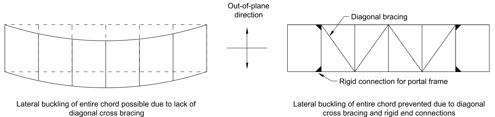
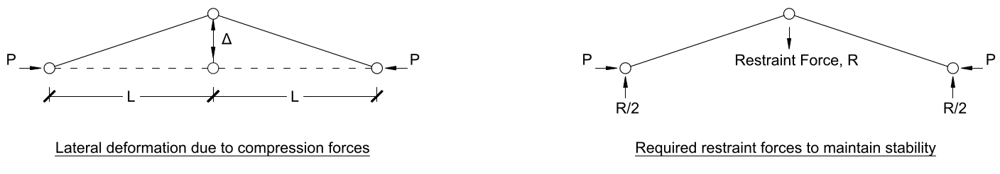
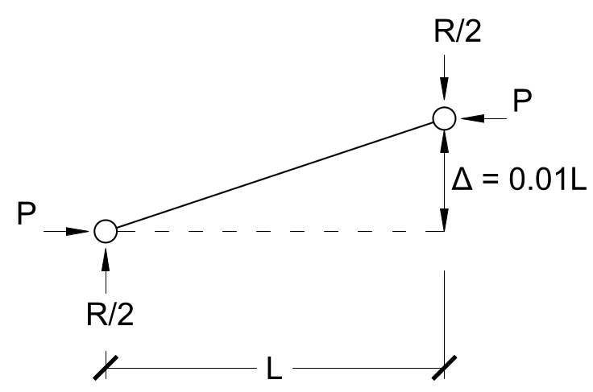
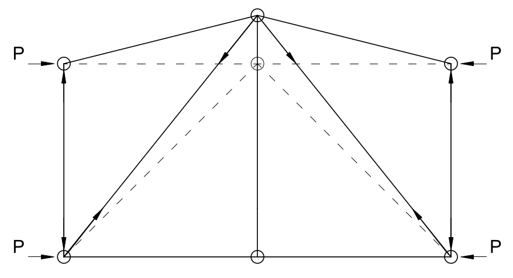
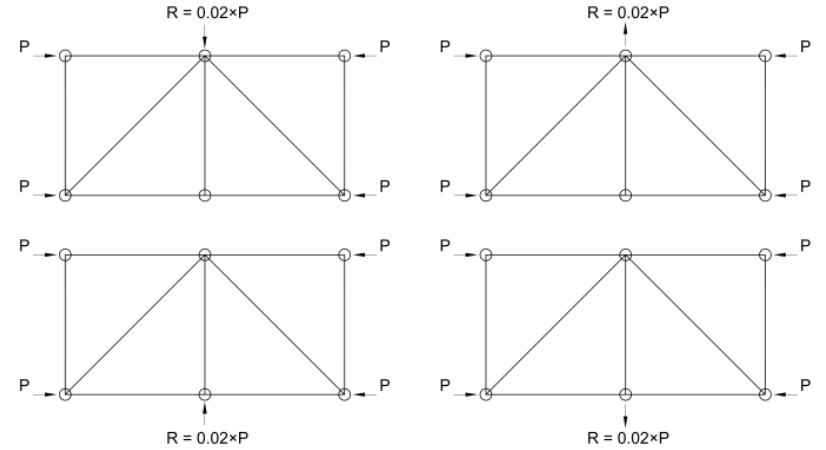

## Lateral Buckling

* When designing the truss, the members were assumed to be perfectly aligned, but this is not the case in real life
* If cross bracing is not added, compression members in the top chord can buckle over the entire span and fail at a much lower load than expected

## Design Checks for Stability

{width=30%}

* In the figure above, the joint at midpoint is not restrained, so it buckles and displaces by $\Delta$; a restraining force $R$ is required to pull it back
* $R$ depends on $\Delta$; a reasonable estimate for $\Delta$ in modern construction is $0.01L$ (i.e. 1%)
* In the FBD, taking the moment about the left joint yields $M = P\Delta - \frac{R}{2}L = 0 \implies R = 2\frac{P\Delta}{L}$, substituting $\Delta = 0.01L$ yields $R = 0.02P$
* {width=40%}
* The restraining force in a truss bridge is provided by the cross bracing
* Since the chords can buckle in either direction on either side, there are 4 cases to design for:
* {width=40%}
* The stability check is a local check at each joint, as opposed to global analysis of wind and other forces

## Cross Bracing Design Process

* The cross bracing can be done after the main truss is designed for gravity loads
* The bottom bracing does not need to consider stability because the bottom chords are in tension
* To design the cross bracing:
	1. Calculate the wind loads and determine the forces in the members of the top bracing using method of joints/sections
	2. Calculate the forces required to stabilize the compression chords under gravity loads
		* Note this may be different between the two sides due to asymmetry; take the larger of the two to be conservative
	3. Select appropriate HSS sections based on the larger of the two forces
		* Note the braces are designed for the more severe case, not both cases at the same time
		* It is unlikely that both will happen at the same time; e.g. during severe windstorms there will not be a lot of people on the bridge creating a large gravity load

