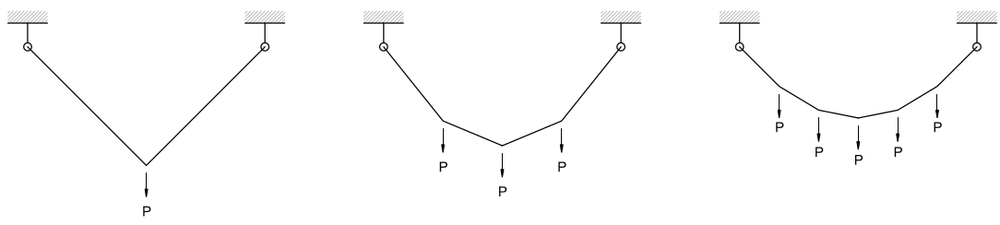
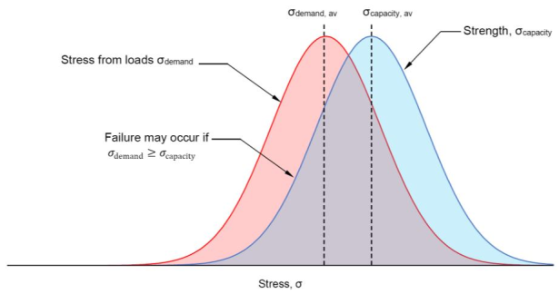
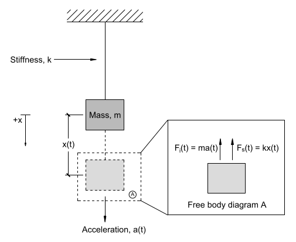
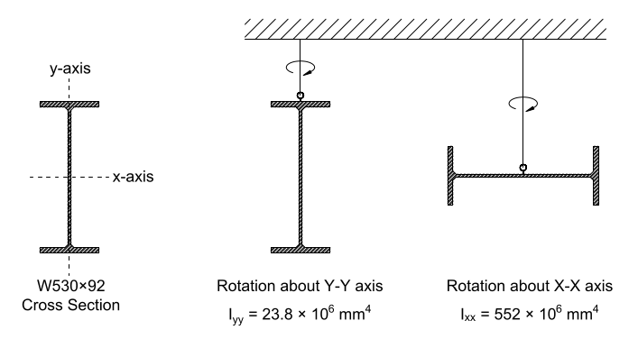
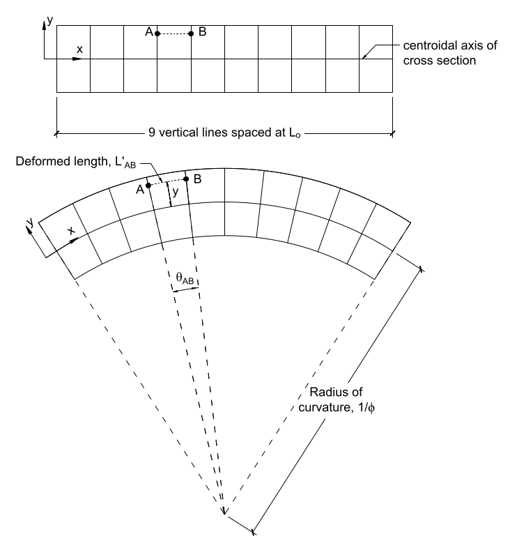
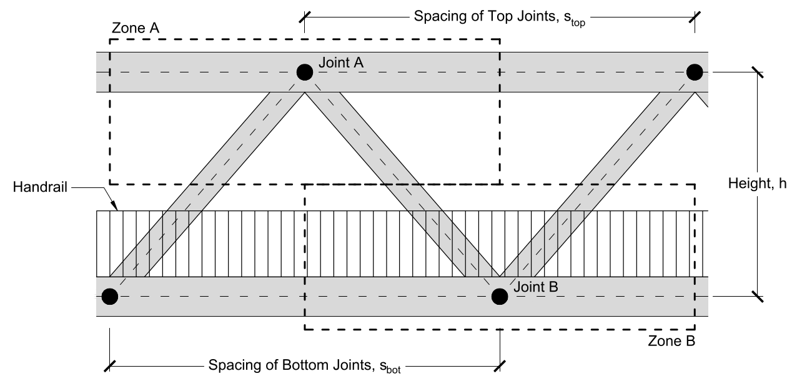
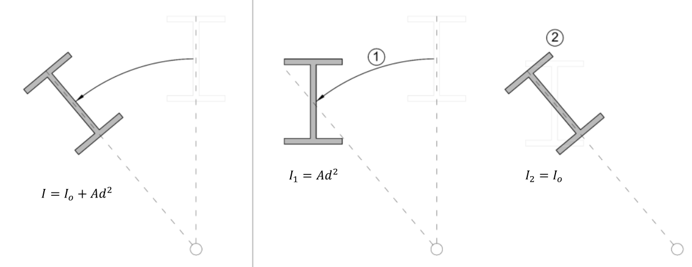
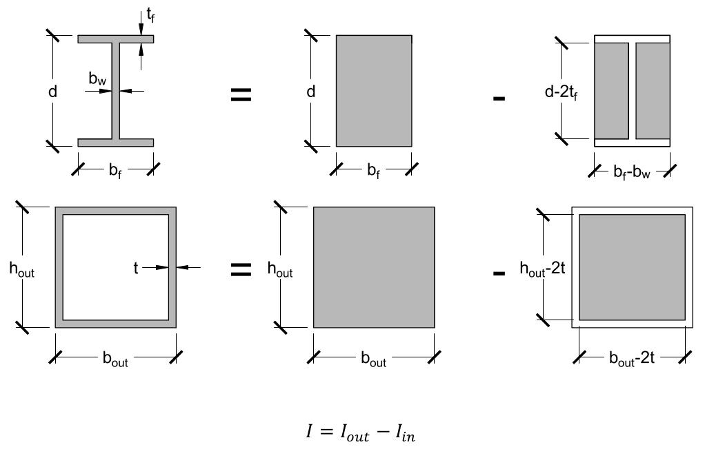
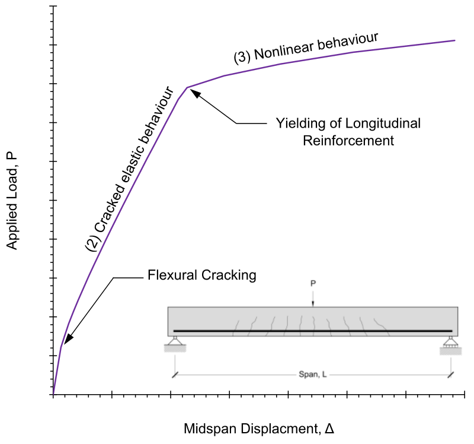
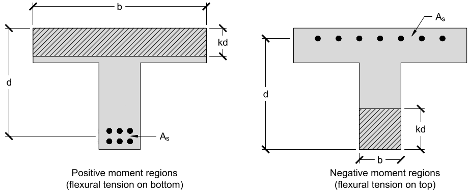

\maketitle

# Lecture 1, Sep 13, 2021

## The 3 Principles of Engineering

1. $F = ma$ -- we use math equations to model systems
2. You can't push a rope -- we can't always rely on just equations; we need common sense too
3. To find the answer, you must know the answer -- experience is very important; if you're doing something for the first time, be extremely careful; sometimes solving a problem requires first guessing at the solution

## Significant Digits: Slide Rule

* Use 3 significant digits iff first nonzero digit $\neq 1$
* Use 4 significant digits if first nonzero digit is $1$
* Using these numbers give us about $0.5\%$ accuracy; because the Earth is not a sphere, $g$ varies between different locations by about this amount, so there's no point to be more precise (for this course use $9.81$)
* Use engineering notation (exponents for scientific notation should be multiples of 3) -- easier to think about so we know whether numbers are realistic

# Lecture 2, Sep 14, 2021

## Forces

* A push or a pull that can cause an object to move or deform; by its nature a vector quantity
* Forces are measured in newtons; $1\si{N}$ is about the weight of a small apple; $1\si{kN}$ is about the weight of a football player
	* In imperial units pounds are used
* When objects are not accelerating, $\sum \vec{F} = 0$ (translational equilibrium)
* Forces can be broken down into axis-aligned components

## Moments

* Knowing translational forces sometimes isn't enough
* All torques are moments, but not all moments are torques
	* In structural engineering torques are moments where the rotational axis is the long axis of the object
* Rotations need a reference point $i$, the point about which the rotation happens
* $\vec{d}$ is the lever arm, the distance over which the force is acting
* The moment is $\vec{M} = \vec{F} \times \vec{d}$; this has units of $\si{Nm}$; although this is the same unit as energy they're different, since moment is the cross product and energy is the dot product
* Moments try to rotate an object while translational forces try to move it; the moment is a measure of how much the object wants to rotate
* The same force can cause rotations in different directions depending on the reference point
* Special case: When a pair of forces are going in equal and opposite directions and separated by some distance $d$, this is called a *couple*
	* Since the forces cancel each other out, there is no translational motion, only rotation
	* Also called a *pure moment*

# Lecture 3, Sep 15, 2021

## Types of Bridges

{width=50%}

* Suspension bridges consist of cables held up by towers, with the weight of the bridge being connected to the main cable using vertical cables
* The weight of the main bridge is transferred to the cable, which is then transferred to the towers and then the ground

## Internal Forces

{width=50%}

* Tension forces pull on both sides of an element, and tries to make it longer
	* If each end is being pulled with a $100\si{N}$ force, the tension is still $100\si{N}$, not $200$
	* The element "transmits" the force from one end to the other end
* Compression forces push in on the element, trying to make it shorter
* Key idea: **If the entire structure is in equilibrium, all its constituent parts are also in equilibrium.**
	* Example: If a beam is being pulled on each end with $100\si{N}$ and thus in equilibrium, we can break it apart at an arbitrary point, and expose an internal force; the internal forces will also be $100\si{N}$ and balance out the forces at the ends; this is the reason why tension is $100$ and not $200$

## Cable Structure

{width=60%}

* When a cable is attached at the ends and only supporting its own weight, it takes the shape of a **catenary** (modelled by $y = \cosh(e^{\frac{x}{a}} + e^{-\frac{x}{a}}) + b$, $a$ = span, $b$ = vertical offset, not a parabola)
	* This is a different shape from uniform loading because the load per unit length of cable is constant, not load per unit length of the span; so at the ends, there is more load per $x$ distance
* If we add loads much heavier than the weight of the cable itself onto the cable, then the effect of the cable's weight will be negligible and the cable becomes **piecewise linear**
* Typically in a suspension bridge the horizontal spacing between loads is constant (not the cable length between loads)
* When the weights are uniformly loaded, the cable takes the shape of a *parabola*

## Forces

* Consider a suspension bridge uniformly loaded with 7 masses each with weight $P$

* At the endpoints, the vertical component of force is equal to half of the total weight of the bridge due to symmetry
* In each segment, the horizontal component of tension remains the same and is equal to the tension at the ends
* In the 2 end segments, the vertical component of force is equal to the endpoints; then as you move in to the middle of the bridge, each segment has vertical tension reduced by $P$, with the middle segments having tension $\frac{1}{2}P$

# Lecture 4, Sep 20, 2021

## Free Body Diagrams

* Requirements:
	1. An FBD must be *free*, i.e. it must be floating in space and not connected to any external things, e.g. the ground (we cut them out of the diagram)
	2. All external forces must be included
	3. All forces at cut locations (internal forces) must also be included
	4. Include body forces, maybe (self-weight)
	5. Do the calculations based on undeformed geometry
		* This is why an FBD tells you you *can* push on a rope, so watch out
* All FBDs will be in equilibrium

## Distributed Loads

* Forces can be "smeared out": point loads can be replaced by a big uniformly distributed load (UDL), symbol $w$ with units $\si{kN/m}$ (force per unit distance/area)
* With free body diagrams we can replace an UDL with an equivalent resultant $wL$ at the midpoint of the UDL
	* {width=30%}
	* Note not all distributed loads are uniform; in this case we put the force at the centroid $\frac{\int _a^b w(x)x\,\dx}{\int _a^b w(x)\,\dx}$ with the equivalent force equal to $\int _a^b w(x)\,\dx$

## Designing Structures

0. Select the type of structure
1. Estimate the geometry and the loads (based on the 3rd principle of engineering!)
2. Perform the analysis, which tells you how the internal forces are distributed
	* This is the big one for this course
3. Select standard shapes or create new ones to safely carry the loads
	* Now you know how much the structure weighs
4. Iterate: With the new knowledge of the structure's forces and weights, re-estimate the geometry, loads, shapes, etc

## Designing Suspension Bridges

{width=70%}

* Find the *load path*: how does the load go to the ground?
	* The load path goes from the car, to the deck, to the hangers, to the main cables, to the towers and then the ground

### Designing the Main Cables (Force Analysis)

{width=50%}

* The FBD is drawn from the tower to the midspan
* Since at the midspan the cable is horizontal, the tension force at point $B$ only has a horizontal component $H$
* $\sum F_x = 0 \implies H - T_{supp,x} = 0 \implies H = T_{supp,x}$
* $\sum F_y = 0 \implies T_{supp,y} - w\frac{L}{2} = 0 \implies T_{supp,y} = \frac{wL}{2}$
* For sum of moments, take moments around point $A$ and counterclockwise to be positive
* $\sum M = 0 \implies \cancel{T_{supp,x} \cdot 0} + \cancel{T_{supp,y} \cdot 0} + Hh - \frac{wL}{2} \cdot \frac{L}{4} = 0 \implies H = \frac{wL^2}{8h}$
	* Note: The uniform load is equivalent to a load of $wL$ at the midpoint, which is $\frac{L}{4}$ since midspan is $\frac{L}{2}$ long
	* $H$ can be shifted so it acts directly under $A$ and $w$ can be shifted so it acts directly to the right of $A$; this does not change the moment due to the nature of moments (cross products: the area of the parallelogram does not change when its sides are shifted)

### Example: Golden Gate Bridge

* $L = 1280\si{m}$, $h = 143\si{m}, w = 370\si{kN/m}$
* $\frac{L}{h} = 8.95$ (between $8$ and $10$)
* $T_{supp,y} = 237\si{MN}$
* $H = 530\si{MN}$
* $T_{max} = \sqrt{237^2 + 530^2} = 580\si{N}$ or $290\si{MN}$ per cable

# Lecture 5, Sep 21, 2021

## Hooke's Law

* The restoring force in a spring is proportional to its change in length: $F = k\Delta t$
* Hooke's law also applies to structures subjected to direct tension or compression such as cables and columns
* Structures that obey Hooke's law are **linear elastic**
* $k$ is sometimes refired to as the *axial stiffness*

## Stress and Strain

* *Stress* is an area-normalized measurement of internal force; for a cable carrying a force $F$ with undeformed cross-sectional area $A$, the stress is $\sigma = \frac{F}{A}$
	* Stress has units of force per unit area and is usually in $\si{MPa}$ ($1\si{Pa} = 1\si{N/m^2}$; $1\si{MPa} = \frac{1\si{MN}}{\si{m}^2} = \frac{1\si{N}}{\si{mm^2}}$)
	* Stress is similar to pressure, but pressure acts externally while stress acts internally
* *Strain* is a length-normalized measurement of deformation; if a cable was originally $L_0$ units long but has now been stretched by an additional $\Delta l$, the strain is $\varepsilon = \frac{\Delta l}{L_0}$
	* Strain is dimensionless but typically presented in units of $\si{mm/mm}$, $\si{mm/m}$ or even percentage
	* $0.001$ is about a reasonable strain under "working load conditions" (e.g. a building with a roof under normal conditions)
* *Engineering strain/stress* use the undeformed area and length; the *true strain/stress* use the deformed area/length; true strain is $\diff{}{x}$ of the displacement field
	* Engineering stress/strain is used instead of the true strain/stress because the latter is too hard to measure
* Using stress and strain allow us to compare structures of different sizes
	* e.g. a thicker cable will break at a higher load than a thinner cable, but if they're the same material, the stress that breaks them will be the same
* Stress and strain also apply for compression, as long as the compression is not too much and buckling doesn't happen

## Young's Modulus and Relation to Hooke's Law

* Stress is proportional to strain by a constant $E$, the *Young's Modulus*: $\sigma = E\varepsilon$
	* Young's modulus is a property of the material and has the same dimensions as stress, typically $\si{MPa}$
	* The strains here are only as a result of carrying a load causing a stress; e.g. thermal or shrinkage strains should not be used here
	* Also known as the *material stiffness*
* $k$ can be expressed in terms of a member's cross sectional area $A$, length $L_0$, and material stiffness $E$: $F = AE\frac{\Delta l}{L_0} = \frac{AE}{L_0}\Delta l \implies k = \frac{AE}{L_0}$
	* This shows that the axial stiffness is proportional to the cross-sectional area and material stiffness, and inversely proportional to length

# Lecture 6, Sep 21, 2021

## Stress-Strain Curves

{width=70%}

* Materials may exhibit linear elasticity for lower loads, but as they approach failure the stress-strain relationship is nonlinear
* Some key *material properties* are used to describe the stress-strain curve:
	1. **Strength**: How much stress a material can carry before it fails
		1. **Yield strength/stress** $\sigma _y$ or $f_y$: The stress at which the material starts yielding (permanently deforming); when yielding occurs, strain will increase even without increasing stress; this is the *yield plateau* (flat part of graph)
			* The yield strain is typically about $0.002$, and the yield plateau ends at about $0.05$
		2. **Ultimate strength/stress** $\sigma _u$ or $f_u$: The stress at which the material fails completely (the peak on the stress-strain curve)
	2. **Ductility**: How much a material can be deformed before it breaks; the largest strain a material can carry before it fractures (ductile vs brittle)
	3. **Young's Modulus** (material stiffness): Slope of the linear elastic region of the curve (see previous lecture)
		* Materials with higher value of $E$ are *stiff*, lower values of $E$ are *flexible*
* Plastic deformations are not recoverable; elastic deformations are
* Phases of the curve:
	1. The linear elastic region where $\sigma = E\varepsilon$ (small strains only)
	2. Yield plateau: Plastic behaviour; strain can change without stress changing (once the yield strength is reached)
	3. The rest of the graph, where the curve is nonlinear; some strengthening due to strain hardening and then softening as necking begins
* If the stress is unloaded when you're on the yield plateau, the stress-strain curve of unloading is linear with the same slope as the original linear elastic region, but it won't pass through the origin
	* Essentially when unloaded the linear elastic region is shifted to the right by the same amount you moved along the yield plateau
* Strain hardening: When a material gets stronger and stiffer when strained beyond its yield point
* Necking: Local tensile strains cause the cross-sectional area to become much smaller; usually precedes failure
	* During this phase, the engineering stress goes down, but the true stress keeps going up because the cross-sectional area decreases
* Steel is very handy because it has a large yield plateau, so there is a lot of warning before it fails
* At the atomic level:
	* During the linear elastic region the atoms get pulled apart and they can spring back together
	* During the yield plateau, the atoms slip past each other
	* Past the yield plateau, the atoms get stuck so stress hardening happens

## Strain Energy

* The energy stored in a material as it is deformed: $W = \int F\,\dd\Delta l$
* During the linear elastic phase the strain energy is $\frac{1}{2}k(\Delta l)^2$
* The *strain energy density* $U = \int \sigma\,\dd\varepsilon$ is the energy stored in the material per unit volume
	* $U = \frac{W}{V} = \int \frac{F}{V}\,\dd\Delta l = \int \frac{F}{AL_0}\,\dd\Delta l = \int \frac{F}{A}\,\dd\frac{\Delta l}{L_0} = \int \sigma\,\dd\varepsilon$
	* Also known as *specific strain energy*
	* Units of $\si{MJ/m^3}$ since $\si{MPa} = \si{MN/m^2} = \si{MN \cdot m/m^3} = \si{MJ/m^3}$
	* $W = U \cdot V_0$ where $V_0$ is the original volume before deformation
	* In the linear elastic region: $W = \int \sigma\,\dd\varepsilon \cdot V_0 = \int E\varepsilon\,\dd\varepsilon \cdot V_0 = \frac{1}{2}E\varepsilon^2 V_0 = \frac{1}{2}\sigma\varepsilon V_0$
	* Strain energy density is a material property independent of the member
* Additional material properties:
	4. **Resilience**: Max amount of energy the material can absorb before yielding; the area under the curve in the linear elastic region
	5. **Toughness**: Max amount of energy the material can absorb before failing; the area under the entire stress-strain curve

## Thermal Expansion

* Thermal strains $\varepsilon _{th}$ are related to temperature changes by $\varepsilon _{th} = \alpha\Delta T$, where $\alpha$ is the *coefficient of thermal expansion*, a material constant
	* Thermal strains only cause stresses if the material is not allowed to expand/contract
	* Stresses caused by thermal strain can be calculated by Young's modulus if the length of the material is fixed

# Lecture 7, Sep 27, 2021

## Safety

* Types of forces
	1. Dead loads -- Things that can't move -- e.g. self-weight, added features (e.g. asphalt on a suspension bridge, chairs in this lecture hall, often called *superimposed* dead loads)
		* Generally well-known during design, low-uncertainty
	2. Live loads -- Things that can move -- e.g. cars, people, wind
		* Generally more uncertain and unpredictable
		* To design for these, we look for worst cases
* Once we know the types of load, we make a best guess
	* For some things we take the average, e.g. cars
* {width=50%}
* The basic safety equation: $\sigma _{demand} < \sigma _{capacity}$, i.e. your structure should be able to handle more stress than demanded
	* This just tells you whether the structure will fall down, not whether it is safe
	* $\sigma _{capacity}$: Yield or ultimate strength?
		* Generally if we have a yield strength $\sigma _y$, we should use that, because the ultimate strength of e.g. steel is hard to measure and uncertain
	* Stress demand and capacity usually follow a normal distribution (bell curve); there might be structural imperfections leading to uncertainties in dead loads, and material imperfections might lead to uncertainties in stress capacity
		* This means that even if the average $\sigma _{demand}$ is greater than the average $\sigma _{capacity}$, they might still overlap
		* The overlap is where the uncertainties make the stress demand greater than the capacity and so the structure fails
		* We want to minimize this overlap but it is not possible to make this zero (size of overlap is related to *risk* of failure)
* A safe structure has $\sigma _{demand} < \sigma _{capacity}$ and a low risk of it being otherwise
* 2 ways to deal with risk:
	1. Limit states design (very complicated and an entire course on its own)
	2. Allowable stress design (this course), aka working stress design
		* Key concept: Factor of Safety $\text{FoS} = \frac{\sigma _{capacity}}{\sigma _{demand}}$
			* If this number is less than $1$, it will fall down
			* If this number is greater than "some specified number", then it is safe
				* This "some specified number" can be determined using limit states design
				* In the 1800s this would be 3-10 based on consequences for failure and warning (e.g. for ductile metals like steel the FoS can be lower since there is a lot of warning before it fails)
				* In the 1960s FoS of 2 is typical
				* Today, with more control on the materials, the FoS is typically about 1.7
				* e.g. The Brooklyn bridge built in the 1980s has an FoS of 5, the Golden Gate bridge has 2.68, the Akashi Kaikyo bridge has 2.25; numbers go down over time because materials are more well understood and uncertainties decrease
* Allowable stress: $\frac{\sigma _y}{\text{FoS}}$ and this is the amount of stress that the structure is allowed to take
	* In this class the FoS will be given

# Lecture 8, Sep 28, 2021

## Dynamic Equilibrium

* Oscillating systems are not in static equilibrium, so we cannot use our usual methods
* We can apply D'Alembert's Principle: Convert dynamic equilibrium ($a \neq 0$) to equivalent static equilibrium by introducing a fictitious *inertial force*
	* This inertial force is $F_i = ma$ and acts in the opposite direction of acceleration
	* Think of it as inertia resisting acceleration
	* By doing this we can convert it into a static system where $\sum F = 0$, and we no longer have to consider time
	* The inertial force is fictitious but consistent with physics
	* $\sum F = ma \implies \sum F - ma = 0 \implies \sum F - F_i = 0$ if $F_i = ma$ is considered a force
	* Example: centrifugal force is not a real force but we still feel it

## Free Vibration Without Gravity in One Dimension

{width=40%}

* Consider a mass attached to a spring; ignoring all resistance, if the mass is pulled down and then released, the system is in free vibration
* The system can be modelled by a second-order linear homogeneous DE: $ma(t) + kx(t) = 0 \implies mx''(t) + kx(t) = 0$
* This has solution $x(t) = A\sin(\omega _nt + \phi)$, where $A$ is amplitude, $\omega _n$ is the natural angular frequency, and $\phi$ is the phase delay
	* If we substitute back this solution, we get $\omega _n = \sqrt{\frac{k}{m}}$
	* This shows that the frequency is dependent only on the mass and spring stiffness, not on anything else
	* We can express the natural frequency in terms of Hz: $f_n = \frac{1}{2\pi}\omega _n = \frac{1}{2\pi}\sqrt{\frac{k}{m}}$ (because $2\pi$ radians represent a full rotation/cycle)
	* The natural period period is then $\frac{1}{f_n} = 2\pi\sqrt{\frac{m}{k}}$, with units of seconds
	* The amplitude $A$ and phase shift $\phi$ can be determined using the initial conditions (Initial Value Problem)

## Adding Gravity

* If we introduce gravity, the equation becomes inhomogeneous: $ma(t) + kx(t) = 0 \implies mx''(t) + kx(t) = mg$
* The modified solution has form $x(t) = A\sin(\omega _n t + \phi) + \Delta _0$, where $k\Delta _0 = mg \implies \Delta _0 = \frac{mg}{k}$
	* Essentially the system will now oscillate around this shifted point instead, but other properties remain the same
	* The general solution to an inhomogeneous linear ODE is the general solution to the homogeneous DE plus a particular solution; intuitively in this case $x = \Delta _0$ represents the particular solution, where the force of the spring and gravity are in balance and no initial movement, so the system stays in that equilibrium forever

## Other Methods for Calculating $\omega$

* $\omega _n$ and $f_n$ are important properties of the structure as it allows us to determine whether the structure is susceptible to time-varying loads (resonance)
* Measuring $k$ can be difficult, so we can compute $f_n$ from the static displacement $\Delta _0$ instead:
	* $k\Delta _0 = mg \implies k = \frac{mg}{\Delta _0}$
	* $f_n = \frac{1}{2\pi}\sqrt{\frac{k}{m}} = \frac{1}{2\pi}\sqrt{\frac{mg}{\Delta _0} \cdot \frac{1}{m}} = \frac{1}{2\pi}\sqrt{\frac{g}{\Delta _0}} \approx \frac{15.76}{\sqrt{\Delta _0}}\si{Hz}$
	* Note: This assumes $\Delta _0$ has units of $\si{mm}$

# Lecture 9, Sep 28, 2021

## Relationship Between Moment and Angular Acceleration

* If we apply a pure moment $M$, what is the angular acceleration of the mass?
	* If the lever arm is $y$ then $M = Fy$
	* The angular acceleration is related to the translational acceleration: $a = \alpha y$
	* If we combine them with $F = ma$: $M = Fy = (m\alpha y)y = m\alpha y^2 = (my^2)\alpha$
	* The $my^2$ term is the angular equivalent of mass, the *moment of inertia* $I_m$
* $M = I_ma$ is the rotational analogue of Newtons second law, and $I_m$ has units of mass times length squared

## Calculating the Moment of Inertia

* To determine $I_m$ for non-point masses, we can break the object into smaller pieces:
	* {width=30%}
	* $I_m = \sum I_{m, i} = \sum \Delta m_iy_i^2$
* We can get the exact moment of inertia by taking an integral: $I_m = \int _M y^2\,\dd m$ where $M$ is the entire mass
* For a 2-dimensional object with uniform density $\rho$ this reduces to $\rho \int _A y^2\,\dA$
* The integral term $\int _A y^2\,\dA$ is known as the *second moment of area* $I$, with dimensions of length to the power of 4

## Properties and Physical Interpretation of the Moment of Inertia

* From the formula we can see that $I$ depends on the axis of rotation, and masses further from the axis of rotation contribute more to the moment of inertia
* {width=50%}
* Example: $\text{W530}\times\text{92}$ I-beam ($530\si{mm}$ nominal height, $92\si{kg/m}$ weight); the moment of inertia about the y axis is much lower because the masses are closer to the axis

## Example Calculation

* Example: Calculate the second moment of area for a rectangle rotating about its middle axis
* $\dA = b\,\dy$ where $b$ is the width of the rectangle
* $I = \int _{-\frac{h}{2}}^{\frac{h}{2}} by^2\,\dy = \left[\frac{1}{3}by^3\right]_{-\frac{h}{2}}^{\frac{h}{2}} = \frac{bh^3}{12}$

# Lecture 10, Oct 4, 2021

## Bending: Plane Sections Remain Plane

{width=50%}

* Just as in the case with tension, the moments inside a bent member remain constant throughout the member
* Consider a series of vertical lines drawn on the beam $L_0$ units apart
	* The fundamental assumption for bending is that these lines stay straight lines when the beam is bent
	* It is assumed that the horizontal length at the centroid axis does not change
	* The beam curves into an arc, with lines separating at the top and getting closer together at the bottom (described by Hooke as "plane sections remain plane")
* One way to measure how bent the beam is is to measure the angle, but that depends on the length of the beam, so to quantify the bending we introduce the *curvature* $\phi = \diff{\theta}{x}$, or in the discrete case, the angle between two vertical lines divided by the original distance along them, $L_0$
	* The *radius of curvature* $\frac{1}{\phi}$ is the radius of the circle formed by the bent beam
	* This is also equal to the rate of change of slope with respect to length
	* This measure doesn't depend on the length of the beam; no matter where we calculate it between it is the same (with the simplifying assumptions)
* **Curvature $\phi$ is a measure of bent-ness**
* Bending produces strain because the distance between vertical lines changes except at the centroid
* Note: The following calculations assume a small deformation; these equations are good for angles up to $10\degree$
* Consider the spacing between two points $L_{AB}$ located a distance $y$ above the centroid
	* The angle produced by bending is $\theta _{AB} = \phi L_0$
	* The radius of the centroid is $\frac{1}{\phi}$ so the radius to the points $A$ and $B$ is $y + \frac{1}{\phi}$
	* Therefore the new distance is $L'_{AB} = (\phi L_0)\left(y + \frac{1}{\phi}\right) = \phi yL_0 + L_0$
	* The strain between $A$ and $B$ is then $\varepsilon(y) = \frac{\Delta l}{L_0} = \frac{L'_{AB} - L_0}{L_0} = \frac{\phi yL_0 + L_0 - L_0}{L_0} = \phi y$
* $\varepsilon(y) = \phi y$ is the fundamental relationship between strain and curvature in a member
	* Notice how the strains are not constant over the cross section and depends on $y$; at the very bottom there is maximum compressive strain, at the top maximum tensile strain and at the centroid no strain

## Flexural Stiffness

* Like how tension is related to elongation for axial forces, there is a relationship between the curvature of a bent member and its carried moment
* Consider a cross-section; if we take a small slice of that cross section with area $\Delta A$, then $\Delta F = \sigma(y)\Delta A = E\phi y\Delta A$
	* Since this force doesn't pass through the centroid axis, it produces a moment $\Delta M = \Delta F \cdot d = \Delta F \cdot y = E\phi y\Delta A \cdot y = \phi Ey^2\Delta A$
	* Now we can take the integral to find the moment carried by the entire cross-section: $M = \int _A \phi Ey^2\,\dA = \phi E\int _A y^2\,\dA$
	* Recall from last lecture that for a 2d object with constant density $I_m = \rho I$ where the second moment of area $I = \int _A y^2\,\dA$
	* Therefore $M = EI \cdot \phi$
* $EI$ is the *flexural stiffness* of the member, which relates the moment (force-based quantity) to the curvature (displacement-based quantity)
	* Axial force $F \leftrightarrow$ Bending moment $M$
	* Axial stiffness $k \leftrightarrow$ Flexural stiffness $EI$
	* Displacement $\Delta l \leftrightarrow$ Curvature $\phi$
	* $F = k\Delta l \leftrightarrow M = EI\phi$

# Lecture 11, Oct 5, 2021

## Structural Analysis

* Often we want to analyze the forces in a structure in response to loads such as objects, wind, earthquakes, etc
* *Stick models* are used as simplifications, with *members* connected at *joints*
* Member types:
	* Mostly horizontal: Beams (usually with less axial compression and maybe more bending)
	* Mostly vertical: Columns (usually with a lot of axial compression)
	* ~~Diagonal: Beam-Columns~~
* Types of loads:
	* Axial loads $F_x = N$ (normal to cross section)
	* Shear loads $F_y = V$ (vertical)
	* Moments and internal bending moments $M$

## Supports

{width=70%}

* Supports hold up the structure and create *reaction forces* to hold up the structure
* The reaction forces are closely related to the level of restraint of the support; e.g. a hinge stops all translational movement but allows rotational movement
* As the amount of restraint provided by the support increases, its ability to provide a reaction force along that degree of freedom increases
* In structural engineering, the 3 most common types of supports and connections are *rollers*, *pins*, and *fixed ends*:
	1. Rollers: Only resist translational forces in 1 direction and cannot resist forces in other directions **or moments**
	2. Pins/hinges: Cannot resist moment but resist translational movement
		* When deformed, angles may change
		* When cut for FBD, there is an internal horizontal force and vertical force that are equal and opposite between diagrams
	3. Fixed ends/rigid connections: Allows no movement
		* Even when deformed, fixed ends have angles of $90\degree$, and the beams just bend
		* When cut for FBD, there is an internal horizontal force, vertical force, and moment that are equal and opposite between diagrams
* Whenever there is no motion in a degree of freedom for a support, there is a reaction force along that degree of freedom
* Note: Supports in real life cannot be perfectly described by the 3 idealized supports above, so choosing the type that best represents real life requires engineering judgement and experience
* A *degree of freedom* in this context is how many variables are needed to describe the system
	* 3 degrees of freedom, 2 translational, 1 rotational, are used to describe a non-deformable body in 2D
	* Supports fix some of them but leave some of them free, reducing the number of degrees of freedom

## Solving for Reaction Forces -- Free Body Diagrams

* To solve for reaction forces in a structure, free body diagrams are drawn for every interaction
* The 3 key equilibrium equations are used to solve for the unknown forces: $\threepiece{\sum F_x = 0}{\sum F_y = 0}{\sum M = 0}$
	* Note: In 3 dimensions there are 3 axes of translational equilibrium and also 3 axes of rotational equilibrium $\theta _x, \theta _y, \theta _z$, together 6 degrees of freedom

## Statically Determinate Structures

{width=40%}

* A structure is *statically determinate* if its reaction forces can be directly solved for using the 3 equilibrium equations
* Forces in statically determinate structures do not depend on the stiffness of the structure
* Most simple 2D structures are statically determinate if their supports provide 3 reaction forces (since there are 3 equilibrium equations)
* Structures with fewer reaction forces than the number of equilibrium equations are called *mechanisms*, because they are *unstable* and can accelerate when subject to an applied load
	* If the system ends up being unsolvable the system would be moving since one of the degrees of freedom is not in equilibrium
	* If the system ends up being solvable, then it is not moving, but any applied force in the right direction would cause it to move
* *Statically indeterminate* structures have more reaction forces than the number of equilibrium equations, so solving them require considering other factors such as stiffness and load distribution
	* The *degree of indeterminacy* is the number of reaction forces minus the number of equilibrium equations
* (1) is a *simply supported beam* (pin on one end, roller on the other end) -- these beams can bend and change length freely

## Example: Internal Hinges

{width=40%}
{width=40%}

* Some structures are built with an internal hinge, which provide only two translational forces
* We can split the FBD at the hinge, which introduces 2 internal hinge forces, but 3 additional equilibrium equations, effectively reducing the indeterminacy by 1
* On the left: $\threecond{\sum F_x = 0}{\implies A_x - C_x = 0}{\sum F_y = 0}{\implies A_y - C_y = 0}{\sum M = 0}{\implies hC_x = 0}$
* On the right: $\threecond{\sum F_x = 0}{\implies B_x + C_x = 0}{\sum F_y = 0}{\implies B_y + C_y - P = 0}{\sum M = 0}{\implies \frac{L}{2}P - hC_x - LC_y = 0}$
* Since we have 6 equations and 6 unknowns this system is now statically determinate

# Lecture 12, Oct 11, 2021

## Truss Bridges

* Trusses are assemblies of steel or wood connected to form lattice-like structures
* Modern truss bridges are commonly built using steel (often hollow tubes) bolted or welded together
* The cross members at the top are called wind bracings and resist horizontal loads caused by winds etc
* Why use trusses?
	1. They're light since most of their volume is air (including hollow members)
	2. They're stiff -- they deform very little under loads (the taller the truss, the stiffer it is)
	3. They're very efficient

## Design Process for Truss Bridges

{width=80%}

1. Define the truss geometry: The span, height, deck width and configuration are determined
	* Increasing the height of the truss at the midspan reduces the forces in the top and bottom chords but increases cost
	* Also includes the number of vertical and diagonal members, which comes from experience
2. Estimate the joint loads: Estimate the point loads where the deck meets the structure
	* Assumptions:
		1. All connections are modelled as hinges/pins
		2. All loads are applied at joints
		* As a result of these assumptions, all members only carry axial loads (no bending)
	* The loads are often assumed to be uniform, unless designing for trains or very short bridges where every wheel matters
	* Load estimations:
		* The total load must take into account the weight of the deck, the self-weight of the truss structure, and live loads such as people
		* $w_{total} = w_{deck} + w_{struct} + w_{live}$
		* The live load is often taken as $5.0\si{kPa}$, or $100\si{lbs/ft^2}$
		* For wood decks $w_{deck}$ can be estimated as $1.0\si{kPa}$
		* $w_{struct}$ is typically between $0.5$ to $1.0\si{kPa}$ when using hollow steel members to span distances up to $100\si{m}$
		* The joint load $P_i = w_{total}A_{trib}$ where $A_{trib}$ is the joint's *tributary area*, the area it is responsible for supporting
		* {width=70%}
3. Solve for the reaction forces and analyze all member forces
4. Size the members so they can safely resist the loads (lecture 15)
5. Repeat steps 1-4 to design cross bracing
	* Cross bracing is added to resist horizontal loads caused by wind and instability effects (lectures 16-17)
6. Calculate the stiffness of the bridge by estimating the deflection at the midspan (lecture 18)
7. Design against dynamic loads: Testing for resonance (lecture 19)
8. Check if the initial estimate of structure weight is greater than the actual structure weight
	* Initially the bridge was designed with an estimate of $w_{struct}$, so now we need to make sure that estimate was reasonable
	* If the real weight is greater than $w_{struct}$ the process must be repeated with a more conservative estimate
9. Detailed design
	* Everything before this is the preliminary design; the actual detailed process for the design is more complicated and not covered in first year

# Lecture 13, Oct 12, 2021

## Truss Analysis

* Two methods for analyzing truss bridges:
	1. Method of joints, more suitable for analyzing forces over the whole bridge; uses only the translational equilibrium equations
	2. Method of sections, more suitable for quickly analyzing forces over sections of the bridge; uses all 3 equilibrium equations
* First the joint loads are determined from the distributed area loads
* The reaction forces from the supports are then calculated using equilibrium equations
* For a simply supported bridge with a roller on one end and a pin on the other end, the vertical load is shared equally between them due to symmetry, making each vertical reaction force equal to half the total load

## Method of Joints

* The Method of Joints analyzes the bridge joint by joint
* Start at the end joints that meet the supports, since all other joints have too many unknown forces
* {width=30%}
* Once we have the free body diagrams we can calculate the forces at this joint; if force vectors form a closed loop when arranged tip-to-tail, the joint is in equilibrium
* With these forces we can now move on to other joints; note the order of joints is important, as some joints may still have too many forces to be solved
	* Since we're only using the two translational equilibrium equations, any joint that has 3 or more unknown forces is unsolvable at the moment
* Note the forces on the joints are applied *by* the members, not *to* the members; as a result, special care must be taken to tell whether a member is in tension or compression
	* Since the joint forces are applied by the members, the actual force applied to the members is the exact opposite by Newton's third law
	* {width=40%}
	* In the following image, $BD$ is in compression, and $BC$ is in tension
	* {width=25%}
* After repeating this process for half of the joints (the other half can be determined by symmetry), the final forces are presented:
* {width=70%}
* Note that the sign convention is **tension is positive** and **compression is negative**

## Method of Sections

{width=80%}

* With the Method of Joints, calculating forces in the middle of the bridge is a tedious process; for preliminary designs and estimates the Method of Sections can be used to get them faster
* This method uses all 3 equilibrium equations to solve for up to 3 unknown member forces that pass through a section of the truss
* The truss is cut at some location and 2 free body diagrams are constructed:
* In Diagram A, $\threecond{\sum F_x = 0}{\implies DF + EF_x + EG = 0}{\sum F_y = 0}{\implies 150 - 60 - 60 + EF_y = 0}{\sum M = 0}{\implies 60 \cdot 4 - 150 \cdot 8 - 3DF = 0}$
	* The equations of equilibrium should only include the support reaction forces, the joint loads, and the unknown internal forces we're trying to solve for
	* Note point $E$ was taken for the moments, since this eliminates $EF$, $EG$ and load at $E$, leaving only 1 unknown force ($DF$) in the equation

# Lecture 14, Oct 13, 2021

## Euler Buckling

{width=35%}

* Methods under compression can fail in 2 ways:
	1. *Crushing*: Typically occurs for short, stocky members; the member shortens; the force that causes crushing is the *squash load*
		* The squash load is simply $P_{c} = \sigma _{c}A$
	2. *Buckling*: Typically occurs for long, thin members; the member curves and folds
		* The load that causes this is the *Euler load* $P_e = \frac{\pi^2 EI}{L^2}$
* The original length is the longest, the buckled length is less long and the shortest length is the crushed length; since the buckled length is greater than the crushed length, it has less strain energy and so it is the lower energy state so nature prefers it
* The method in which a compressive member fails depends on the force required to cause crushing or buckling; whichever requires less force will be the method of failure

## Derivation of Euler Load

{width=80%}

* Fundamental assumptions:
	1. The material is homogeneous and linear elastic (constant Young's modulus $E$ and second moment of area $I$)
	2. The ends are free to rotate and the top is free to move vertically (i.e. a roller at the top, a pin at the bottom)
	3. The member starts straight and the ends cannot move horizontally
* At the cut, the compressive force $P$ and the vertical support are equal and in opposite directions and separated by a distance, so they form a couple; to resist it the beam carries an internal clockwise moment $M$
	* Since $P$ and the vertical support force form a couple, $Py = M = EI\phi$
	* Recall that the curvature is the derivative of the slope, which is the second derivative of displacement; since the second derivative is negative in this case, we have $\phi = -\diffn{2}{y}{x}$
	* The curvature is the negative of the second derivative; note when we have a positive slope (curvature) the beam is concave down so the second derivative is negative
		* Explained more in lecture 20
* Combine the equations to get $\frac{P}{EI}y = -\diffn{2}{y}{x}$, which is a differential equation with solution in the form of $y = A\sin(\omega x + B)$; substituting this solution yields $\omega = \sqrt{\frac{P}{EI}}$
	* Since the ends are fixed, $y(0) = 0$ and $y(L) = 0$
		* Substituting $y(0) = 0 \implies A\sin(B) = 0 \implies B = 0$
		* And then $y(L) = 0 \implies A\sin(\omega L) = 0 \implies \omega L = n\pi \implies \omega = \frac{n\pi}{L}$ for $n \in \mathbb{Z}$
	* Substitute $\frac{n\pi}{L} = \omega = \sqrt{\frac{P}{EI}} \implies \frac{n^2\pi^2}{L^2} = \frac{P}{EI} \implies P = \frac{n^2\pi^2 EI}{L^2}$
	* To obtain the smallest nonzero value for $P$ we take $n = 1$ to get $P_e = \frac{\pi^2 EI}{L^2}$

## Higher Modes of Buckling

{width=40%}

* The $n$ term in $P = \frac{n^2\pi^2 EI}{L^2}$ and $\omega = \frac{n\pi}{L} \implies y(x) = A\sin\left(\frac{n\pi}{L}x\right)$ lets us "choose" the number of half-oscillations $y$ goes through down the entire beam
* The higher modes of buckling do occur but are much more rare because the $P$ force is much greater
* Oscillations in $y$ correspond to more complex types of buckling, where instead of curving into 1 arc, the beam curves into a sine wave; this corresponds to higher modes of buckling

## Buckling of Imperfect Members

{width=40%}

* Unlike tension, buckling is an unstable equilibrium; once a member starts to buckle it will continue to weaken and curve more until it fails
* Under ideal conditions members will stay straight until the Euler load is reached, at which point they suddenly buckle and the force stays constant
* In real life, as the angle of buckling gets larger, the force required gets smaller
* However, real members are imperfect and have some initial lateral deflection at their midpoint $\Delta _0$
* Richard Southwell derived the equation $\Delta _{lat} = \frac{\Delta _0}{1 - \frac{P}{P_{crit}}}$ that relates lateral deflection $\Delta _{lat}$ to load $P$
	* The $P_{crit}$ is the critical buckling load, and for members satisfying the Euler conditions (homogeneous, elastic, roller at one end and pin at the other) this is equal to the Euler load $P_e$

# Lecture 15, Oct 18, 2021

## Design Process for Trusses

1. Determine loading
2. Determine joint forces
3. Solve for forces in the truss (method of joints or method of sections)
4. Select the **size** and **safety** of the members

## Design of Tension Members

* Structures are designed according to the yield instead of the ultimate strength, since the savings are not worth the risks and large deformations are undesirable
* An appropriate FoS for yield is 2.0, with most steel having a $\sigma _y = 350\si{MPa}$
* Second moments of area don't need to be considered for tension members since they cannot buckle

## Design of Compression Members

{width=50%}

* To prevent crushing/squashing, the same FoS and design process for tension members can be used
* To prevent buckling, a higher FoS of 3.0 is used because bucking is more dangerous
	* Buckling occurs more suddenly and is more unstable so the consequences are greater
	* Post-bucking strength can be 0, unlike post-yielding strength which is greater than the yield strength
	* If a member must carry a compressive force $F$, then $P_e = \frac{\pi^2 EI}{L^2} \implies I = \frac{P_eL^2}{\pi^2E} \implies I \geq 3.0\frac{FL^2}{\pi^2 E}$
* Unlike the yield stress, the Euler buckling stress $\sigma _e = \frac{P_e}{A} = \frac{\pi^2EI}{AL^2}$ does depend on the length of the member and is not a material property
	* If we set the *radius of gyration* $r = \sqrt{\frac{I}{A}}$, then $\sigma _e = \frac{\pi^2EI}{AL^2} = \frac{\pi^2E}{L^2}\frac{I}{A} = \frac{\pi^2E}{L^2}r^2 = \frac{\pi^2E}{\left(\frac{L}{r}\right)^2}$
	* $\frac{L}{r}$ is the *slenderness ratio*, a dimensionless quantity that describes how easy the member buckles; members with larger values tend to buckle instead of squash
		* Larger values means that $\sigma _e$ is smaller, so the stress required to cause buckling is smaller so buckling is more likely
	* The radius of gyration is not a physical quantity and does not actually correspond to a circle
		* Since $I$ is a property that affects the flexural stiffness of a member and $A$ affects the axial stiffness, the radius of gyration is a ratio of a member's flexural stiffness to its axial stiffness
		* If a member is more easily bent than stretched/compressed (low flexural stiffness, high axial stiffness), then $r$ will be small, which means the slenderness ratio is large and the member is more likely to buckle
		* If we had 2 point areas, both $\frac{A}{2}$, with a distance between $2r$ between them, and this had the same moment of inertia as the member, the $r$ is the radius of gyration
* For low slenderness ratios $\sigma _e$ is very high so the member fails at its yield strength; for large slenderness ratios $\sigma _e$ decreases rapidly so the member fails at a fraction of its yield strength
* The red curve is the failure stress of the member, also known as the *failure envelope*
* The blue curve instead considers the minimum of the allowable yield stress and buckling stress and is the one we should design for
* Under the blue curve is safe, between blue and red is unsafe but won't fail, and outside red will fail
* Modern design codes also limit the slenderness ratio (often to 200) to discourage the use of very slender members that are vulnerable to unexpected load changes; $\frac{L}{r} \leq 200 \implies r \geq \frac{L}{200}$

## Hollow Structural Sections (HSS)

* HSS are hollow steel tubes formed by rolling sheets of steel and come in square, rectangular, or circular cross sections; they are light, strong and stiff and often used for truss design
* HSS are strong, stiff, and light
* Height, width and thickness are the key geometric properties for HSS
* {width=50%}
* The *designation* of an HSS (the nominal dimensions) is different than the size (the actual dimensions); in reality HSS 305x203x13 will have a wall thickness of 12.7mm, not 13mm, because imperial vs metric units
* Typically one HSS size is chosen for the entire top chord or bottom chord of a bridge; the web members (which are smaller than the chords so they can connect together) can be individually sized to their loads

# Lecture 16, Oct 19, 2021

## Resisting Wind Loads

* Wind forces can be calculated with $F = \frac{1}{2}\rho v^2c_DA$, where $\rho$ is air density, $v$ air velocity, $A$ is the frontal area on which the wind acts, and $c_D$ is the drag coefficient
	* For boxy objects like walls and most structural members we can take a conservative value of 1.5, and assuming a wind speed of 170km/h the wind load is approximately $2.0\si{kPa}$ of horizontal load
* Cross bracing is added to connect the top chords to each other and the bottom chords to each other, just like how vertical trusses transfer gravitational load
* Wind can blow or pull away on either side, creating 4 possible loading combinations
	* Members must be designed for both tension and compression

## Solving For Forces

{width=50%}

* In the bottom bracing, method of joints/sections can be used as usual, after first determining the reaction forces $R_{y,l}$ and $R_{y,r}$
* There are no diagonal members in the left and rightmost sections of the top cross bracing so the bridge could be entered; instead the connections are typically stiffened
* We can still analyze it using method of joints/sections by assuming that the reaction forces provided by the supports can be transferred to the stiff connections and ignoring the end sections
* Actually moving this support force to the top requires a good frame design, which is not covered in this course

## Calculating Joint Loads

{width=50%}

* To calculate the joint loads, we need to know the frontal area of each joint; this is determined by the tributary area method, but is more complicated
* In the figure above joint B will have a greater load because of the handrail
* In joint A, we can approximate the frontal area by summing the area of each piece, which is approximated by its length times its width
* Handrails consisting of vertical members close together can be approximated by a solid surface, because the resulting turbulence from air passing through increases the drag force
* In joint B, the frontal area of the handrail is much larger than the frontal area of the HSS, so the HSS can be ignored for simplicity

# Lecture 17, Oct 20, 2021

## Truss Deformations

{width=20%}

* When a truss is loaded, it will deform, and we need to know how much it deforms, as well as how much it vibrates
* Usually we limit the displacement to $\Delta < \frac{L}{300}$
* We need a general method to calculate the displacements of trusses
* An energy based approach can be used: by conservation of energy, the external work done $E_{ext} = E_{int}$, the internal work done
	* External work is work done by "external forces", that is, applied loads such as cars on a truss bridge; since this force moves over a distance, it does work
	* Internal work is the strain energy in each member
	* This assumes that there are no other energy sources or sinks such as friction
* {width=40%}
* $W_{ext} = W_{in} \implies \int F_x\,\dd\Delta x + \int F_y\,\dd\Delta y + \cdots = \int P_{BC}\,\dd\Delta l_{BC} + \int P_{AB}\,\dd\Delta l_{AB} + \cdots$
	* Assume Hooke's law applies, this simplifies to $\frac{1}{2}F_x\Delta x_B + \frac{1}{2}F_y\Delta y_b = \frac{1}{2}P_{AB}\Delta l_{AB} + \frac{1}{2}P_{BC}\Delta l_{BC}$
	* We know the internal forces $P_{AB}$ and $P_{BC}$ and their changes in length, so we know the right hand side
	* We also know the applied loads $F_x$ and $F_y$, so the unknowns are $\Delta x_B$ and $\Delta y_B$, but only one equation, so we need something else

## Method of Virtual Work

* For this method, we remove all the real loads, but keep the geometry, the boundary conditions, and the material properties to get us the virtual system
* We apply a single load $F^*$ onto the new virtual system
	* This load has an arbitrary value and it eventually cancels out
* The load is applied at the location of interest in the direction of interest
	* Usually we choose the middle of the structure going downwards to calculate the maximum vertical deformation in a truss
* Since $F^*$ is arbitrary, we can make it 1 for simplicity
* {width=30%}
* $W_{ext} = W_{int} \implies \frac{1}{2}F^* \Delta y_B^* = \frac{1}{2}P_{AB}^*\Delta l_{AB}^* + \frac{1}{2}P_{BC}^*\Delta l_{BC}^*$
	* The right hand side and $F^*$ are known since we can solve for them, so we have one unknown and can solve for $\Delta y_B^*$
* We have a series of displacements and a series of forces
* We can take the displacements from the real system and mix it with the forces from the virtual system and it still works
* The *principle of virtual work* says that the external energy from the **virtual** external forces moving through the **real** external displacements will be equal to the internal energy from the **virtual** internal forces moving through the **real** internal displacement
	* i.e. The forces we're going to use are the virtual ones, but the displacements are real; this allows us to solve for real displacement
* Apply the principle: $W_{ext} = W_{int} \implies F_x^*\Delta x_B + F_y^*\Delta y_B = P_{AB}^*\Delta l_{AB} + P_{BC}^*\Delta l_{BC}$
	* The $\frac{1}{2}$ doesn't just cancel out; it's more correct this way and easier too
	* In our case $F_x^* = 0 \implies F_y^*\Delta y_B = P_{AB}^*\Delta l_{AB} + P_{BC}^*\Delta l_{BC}$, and since $F^* = 1$ we now have an equation for the displacement
	* Virtual: $F_y^*, P_{AB}^*, P_{BC}^*$, which come from solving method of joints analysis of the virtual system
		* The $P_{AB}^*$ and $P_{BC}^*$s tell you how important each member's displacement is
	* Real: $\Delta y_B = ?, \Delta L_{AB}, \Delta L_{BC}$, the latter two can be solved and are the internal change in length due to the **real** loads
	* When we use this method we need to solve the system twice, once for the real loads to get the real displacements, and once with the virtual loads to get the virtual internal forces
* Overall procedure:
	1. Solve for the real internal forces in the truss (real loads)
	2. Calculate the internal changes in length for each member from the real loads ($\Delta l_{BC}$, $\Delta l_{AB}$)
	3. Remove the real loads and apply a $1\si{kN}$ virtual load at the joint of interest in the direction of interest
	4. Solve for all internal virtual forces due to the virtual load
	5. $F^*\Delta = \sum _{i = 1}^n P_i^*\Delta l_i$

## Why the Method Works

* Assuming members are linear elastic, the behaviour of the entire structure is linear and follows the superposition principle; if we combine two loads then the combined deformation is simply equal to the sum of the individual deformations
* This means we can combine the virtual load + deformation and the real load + deformation into a single system:
* {width=40%}
* We can then analyze the load-displacement graphs for both the internal and external loads:

{width=50%}

* In the graph, the red area is the work done by the real loads, and the blue area is the work done by the virtual loads
* The top graphs show the plots for external forces (in both the $x$ and $y$ directions), and the bottom graphs show the plots for internal forces (in both the left and right members); because we added an additional virtual load in only the $y$ direction, the top right graph has some blue area caused by the virtual load
* Because of superposition and conservation of energy, the combined area of the top two graphs and the combined area of the bottom two graphs are equal (internal work equals external work)
* Additionally, because the real and virtual forces can exist on their own and they also have their internal work equal external work, the total blue area in the top graph is equal to the total blue area in the bottom graph, and the total red area in the top graph is equal to the total red area in the bottom graph
* Therefore, the total purple area in the top graph is equal to the total purple area in the bottom graph; this purple area represents the product of a real displacement and a virtual force, which is why $F^*\Delta = \sum P_i^*\Delta l_i$
	* The purple area is a rectangle instead of a triangle, which is why in $F_x^*\Delta x_B + F_y^*\Delta y_B = P_{AB}^*\Delta l_{AB} + P_{BC}^*\Delta l_{BC}$, there is no $\frac{1}{2}$ multiplier

# Lecture 19, Oct 25, 2021

## Damped Free Vibrations

* Oscillating systems will eventually stop due to loss of energy by *damping*, which could be engineered or an inherent system property
* Damping is quantified by the damping ratio $\beta$, the ratio between the provided damping properties of the system and the minimum amount of damping to prevent it from oscillating completely
	* *Critical damping* is the amount of damping that can make the system stop oscillating the fastest
	* More damping (overdamped) will make the system reach equilibrium slower, and less damping (underdamped) will cause it to oscillate
* In civil structures $\beta$ range from $0$ to $0.05$
* For a damped system, the differential equation becomes $m\diffn{2}{x}{t} + 2\beta\sqrt{mk}\diff{x}{t} + kx = 0$
* The solution is an exponentially decaying sinusoid with the form $x(t) = Ae^{-\beta\omega _n t}\sin(\omega _d t + \phi) + \Delta _0$, where:
	* $A$ is the amplitude of oscillation
	* $\beta$ is the damping ratio
	* $\omega _n$ is the natural frequency $\sqrt{\frac{k}{m}}$
	* $\phi$ is the phase delay
	* $\Delta _0$ is where the system naturally settles due to gravity
	* $\omega _d$ is the *damped frequency*, related to $\omega _n$ by $\omega _d = \omega _n\sqrt{1 - \beta^2}$
		* Since $\beta$ is usually low in civil structures, $\omega _d \approx \omega _n$

## Forced Oscillations

* In reality structures may be subjected to dynamic loading due to the movement of people etc; in the simplest case the load is sinusoidal with $F(t) = F_0\sin(\omega t)$
* Substituting the dynamic load into the equation: $m\diffn{2}{x}{t} + 2\beta\sqrt{mk}\diff{x}{t} + kx = F_0\sin(\omega t)$
* The complete solution is outside the scope of this course but consists of the sum of two parts: the *transient* solution, which dominates when $t$ is small, and the *steady-state* solution, which dominates when $t$ is large and dictates the long-term behaviour of the system
* The steady state solution is more relevant to design and can be expressed as $x(t) = \text{DAF} \cdot \frac{F_0}{k}\sin(\omega t + \phi) + \Delta _0$
	* DAF is the *dynamic amplification factor*, calculated as $\frac{1}{\sqrt{\left(1 - \left(\frac{f}{f_n}\right)^2\right)^2 + \left(\frac{2\beta f}{f_n}\right)^2}}$, where $f$ is the driving frequency and $f_n$ is the natural frequency of the system
	* From the equation for the DAF we can see that the response of the system is strongly influenced by $\frac{f}{f_n}$, as it influences both the frequency and the amplitude of the response through the DAF

## Resonance

{width=40%}

* The DAF has the highest value when the driving frequency is approximately equal to the natural frequency, which leads to a very high increase in amplitude known as *resonance*
* Increasing the amount of damping increases $\beta$ and reduces the DAF, especially the peak value at resonance
* The DAF is $1$ when $\frac{f}{f_n}$ is 0, and gradually becomes 0 as the ratio $\frac{f}{f_n}$ becomes large, with a peak at $\frac{f}{f_n} = 1$

{width=70%}

## Designing for Dynamic Effects

* To check for dynamic effects, we don't need to solve the whole system; we just need to check whether the maximum stress results in failure
* Consider a set of dynamic loads $w_{tot} = w_{sta} + w_0\sin(\omega t)$, where $w_{sta}$ is the stationary component of loading, which does not vary in time, such as the dead load of the structure and the weight of a standing crowd of people; $w_0$ and $\omega _0$ is the dynamic load caused by, for example, a crow of people walking around
* When designing a pedestrian bridge the frequency of loading caused by walking is typically assumed to be $2\si{Hz}$; therefore unless there is significant damping, having a natural frequency close to $2\si{Hz}$ can lead to large oscillations and possibly collapsing the structure
* The equivalent static load is then $w_{eq} = w_{sta} + \text{DAF} \cdot \omega _0$ as the maximum amplitude of oscillation is scaled by the DAF
* The DAF can be calculated once the damping $\beta$ and natural frequency $f_n$ are determined; using the equivalent static load we can then check whether the members can withstand the stresses
* For a point load at the midspan, the natural frequency can be estimated to be $f_n = \frac{15.76}{\sqrt{\Delta _0}}$; for a UDL at the midspan $f_n = \frac{17.76}{\sqrt{\Delta _0}}$, where $\Delta _0$ is the midspan deflection under $w_{sta}$ in mm, i.e. how much the midspan of the structure deforms with just the static load

# Lecture 20, Oct 26, 2021

## Stress Resultants: Beyond Tension and Compression

{width=30%}

* By cutting a beam we expose internal forces; these forces are the *stress resultants*
* Note that the overall beam is in neither tension nor compression
* The horizontal force parallel to the longitudinal axis is the *axial load* $N$ or $P$, the vertical force perpendicular to the axis is the *shear force* $V$ and the moment is the *bending moment* $M$
	* If there is too much deformation due to the shear force, the beam will deform in a shear transform
	* We design our trusses so that both the moment and shear force are zero; in reality there is some caused by the self-weight but this is ignored
* Using the equations of equilibrium: $\threecond{\sum F_x = 0}{\implies N = R_{x,L}}{\sum F_y = 0}{\implies V = R_{y,L} - wx}{\sum M_o = 0}{\implies M = R_{y,L}x - (wx)\left(\frac{1}{2}x\right)}$
* Notice that unlike tension/compression these forces change depending on where you cut the beam, i.e. they vary over the length

## Shear Force and Bending Moment Diagrams

{width=70%}

* It turns out that the shear force is related to the vertical applied loads $w(x)$ by $w(x) = \diff{}{x}V(x)$, and the moment is related $\diff{M}{x} = V(x)$; i.e. the shear is the derivative of bending moment, and the applied load is the derivative of shear
	* Applied loads will increase the shear; the shear force has sudden jumps at locations where there are concentrated reaction forces or loads
	* Shear forces will increase the moment
* $\Delta M = \int _A^B V(x)\,\dx$ and $\Delta V = \int _A^B w(x)\,\dx$
* Therefore we can find the graph of shear and moment over the length of a member by integrating the loads
* For a shear force diagram, imagine you're walking across the bridge from the left to the right and accumulating the loads
* For a bending moment diagram, take the area under the shear force diagram
* We know the shear force and bending moment diagrams are correct if they start and end at 0
* Upward loads cause positive shear and downward loads cause negative shear (from left to right)
* Positive bending moments are drawn below the axis and causes a positive moment (from the left to the right); negative moments are drawn above the axis and cause negative moments
* {width=30%}
* {width=35%}

# Lecture 21, Oct 27, 2021

* Once we calculate the bending moments and shear forces, we want to ask whether the structure is safe and how much it will deform

## Navier's Equation

* Recall that the longitudinal strain in a bending member is $\varepsilon(y) = \phi y$ where $y$ is the distance above the centroidal axis
* The stress is then $\sigma(y) = E\phi y$, and if we consider a very small area of the cross section $\dA$, then $\dd F(y) = \sigma(y)\,\dA = E\phi y\,\dA$; this force produces a moment about the neutral axis $\dd M(y) = y\dd F(y) = E\phi y^2\,\dA$
* If we integrate this we get the axial force $N = \int _A E\phi y\,\dA = 0$, equal to zero because when subjected to pure bending the axial force will always be zero; this requires that the *first moment of area* $\int _A y\,\dA = 0$ (this will be used in the next lecture)
	* Essentially half of the cross section will be in tension and the other half will be in compression, so when the integral is taken over the entire thing they cancel out
* Integrating $\dd M$ gets us $M = \int _A E\phi y^2\,\dA = E\phi\int y^2\,\dA = EI\phi$
* Combining this and $\sigma = E\phi y$, we get $\sigma(y) = \frac{My}{I}$, which is called *Navier's Equation*, which relates flexural stress to bending moment

## Steel Wide Flange Members

* *Wide-flange sections*, also known as I-beams or H-piles, are commonly used in members that bend since they can carry bending moments very efficiently
* According to Navier's equation, the bending stresses are the greatest at the top and bottom, so it is often convenient to consider those points only
* $\twopiece{\sigma _{max,top} = \frac{My_{top}}{I} = \frac{M}{S_{top}}}{\sigma _{max,bot} = \frac{My_{bot}}{I} = \frac{M}{S_{bot}}}$, where $S = \frac{I}{y}$ is the *section modulus*
* The middle is the *web* and the top and bottom are the *flanges*

# Lecture 22, Nov 1, 2021

## Calculating the Centroidal Axis

* $\int _A y\,\dA = 0$, derived in the previous lecture, can be used to determine whether the centroidal axis has been determined correctly
	* This integral is typically not evaluated analytically and instead broken up into $\sum _{i = 1}^n y_iA_i$, where $y_i$ is the distance between the area component and the centroidal axis
* We can perform a coordinate transform $y_i = \bar{y} - y_{i,b}$, where $\bar{y}$ is the location of the area component relative to the base of the cross section and $y_{i,b}$ is the vertical distance between the base of the cross section and the centroid, so $0 = \sum (\bar{y} - y_{i,b})A_i \implies \sum \bar{y}A_i = \sum y_{i,b}A_i$; since $\bar{y}$ is a constant, $\bar{y}\sum A_i = \sum y_{i,b}A_i \implies \bar{y} = \frac{1}{A}\sum _{i = 1}^n y_{i,b}A_i$
* The centroidal axis is essentially a centre of mass
* As long as the shape can be broken up into simple shapes that we can determine the centroids of, we can use this to calculate the centroidal axis

## Parallel Axis Theorem

{width=60%}

* For simple shapes such as rectangles $\left(\frac{bh^3}{12}\right)$ or circles $\left(\frac{\pi d^4}{64}\right)$, a simple equation for $I$ can be explicitly evaluated; more complex shapes need another method
* We can try breaking up the cross section into smaller pieces and summing them up to get the overall $I$
* When calculating $I$ for these smaller pieces, not all of them will be about their local centroidal axes; $I_0$, the second moment of area about the local centroidal axis, is not the same as $I_i$, the second moment of area about the global centroidal axis
* If the local centroidal axis is $d_i$ from the axis of rotation, then $\alignedeqntwo[t]{I_i}{\int _{A_i} (y + d_i)^2\,\dA}{\int _{A_i} (y^2 + 2d_iy + d_i^2)\,\dA}{\int _{A_i} y^2\,\dA + \int _{A_i} 2d_iy\,\dA + \int _{A_i} d^2\,\dA}{I_{0,i} + 2d_i\int _{A_i} y\,\dA + d_i^2\int _{A_i}\,\dA}{I_{0,i} + A_id_i^2}$
* This is known as the *parallel axis theorem* and allows $I$ to be calculated about an axis parallel to the local centroidal axis; applied to each piece we get $I = \sum _{i = 1}^n (I_{0,i} + A_id_i^2)$, where $I_{0,i}$ is the local second moment of area, $A_i$ is the area of each piece and $d_i$ is the distance between the centroidal axes
* The parallel axis theorem can be interpreted as the total inertia being a sum of the inertia from first translating about the global axis, and then rotating about the shape's own centroidal axis

## Summary and Tips

{width=50%}

* For shapes with a horizontal axis of symmetry, the local centroidal axis for all components is the same centre axis, so we can subtract components to calculate more complex shapes
* Each component shape is much simpler to calculate, and we can sum them together without having to use the parallel axis theorem because due to symmetry all their centroidal axes are the same
* In summary, to calculate flexural stresses, $\bar{y}$ and $I$ must be determined to calculate stresses, strains and curvature; the steps are as follows:
	1. Break up the cross section into simple shapes whose centroids are $y_{i,b}$ from the bottom of the member
	2. Determine the centroidal axis using $\bar{y} = \frac{1}{A}\sum _{i = 1}^n y_{i,b}A_i$
	3. Calculate the distances between the local centroids of the component areas and the global centroidal axis, $d_i$
	4. Use the parallel axis theorem to determine $I = \sum _{i = 1}^n (I_{0,i} + A_id_i^2)$

# Lecture 23, Nov 2, 2021

## Curvature Diagrams

* Like shear and moment diagrams, we can draw curvature diagrams
* Recall $\phi = \frac{M}{EI}$, so we can use this and the bending moment diagram to draw a curvature diagram (note $EI$ is usually a constant, so the BMD and curvature diagrams are usually the same shape, just scaled by a constant; $EI$ is not constant if the shape has a changing cross section or is not made of a uniform material)
	* The units of $\phi$ is $\si{rad/mm}$
	* Curvature can have jumps due to changing $EI$, but the moment diagram is always continuous
* Note that the $y$ in $\sigma = \frac{My}{I}$ is not the same as the $y$ in $\phi = \diffn{2}{y}{x}$ (for small angles only); the first is internally in the member itself, the second is the deflection of the beam ($y(x)$ is the displaced shape of the beam)
	* If angles are not small, then $\phi = \frac{\diffn{2}{y}{x}}{\left(1 + \left(\diff{y}{x}\right)^2\right)^{\frac{3}{2}}}$
	* Angles are usually very small so $\diff{y}{x}$ is small and even more so when squared; the difference it causes is usually less than the uncertainties of the material constants so it's irrelevant
* Even though we know the curvature, we still don't know the displaced shape $y(x)$; to do this we need to double integrate, but this is a lot of work
	* Integrating $\phi$ gets $\theta$, and integrating $\theta$ gets us $y(x)$
	* Example: Consider a beam with a $w\si{kN/m}$ distributed load on top; the max bending moment is $\frac{wL^2}{8}$ can can be modelled by $M(x) = \frac{x(L - x)w}{2}$
		* The curvature is $\frac{x(L - x)w}{2EI} = \frac{wxL}{2EI} - \frac{wx^2}{2EI}$
		* $\theta = \int \phi\,\dx = \frac{wx^2L}{4EI} - \frac{wx^3}{6EI} + C_1$
		* $y = \int \theta\,\dx = \frac{wx^3L}{12EI} - \frac{wx^4}{24EI} + C_1x + C_2$
		* Using our initial conditions, $C_2 = 0$ and $C_1 = -\frac{wL^3}{24EI}$
		* To test this we can evaluate at $x = \frac{L}{2}$, since the structure is symmetric the slope should be 0 at this point
		* $y(x) = \frac{wx^3L}{12EI} - \frac{wx^4}{24EI} - \frac{wL^3x}{24EI}$
		* Note the signs might be weird
	* Even though it might be easy in this case, it is usually very hard; in this case we had a single continuous equation for the bending moment, but if we had point loads or other more complex loading types there will be lots of pieces in the moment equation
	* The moment equation is usually hard to obtain
* To get the shape more easily, we can use the two Moment Area Theorems

## First Moment Area Theorem ($\theta$)

* Since curvature $\phi = \diff{\theta}{x}$ the change in slope over the change in length, so by the fundamental theorem of calculus, the change in slope between two points $\Delta \theta _{AB}$ is the integral of the curvature
	* Note $\theta(x)$ is the slope of the beam at $x$
* $\Delta \theta _{AB} = \int _A^B \phi(x)\,\dx$ is the first Moment Area Theorem, which states that **the change in slope between any two sections of a deflected beam is equal to the area under the curvature diagram between those two sections**
* Note that since this method only gives us the change, we need a point where the slope is known
* Signs are not automatic and must be determined using intuition

## Second Moment Area Theorem ($\Delta$)

* $\Delta = \int \theta\,\dx$ so we can do an integration-like process
* $\theta$ is the area under the curve between two regions plus a constant $C_1$
* $\Delta = \int (A + C_1)\,\dx$
* If we pretend that $A$ is not a function of $x$, then we get $Ax + C_1x + C_2$
* But since $A$ is a function of $x$, we have to multiply by $\bar{x}$ instead of $x$ for $A\bar{x} + C_1x + C_2$, where $\bar{x}$ is the distance to the **centroid of the area under the curvature diagram**
* $C_1x + C_2$ is a line, which tells us that our answer is going to have a linear offset
* Geometrically this line is the tangent to the displaced shape at $A$
* Note $\delta _{BA}$ has the displacement at $B$, the tangent at $A$, and the area under the curvature diagram between $A$ and $B$
* If the area under the curve is complicated we can break it up into pieces and have $\delta _{BA} = \sum _{i = 1}^n A_id_i$, where $A_i$ is the area of each piece and $d_i$ is the horizontal distance between $B$ and the centroid of the piece $i$
* **For any two points A and B along the deflected beam, the tangential deivation of point B, $\delta _{BA}$, is equal to the product of the area under $\phi(x)$ betweeen A and B, and the distance from the centroid of the diagram between $A$ and $B$, to $B$ (i.e. the first moment of area about point $D$)**

{width=30%}

{width=30%}

## Areas and Centroids of Common Shapes

* When using these two theorems, the areas and centroids of many different shapes are needed; these are available in the appendix
* If the cross sections are more complex but can be broken down into a number of common shapes, then we can still apply the two Moment Area Theorems and sum up the contributions from each piece
* $\twopiece{\Delta\theta _{AB} = \sum {i = 1}^n \left[\int \phi(x)\,\dx\right]_i}{\delta _{DT} = \sum _{i = 1}^n \left[\bar{x}\int \phi(x)\,\dx\right]_i}$

# Lecture 24, Nov 3, 2021

## Using Moment Area Theorems to Analyze Structures

* Although the MATs allow us to calculate change in slope and tangential deflection, we still don't know the absolute slope or deflection at a point unless we also use other information about the structure
* Generally to analyze the displacements and slopes of a loaded member the steps are:
	1. Calculate the reaction forces
	2. Draw the shear force, bending moment, and curvature diagrams
	3. Sketch out and estimate the approximate shape of the deformed member
	4. Identify locations where the deflection and slope are known by considering supports and loading conditions (e.g. locations where the tangent is horizontal)
	5. Calculate slope and displacement at a location of interest by using the known location and the MATs

## Case 1: Known Horizontal Tangent due to Support Conditions

{width=70%}

* Consider a cantilever with a point load at its tip; since it is attached by a fixed end, the tangent at the support will always be horizontal
* The max bending moment is at the support, with magnitude $PL$; thus the area under the curvature diagram is $\frac{1}{2}L\frac{PL}{EI} = \frac{PL^2}{2EI}$, which is the slope at the tip
* Since the tangent is horizontal at the support, if we calculate $\delta$ from this point, the tangential displacements are just the real displacements
* The tip displacement is $\Delta = \left(\frac{1}{2}L\frac{PL}{EI}\right)\left(\frac{2}{3}L\right) = \frac{PL^3}{3EI}$ (note $\frac{2}{3}L$ is because the centroid of this triangle is $\frac{1}{3}L$ from the left side, so the distance between that and our point of interest is $\frac{2}{3}L$)

## Case 2: Known Horizontal Tangent due to Symmetry

{width=70%}

* When the loading is symmetric, there is a horizontal tangent in the middle
* The slope at the right support is equal to the area under the diagram between $C$ and $D$, since the tangent is horizontal at $C$: $\theta _D = \frac{1}{2}\frac{L}{2}\frac{PL}{4EI} = \frac{PL^2}{16EI}$
* We can also use the tangential deviation from $C$ to calculate displacements; suppose we want to know the upwards displacement of $E$, then $\Delta E = \delta _{EC} - \delta _{DC}$
	* For $\delta _{EC}$ the region has area $\frac{PL^2}{16EI}$; the centroid of the area we're considering is at $\frac{L}{3 \cdot 2}$ to the right of the midpoint, so the distance of $E$ from this is $\frac{3}{2}\frac{L}{2} + \frac{L}{2} = \frac{5L}{6}$, so $\delta _{EC} = \frac{PL^2}{16EI}\frac{5L}{6} = \frac{5PL^3}{96EI}$
	* Similarly $\delta _{DC} = \frac{PL^2}{16EI}\left(\frac{2}{3}\frac{L}{2}\right) = \frac{PL^3}{48EI}$
	* Their difference is then $\Delta _E = \frac{PL^3}{32EI}$

## Case 3: No Known Horizontal Tangents

{width=70%}

* We can still estimate the displacements and slopes by determining the tangential derivation of supports
* If the displacements are small then $\theta A \approx \frac{\delta _{CA}}{L}$
* To calculate the tangential derivation we divide the area under the curvature diagram into two triangles:
	* Left piece has a width of $\frac{2L}{3}$ so an area $\frac{1}{2}\frac{2L}{3}\frac{2PL}{9EI}$; the centroid of this piece is located $\frac{1}{3}\frac{2L}{3}$ to the left of the end of the piece, so the distance of $C$ from the centroid is $\frac{2L}{9} + \frac{L}{3}$
	* Right piece has a width of $\frac{L}{3}$ so an area $\frac{1}{2}\frac{L}{3}\frac{2PL}{9EI}$; the centroid is $\frac{1}{3}\frac{L}{3}$ to the right, so the distance from $C$ is $\frac{2}{3}\frac{L}{3}$
	* Together $\delta _{CA} = \left(\frac{1}{2}\frac{L}{3}\frac{2PL}{9EI}\right)\left(\frac{2L}{9} + \frac{L}{3}\right) + \left(\frac{1}{2}\frac{L}{3}\frac{2PL}{9EI}\right)\left(\frac{2}{3}\frac{L}{3}\right) = \frac{4PL^3}{81EI}$
* $\theta _A$ is now known and can be used as a reference if we want to find the slope somewhere along the member
* To calculate the deflection, use the tangential deviation from $A$, and use similar triangles
	* Example: To calculate the deflection at $B$, $\theta _A = \frac{\delta _{CA}}{L} = \frac{\Delta _B + \delta _{BA}}{\frac{1}{2}L}$; $\delta _{BA}$ can be obtained by using MAT2 again

# Lecture 25, Nov 15, 2021

## Shear Stresses

{width=80%}

* Shear stress, denoted by $\tau$, like axial stress, is also equal to the force over an area: $\tau = \frac{V}{A}$
	* Force here is the shear force
	* Area here is related, but not equal to, the cross sectional area of the beam
* In the figure above, a section is cut from a beam; there are vertical shear stresses on the left and right sides, which satisfy vertical equilibrium, but since they form a couple and produce a moment, *complementary shear stresses* exist on the top and bottom faces to satisfy rotational equilibrium
* These shear stresses and complimentary shear stresses can be resolved into diagonal tension and compression
	* Shear stresses can be transformed into diagonal axial stresses and back again, but for beam design the shear stresses can be used directly
* While axial stresses tend to cause the material to extend or contract and change volume, shear stresses tend to change the shape of the material while maintaining its volume
	* Shear stresses are usually denoted $\gamma$
	* Axial stresses come from forces perpendicular to the cross section and changes squares to rectangles (deforms and gets longer)
	* Shear stresses come from forces parallel to the cross section and deform a square into a parallelogram
	* For a linear elastic material, there are no axial stresses produced by shear
* {width=50%}
* Shear stresses cause different modes of failure; in wooden members, adjacent elements can slide past each other; in more brittle materials such as concrete diagonal cracking may occur; finally diagonal compressive shear stresses may lead to diagonal buckling
* {width=70%}
* If we look at a small section cut in the middle of the beam, the shear stresses on the top and bottom of the cut are always the same as the left and right sides
	* Horizontal shear stresses always comes with vertical shear stresses
	* Shear stresses are 0 at the top and bottom of the beam

## Shear Deformations

* Consider a square section, with 4 targets marked at the 4 corners; after this section is deformed by shear, the distance between one pair of diagonals got logger and the other distance between the other pair of diagonals got shorter
* Inside shear is both tension and compression, so it causes materials to elongate and contract at the same time
* Notice the way the concrete beam failed in the image above; the diagonal failure is because there is diagonal tension

## Jourawski's (Zhuravskii's) Equation

{width=50%}

* Since shear force is the derivative of bending moment, where there is shear force, there will be a change in bending moment
* Consider a beam with width $b$ and second moment of area $I$, with a cut $\Delta x$ units wide in the diagram above; the right side has a higher bending of $M + \Delta M$
* In the right diagram, the cut is further cut at some depth; the higher moment on the right side creates higher flexural stresses and causes a net horizontal force of $\Delta C$ to the left
* If we cut it at a depth of $y_0$, $\Delta C = \int _{y_0}^{y_{top}} \sigma(y)\,\dy = \int _{y_0}^{y_{top}} \frac{\Delta My}{I}\,\dy = \frac{\Delta M}{I}\int _{y_0}^{y_{top}} y\,\dy = \frac{\Delta M}{I}Q$
	* $Q$ is the quantity $\int _{y_0}^{y_{top}} y\,\dy$, which is a first moment of area about the centroidal axis of the membe
* For this member to be in equilibrium, there must be a shear force on its underside also with magnitude $\Delta C$; since $\tau = \frac{V}{A} \implies V = \tau A = \tau b\Delta x$
	* The area over which the shear stress acts is the beam's width times the length of the cut
* Therefore, $\frac{\Delta M}{I}Q = \Delta C = \tau b\Delta x \implies \tau = \frac{\Delta MQ}{Ib\Delta x} = \tau\frac{Q}{IB} \cdot \frac{\Delta M}{\Delta x}$, and as $\lim _{\Delta x \to 0} \frac{\Delta M}{\Delta x} = \diff{M}{x} = V$, we have $\tau = \frac{VQ}{Ib}$
	* This equation lets us calculate the shear stress and is called *Jourawski's Equation*
* $\tau = \frac{VQ}{Ib}$ computes the horizontal shear force, but since the vertical shear forces are always the same it also computes the vertical shear forces

## Calculating $Q$

{width=30%}

* Recall that $\bar{y} = \frac{\int _A y\,\dA}{\int _A\,\dA} \implies \int _A y\,\dA = \bar{y}\int _A\,\dA = \bar{y}A$
* Therefore we can calculate $Q$ for a certain depth by first finding $A$, the area of the cross section above the depth of interest, then determine the distance between the centroidal axis of the section of interest and the centroidal axis, $d$, and using $Q = Ad$
* For more complex regions we can break it up into simpler components and use $Q = \int _{i = 1}^n A_id_i$
* We don't care about when $Q$ is negative since the direction of the shear stress doesn't matter, so $Q$ is always an absolute value
* The integral for $Q$ can be evaluated from the top of the cross section or the bottom: $\int _{y_{bot}}^{y_0} y\,\dA = \int _{y_0}^{y_{top}} y\,\dA$
	* This is because $\int _{y_{bot}}^{y_0} y\,\dA + \int _{y_0}^{y_{top}} y\,\dA = \int _{y_{bot}}^{y_{top}} y\,\dA$, but the first moment of area about the centroidal axis is always zero
	* Therefore $\int _{y_{bot}}^{y_0} y\,\dA = -\int _{y_0}^{y_{top}} y\,\dA$, but because we don't care about the sign of $Q$, we can say that they're equal

## Distribution of Shear Stresses

* Like flexural stresses, shear stresses are nonconstant over the cross section since $Q$ depends on the depth that the shear force is being calculated
* In general, $Q$ has the following properties:
	1. $Q$ varies parabolically over the height of the member
	2. $Q$ and thus $\tau$ is zero at the very top and bottom of the member
	3. $Q$ is maximized at the centroidal axis of the member
* If we integrated the shear stresses across $y$ we will get the shear force $V$

# Lecture 26, Nov 16, 2021

## Shear Stresses in Complex Shapes

{width=30%}

* Jourawski's equation can still be used: $\tau = \frac{VQ}{Ib}$
* $Q$ must now account for the geometry more carefully; complex shapes can be broken up into pieces, and $Q = \sum _{i = 1}^n A_id_i$, where $A_i$ is the area of each piece and $d_i$ are the distance between the centroid of the piece and the centroid of the cross-section
	* While $A$ is always positive, $d$ is signed
	* However in the end $Q$ will always be positive since we don't care about the direction of shear stress
* $b$ is the width of the cross section at the location of interest
* Since $Q$ can be calculated from either the top or the bottom, we can do either one; it's not always the easiest to calculate $Q$ from the side it's the closest to
* $Q$ has units of $\si{mm}^3$

## Glued Components

{width=50%}

{width=50%}

* Larger cross sections are often created by fastening together smaller components, so shear resistance at the joint is crucial
* For horizontal glued surfaces, the same procedure is used for $Q$, and $b$ is taken to be the combined width of the interfacing surfaces
* For vertical glued surfaces, $b$ is taken to be the total width of the vertical glued surfaces, but now $Q$ is calculated for the area of the cross section which will slide longitudinally if the glue fails
	* In the example, since the piece will slide on both glue joints if it fails, we consider $b$ to be the total width of both of the joints
* Shear flow: imagine if you poured water down the shape, how does it go to the bottom? Shear stresses point in the same direction
	* Example: For an I beam the shear flow goes horizontally when in the flange and then vertically down the stem
	* If the direction of shear flow goes perpendicular through the glue section then we need to consider shear stresses in that direction (vertical or horizontal)

## Shear Stress Distribution

{width=40%}

* $\tau$ increases when $Q$ increases or when $b$ decreases, so a sudden decrease of width in the cross section will result in a sudden jump in $\tau$
* When determining the maximum shear stress in members with the varied length, check both the centroid, where $Q$ is maximized, and the narrowest location, where $b$ is minimized

# Lecture 27, Nov 27, 2021

## Wooden Beams

* Timber are the structure parts of wood that can be used to make stuff
* There are two types of wood: *softwoods*, which are easy to work with and less strong, and *hardwoods*, which are stronger, stiffer, heavier and harder to work with than softwoods
* Since softwoods are cheaper and easier to work with, they're more often used in construction
* Hardwoods consist of densely packed fibre which makes it hard and stiff
	* Cells in hardwood are smaller and cells in softwood are larger
	* Softwoods grow faster because of this and are cheaper and easier to cut
* Since wood has a grain direction, it is an *anisotropic* material (different mechanical properties in different directions), unlike steel, which is an *isotropic* material (same properties regardless of direction)
	* Furthermore wood is also an *orthotropic* material, since the strength differs parallel vs perpendicular to the grain, which are two orthogonal directions; orthotropic materials are a subset of anisotropic materials
	* Nature optimizes trees to resist stresses along the direction of the grain

## Response to Loading

{width=40%}

* Wooden members tend to perform better when loaded like how a tree would in nature; they're much better at resisting axial forces and bending moments acting parallel to the grain
* When loaded perpendicular to the grain, wood is a lot softer and more ductile and makes for a good material to support delicate objects
* Wooden beams are strong in bending because flexural stresses act parallel to the grain, but are susceptible to shear since the fibres can slide past each other (see image in previous lecture)
* There are also often cracks in the wood along the grain due to shrinkage when the timber is prepared, further weakening it on the axis perpendicular to the grain

## Designing With Wood

* Since wood is not an engineered product, it has great variability in its mechanical properties, even when pieces are cut from the same tree, which presents a challenge in engineering
* The distribution of failure stresses for wood follow a normal distribution; the weakest specimen are only half the average strength
* In order to account for the variability, the 5th percentile strength (i.e. the maximum failure strength of the weakest 5% of specimen) is typically used in design with a factor of safety of 1.5
* The 5th percentile strength is typically weaker in smaller members, since they're influenced more by the presence of knots and other defects
* When determining member strength, the 5th percentile Young's modulus, $E_{05}$, should be used, since we want to design for safety; when determining the deflection, the average Young's modulus, $E_{50}$, should be used, because when calculating deflections there are typically multiple members involved, which will average out the values
* These values are shown for both small and big members of various species of wood in the appendix
* For buckling use the 5th percentile $E$, for moment area theorems use the average $E$

# Lecture 28, Nov 22, 2021

## Thin-Walled Box Girders

* Hollow structural members are efficient as they have high flexural stiffness even though they weigh much less than a solid member
* In additional to the normal modes of failure such as yielding and buckling of the whole structure, they can also fail by *local buckling* of the thin walls instead of the whole structure itself (discussed in later lectures)
* The top and bottom of the tube can be reinforced with vertical stiffeners to resist the high flexural stresses
* These members can fail in the following methods in compression:
	1. Crushing when compressive yield/ultimate strength is reached
	2. Global buckling, when the entire member buckles and sticks out to the side
	3. Local buckling, when only parts of the member buckle but the overall structure does not (imagine crushing a flimsy cardboard tube)

## Local Buckling

{width=20%}

{width=30%}

* When we're dealing with members made of thin pieces, they can fail in another buckling method
* For a plate with a width $b$ and thickness $t$ and length $L$, if the sides are unrestrained, the critical buckling stress according to the Euler equation is $\sigma _{crit} = \frac{\pi^2 E}{12}\left(\frac{t}{L}\right)^2$
	* $P = \frac{\pi^2 EI}{L^2}$ and $I = \frac{bt^2}{12} \implies \sigma _{crit} = \frac{P}{bt} = \frac{\pi^2 EI}{btL^2} = \frac{\pi^2 Ebt^3}{12btL^2} = \frac{\pi^2 Et^2}{12L^2} = \frac{\pi^2 E}{12}\left(\frac{t}{L}\right)^2$
* If the sides are restrained like in the second figure, the critical stress is $\sigma _{crit} = \frac{k\pi^2 E}{12(1 - \mu^2)}\left(\frac{t}{b}\right)^2$
	* This came from an extension of Euler buckling into two dimensions; $k$ depends on the loading conditions and the boundary conditions (i.e. how the edges of the plane are restrained)
	* $\mu$ is the Poisson's ratio of the material, a measure of how much it deforms in the direction orthogonal to the applied load
		* If the material has a strain in the $x$ direction, then $\varepsilon _y = -\mu\varepsilon _x = -\mu\frac{\sigma _x}{E}$, i.e. the material contracts along the $y$ axis to make up for the change in length
		* Since the material is restrained in the $y$ axis, $\sigma _y = -\mu\sigma _x$ since there needs to be a stress in the $y$ direction to keep the $y$ strain zero
		* This additional $y$ stress then carries over to the $x$ axis as an additional stress $\mu^2\sigma _x$, and since it acts in the opposite direction as the applied stress, the net $x$ strain is now $\varepsilon _x = \frac{\sigma _x(1 - \mu^2)}{E}$; this is where the factor of $1 - \mu^2$ in the equation comes from
		* Therefore $\frac{\sigma _x}{\varepsilon _x}\frac{1 - \mu^2}{E} = 1 \implies \frac{\sigma _x}{\varepsilon _x} = E_{eff} = \frac{E}{1 - \mu^2}$
		* For 2D conditions, the effective $E$ is $\frac{E}{1 - \mu^2}$
	* Notice that when comparing this to the equation for unrestrained edges (global buckling), $E$ is replaced by $\frac{E}{1 - \mu^2}$, there is an added factor of $k$, and now we're using $b$, the shorter edge, instead of $L$
* This situation can happen when you fold something into a tube; the top of the tube effectively has both its edges restrained from buckling in the out of plane direction
* Under these conditions the plate buckles into a 3D shape, with two dimensions both buckling into sine waves, making the situation much more complicated

## Plate Buckling Equations

* For the plate in the figure above, with sides restrained from movement both in and out of the plane, $k = \left(\frac{1}{n} \cdot \frac{L}{b} + n\frac{b}{L}\right)^2$
	* This comes from buckling in 2 dimensions where $z(x, y) = A\sin\left(\frac{mx\pi}{b}\right)\sin\left(\frac{n\pi y}{L}\right)$
		* It turns out that the smallest buckling forces comes from when $n = 1$ in the short direction (the width), and $n$ in the long direction doesn't really matter
	* $n$ is the number of half cycles which the buckled plate assumes, which is like the mode of buckling in the Euler equation
	* Even though it takes on a range of values depending on $\frac{L}{b}$ and $n$, the lowest possible value is 4
	* The lower bound of the buckling stress used for design is then $\sigma _{crit} = \frac{4\pi^2 E}{12(1 - \mu^2)}\left(\frac{t}{b}\right)^2$
* {width=30%}
* For the situation above where only one boundary is restrained, the critical stress is greatly reduced, with $k = 0.425$, i.e. $\sigma _{crit} = \frac{0.425\pi^2 E}{12(1 - \mu^2)}\left(\frac{t}{b}\right)^2$
* {width=30%}
* For the situation above where the load varies linearly, $k = 6$, i.e. $\sigma _{crit} = \frac{6\pi^2 E}{12(1 - \mu^2)}\left(\frac{t}{b}\right)^2$
* {width=30%}
* For the situation above, with the plate restrained from buckling in the out-of-plane direction by vertical stiffeners spaced $a$ apart, the critical shear stress is $\tau _{crit} = \frac{5\pi^2 E}{12(1 - \mu^2)}\left(\left(\frac{t}{h}\right)^2 + \left(\frac{t}{a}\right)^2\right)$
	* In this situation, the plate is effectively restrained from buckling in the z direction on all 4 sides

# Lecture 29, Nov 23, 2021

## Design of Thin-Walled Box Girders

{width=70%}

* For a thin-walled box girder we already know of 4 methods of failure:
	1. Tensile failure of the walls due to flexural tension
	2. Compressive failure of the walls due to flexural compression
	3. Shear failure of the walls
	4. Shear failure of the fastening material (glue, screws, etc)
* For the first two we use $\sigma = \frac{My}{I}$ and for the last two we use $\tau = \frac{VQ}{Ib}$
* Taking into account thin wall buckling adds an additional 4 methods of failure (note: compressive flange is the top part, the webs are of the rest of the box):
	5. Buckling of the compressive flange between the webs
		* This is the part of the top piece that's between the web pieces (the middle, i.e. top of the box)
		* {width=70%}
		* Since it's restrained on both sides, we use the equation $\sigma = \frac{4\pi^2 E}{12(1 - \mu^2)}\left(\frac{t}{b}\right)^2$ to determine the critical buckling stress, with the real flexural stress calculated by $\sigma = \frac{My}{I}$
	6. Buckling of the tips of the compressive flange
		* This is the rest of the top piece (the edges, i.e. the part of the top piece that's not a part of the box)
		* {width=70%}
		* Since it's restrained on only one side, we use the equation $\sigma = \frac{0.425\pi^2 E}{12(1 - \mu^2)}\left(\frac{t}{b}\right)^2$
	7. Buckling of the webs due to flexural stresses
		* This is the vertical webs, from the centroid up to the top, or from the bottom to the centroid
		* {width=70%}
		* Since flexural compression at the centroid is 0 and varies linearly as we move to the top/bottom and the piece is restrained on both sides, we use $\sigma = \frac{6\pi^2 E}{12(1 - \mu^2)}\left(\frac{t}{b}\right)^2$ ($\sigma$ here is the maximum compressive stress, taken where $y$ is maximized)
	8. Shear buckling of the webs
		* {width=70%}
		* For shear buckling we use $\tau _{crit} = \frac{5\pi^2 E}{12(1 - \mu^2)}\left(\left(\frac{t}{h}\right)^2 + \left(\frac{t}{a}\right)^2\right)$
* Note: Even though there are two webs, when calculating the critical buckling stress for the webs, we still only use the width of one web, because each web can buckle independently of each other

## Design Considerations

* The matboard is much stronger in tension than in compression, so the design could utilize this
	* This might be hard to do because sometimes the top is in compression and sometimes the bottom is in compression
	* We can vary the cross-section
* Adding more material on one side brings the centroid closer to that side, so the compression stress will be smaller
* In a zone where the top is in compression, the top can be reinforced with more material to resist more compression and bring the centroid closer to that side to make the stress smaller
	* e.g. doubling the top thickness and removing the bottom surface
* Where the bottom is in compression, the cross section would need to be optimized
	* e.g. add a compression flange on the bottom, causing a big increase to I and prevent local buckling of the bottom parts of the webs

# Lecture 30, Nov 29, 2021

## Properties of Stone

* Stone-like materials have different properties than wood or metal:
	* They are heavy and tend to be used in large structures, so there is significant self-weight to be considered
		* However, the added density could be good because it can stabilize the structure
	* Strong in compression but weak in tension, little to no ductility
	* Essentially the opposite of cables (stone is anti-rope)
	* Stone is durable and does not corrode like metal (however, with reinforced concrete, corrosion is still an issue)

## True Theory of Arches

* Stone is commonly used in arches; these must be designed so that the load can be transferred to the ground without any tensile stress
* Hooke summarized this with "As hangs a flexible cable, so, inverted, stand the touching pieces of an arch"
* Under a UDL the ideal shape for an arch becomes a parabola just like a cable in a suspension bridge
* With arches the supports are 2 pins, not a pin and a roller, because with a pin and a roller the arch would simply deform and work like a beam
	* With the 2 pins we can now have a horizontal compression
* If the arch is in the optimal shape then it will only carry compression
* If the arch is not in the perfect shape, then in addition to axial compression, there will also be bending moments
* The optimal shape for a hanging cable is known as the *thrust line*, which is the centroid of compression; even in other shapes, the thrust line is still parabolic and can be calculated
* Draw the parabola thrust line onto the arch, and if the thrust line fit inside the arch, then the arch will not collapse
	* We can compare the thrust line to the centroidal axis; in a perfect arch these two would line up perfectly
	* The distance between the thrust line and the arch centroid is $e$, the eccentricity
	* If the thrust line falls out of the cross section then the arch will fail

## Design for Combined Axial Load and Bending Moment

{width=50%}

* Stone's poor tensile strength makes it bad for resisting bending moments since these will cause tension on one side and compression on the other (which is why beams are usually not made of concrete on its own)
* Sometimes the high self-weight can actually help resist moments
* Consider the stone tower subjected to a high wind load, with unit density $\gamma$ and volume $V_0$; at the bottom it is subjected to axial compression from its self weight, so $\sigma _N = -\frac{N}{A} = -\frac{V_0\gamma}{A}$
	* Note that if the cross-sectional area is constant this is effectively $\sigma = h\gamma$
* The wind causes a bending moment $M$, and the flexural stresses caused by this can be calculated using $\sigma _M = \frac{My}{I}$, so on the left side there would be a flexural tension of $\sigma _M = \frac{My_{left}}{I}$
* If the tower is still linear elastic then these two effects can be combined to get $\sigma = -\frac{N}{A} + \frac{My_{left}}{I}$ at the left and $\sigma = -\frac{N}{A} - \frac{My_{right}}{I}$ on the right
* The compressive force from the tower's self weight essentially counteracts the flexural tension, so if the tower is heavy enough, the left side may remain in compression despite the high wind

# Lecture 31, Nov 30, 2021

## Concrete

* Concrete has the advantage of being able to be cast into any shape
* Cement is to concrete as flour is to cake: concrete is made of a combination of materials, including cement, water, sand, aggregate (rocks), and admixtures (additives to change the concrete's properties)
	* Cement is the expensive part, made of limestone, heated to remove carbon dioxide, and ground into a powder
	* Adding water to this basically gives you artificial stone
* Concrete can be made inexpensively and locally but produces a lot of carbon dioxide
* When concrete cures, it does not dry, instead it undergoes a chemical reaction that consumes the water and produces heat
* Concrete is either cast or placed, not poured; it is gently laid down so that the aggregate doesn't all sink to one place

## Material Properties of Concrete

* Concrete exhibits linear elasticity in compression until about 40% of its ultimate compressive stress, and is fully linear elastic in tension until it fails by cracking
	* The full stress-strain curve in compression for concrete looks like a parabola
	* Stone usually does not have the curve (only concrete does)
	* The yield strain of steel and concrete are similar
* The notation for stresses in concrete are different, with $f$ representing axial stresses and $v$ representing shear stresses (instead of $\sigma$ and $\tau$)
* The compressive strength of concrete is denoted $f_c'$
	* Compressive strengths higher than $40\si{MPa}$ is high strength concrete (as opposed to normal strength); high strength concrete can have compressive strengths exceeding $100\si{MPa}$
	* The prime denotes the testing method (size, age, machine, etc)
* Since performing tensile tests on stone-like materials is difficult, often cracking stresses are obtained using empirical equations that relate compressive strength to these quantities
* The tensile/cracking strength of concrete is related to its compressive strength by $f_t' = 0.33\sqrt{f_c'}$
	* Note that $f_c'$ *must* be in $\si{MPa}$, because the square root means that $0.33$ has dimensions
* For normal strength concrete, the Young's modulus relates to compressive strength by $E_c = 4730\sqrt{f_c'}$
	* Again $f_c'$ must be in $\si{MPa}$
	* Note that even though 4730 seems precise it's actually not

## Reinforcing Steel

* Reinforcing steel bars or *rebar* are bent and tied together to form cages to strengthen the concrete; concrete without steel is called plain concrete and concrete with steel is reinforced concrete
* Deformed bars have ribs on the bar to mechanically connect to the concrete (so the concrete grabs onto the bar)
	* This allows us to assume that the steel strain is equal to the concrete strain
* Rebar is made of mild steel with $E_s = 200000\si{MPa}$ and a yield strength of $f_y = 400\si{MPa}$ in both tension and compression (note: different countries have different standards; most other places use $f_y = 500\si{MPa}$)
* Rebar has standard sizes with designations; the bar number roughly refers to the diameter
	* The M in the names mean metric
* We assume that rebar has a flat yield plateau with no strain hardening because to get strain hardening requires strains that are not realistic

## Reinforced Concrete

* Concrete reinforced with steel behaves similarly in compression but is much better in tension
* Once the concrete cracks, the steel carries the tension and it yields, making the material much more ductile and able to carry much more tension
	* The shape of the stress-strain response after cracking is complex
* More steel leads to more cracks, which distributes the tension more evenly across more narrow cracks instead of one big crack

# Lecture 32, Dec 1, 2021

## Flexural Behaviour of Reinforced Concrete

{width=40%}

* Concrete beams are reinforced on the side experiencing tension for bending to have the steel carry the tension (longitudinal reinforcing bars)
* They should be as far away from the neutral axis as possible to be efficient, but they can't be exposed since that leads to corrosion
	* The part between the reinforcing bar and the outside of the concrete is the *cover* and is typically $40\si{mm}$
	* There are also often hooks (bent sections) on the ends to make the bars harder to take out
	* The steel balances out the moment caused by the concrete compression, so it's the most efficient to make the steel far away from the neutral axis
* There are 3 phases when reinforced concrete is subjected to bending:
	1. Linear elastic: For small loads, the concrete can take the tension and the behaviour is linear elastic (Navier's equation can be used, as well as all the equations we're learned thus far)
	2. Cracked elastic: For larger loads, the concrete fails from tension; the steel carries the tension and the concrete carries the compression; stresses are still small enough that the behaviour is linear elastic, but now with a different slope
		* The neutral axis is no longer the centroidal axis
		* This is where most service loads lie in
	3. Nonlinear: For even larger loads, the steel will begin to yield and the concrete will begin to crush; behaviour in this phase is complex
		* This region is incompatible with the allowable stress method we're using so we don't consider it for now
* For underreinforced beams, yield happens first and then crushing happens; overreinforced beams crush first and may yield later, or may not yield at all
	* Underreinforced concrete is better because the yielding provides a warning, while the overreinforced concrete does not have it
* Cracks are not a problem for reinforced concrete, in fact they're designed with cracking in mind
* Reinforced concrete is a composite structure, with different materials carrying different loads

## Analysis of Cracked Elastic Response

{width=70%}

* Terminology:
	* Depth: $h$ is the overall concrete member depth (height of the cross section); $d$ is the *effective depth* (from the compression face to the centroid of the longitudinal reinforcement)
		* If there are multiple layers of reinforcing bars then $d$ is the distance to their combined centroid (e.g. with 2 layers, the centroid is somewhere in between)
	* {width=50%}
	* $b$ is defined as the width of the compression side of the cross section
	* $A_s$ is the *area of reinforcement*, the total cross-sectional area of the rebar
	* $kd$ is the depth of compression of the cracked section
	* $jd$ is the vertical distance between the compressive and tensile forces and is called the *flexural lever arm*
* Assumptions:
	1. Plane sections remain plane, so longitudinal strains vary linearly over the height
	2. Concrete does not carry any tensile stresses
	3. The steel is bonded to the concrete perfectly, so the concrete and steel strains are always equal
	4. No axial load $N = 0$
	5. Hooke's Law still applies
	6. The flexural compression depth is in the top flange
* The longitudinal strain is still $\varepsilon = \phi y$, but $y$ is no longer the distance from the centroidal axis of the cross section; the neutral axis of the cracked member is different because the concrete can't carry tensile stresses
	* To find the new neutral axis we need to solve for the conditions to make the net axial force 0
	* Everything above the neutral axis is compression carried by the concrete, everything below the neutral axis is tension carried by the steel
* Let $kd$ be the distance from the top to the neutral axis ($d$ is the distance from the top to the reinforcing steel bars); then $\varepsilon = \phi y \implies \phi = \frac{\varepsilon}{y} = \frac{\varepsilon _{c,top}}{kd} = \frac{\varepsilon _{c,top} + \varepsilon _s}{d}$, where $\varepsilon _{c,top}$ is the compressive strain at the top and $\varepsilon _s$ is the tensile strain in the steel
* Rearranging: $\varepsilon _{c,top} = \phi kd \implies \varepsilon _s = \phi d - \varepsilon _{c,top} = \phi d - \phi kd = \phi d(1 - k)$
	* Stresses can be solved for once these strains are known
	* Compressive stress in the concrete is 0 at the neutral axis and maximum at the top
	* Steel carries tensile stress at the location of the bars
* The net compressive force in the concrete can be found by integration: $C_c = \int _{A_c} f_c\dd A_c = \int _{A_c}E_c\varepsilon _c\dd A_c = \frac{1}{2}bkdE_c\varepsilon _{c,top}$
* The net tensile force in the steel can be found by multiplying the steel stress by the area: $T_s = f_sA_s = E_s\varepsilon _sA_s$
* A member in pure bending has no net axial force so $\frac{1}{2}bkdE_c\varepsilon _{c,top} = E_s\varepsilon _sA_s \implies \frac{1}{2}\phi bk^2d^2E_c = \phi E_sA_sd(1 - k)$
	* $k$ can be solved: $\frac{1}{2}k^2 + k\frac{E_s}{E_c}\frac{A_s}{bd} - \frac{E_s}{E_c}\frac{A_s}{bd} = 0$
	* Define the *modular ratio* $n = \frac{E_s}{E_c}$, the ratio of the Young's modulus of reinforcing steel to concrete
	* Define the *quantity of longitudinal reinforcement* $\rho = \frac{A_s}{bd}$
	* Using these quantities, $\frac{1}{2}k^2 + kn\rho - n\rho = 0$
* $k = \sqrt{(n\rho)^2 + 2n\rho} - n\rho$
* To find $M$, note that $C_c$ and $T_s$ form a couple, so $M = C_cjd = T_sjd$
	* $jd$ is the vertical distance between the compressive and tensile forces and is called the *flexural lever arm*
	* Since concrete stresses are triangular, the equivalent force is located at $\frac{kd}{3}$
	* $jd = d - \frac{1}{3}kd \implies j = 1 - \frac{1}{3}k$
* Using this we can find a link between the bending moment and stress in reinforcement: $M = T_sjd = A_sf_sjd \implies f_s = \frac{M}{A_sjd}$
	* So the strain is $\varepsilon _s = \frac{M}{E_sA_sjd}$
* We can also find the curvature: $\frac{M}{E_sA_sjd} = \varepsilon _s = \phi d(1 - k) \implies \phi = \frac{M}{A_sE_sjd^2(1 - k)}$
* Concrete stress: $f_c = E_c\varepsilon _c = E_c\phi kd = E_ckd\frac{M}{A_sE_sjd^2(1 - k)} = \frac{k}{1 - k}\frac{M}{nA_sjd}$
* The maximum moment that can be carried without yielding is $M_{yield} = A_sf_yjd$ where $f_y$ is the yield stress of the steel

## Summary of Design Process

1. Make SFD, BMD, determine maximum moment that must be carried
2. Estimate area of steel required
	* Using a provided $d$, estimate $k \approx \frac{3}{8}$ and $j \approx \frac{7}{8}$
	* Use the fact that $M_{yield} = A_sf_yjd \implies A_s = \frac{M}{f_yjd}$
	* If the max allowable stress in the steel is $\alpha f_y$, then $A_s = \frac{M}{\alpha f_yjd}$
	* Note the max allowable steel stress is typically taken to be $0.6f_y$
3. Determine the number of bars needed so the area requirement is met
4. Calculate $k$ using $k = \sqrt{(n\rho)^2 + 2n\rho} - n\rho$, where $n = \frac{E_s}{E_c}, \rho = \frac{A_s}{bd}$
5. Calculate the flexural lever arm $jd = d\left(1 - \frac{1}{3}k\right)$
6. Check to ensure that the steel stress $f_s = \frac{M}{A_sjd}$ is less than the max allowable stress
	* Max allowable steel stress is $0.6f_y$ (factor of safety of 1.67)
7. Check to ensure that the concrete stress $f_c = \frac{k}{1 - k}\frac{M}{nA_sjd}$ is less than the max allowable stress
	* Max allowable concrete stress is typically taken to be $0.5f_c'$ (factor of safety of 2)

# Lecture 33, Dec 6, 2021

## Reinforced Concrete Under Shear

* Shear causes diagonal tension, which could easily cause diagonal cracks to form
	* Bending cracks are vertical, shear cracks are diagonal
* Once concrete is cracked diagonally, there are two ways it can carry shear stresses:
	1. Aggregate interlock: The rough crack surfaces due to the aggregate (rock pieces) lock against each other, along with the longitudinal steel carry tension across the crack
	2. Shear reinforcement (aka stirrups or transverse reinforcement): Steel reinforcement bars perpendicular to the longitudinal reinforcement carry tension across the crack
		* It would be more effective to make these diagonal to be perpendicular to the tension direction, but doing so makes it much harder to construct
* Shear failures can be very aggressive and sudden so they're very dangerous (compared to yielding of longitudinal steel)

## Shear Equation

{width=60%}

* Jourawski's equation can no longer be used because the concrete's tensile capacity is severely reduced
* Recall that $M = T_sjd$ where $jd$ is the flexural lever arm (vertical distance between the centroid of the flexural stresses and the centroid of the tensile stresses)
* Consider a longitudinal slice as shown above, then $M = T_sjd \implies V = \diff{M}{x} = \frac{\Delta T_sjd}{\Delta x} \implies \Delta T_s = \frac{V\Delta x}{jd}$
* Shear stress $\tau$ acts over an area with length $\Delta x$ and width $b_w$ (top right figure), so to satisfy equilibrium, $vb_w\Delta x = \Delta T_s = \frac{V\Delta x}{jd} \implies v = \frac{V}{b_wjd}$
	* {width=30%}
	* Note that $b_w$ may consider adjacent webs
* Shear failure happens when $v > v_c + v_s$, where $v_c$ is the shear strength from aggregate interlock, and $v_s$ is the shear strength from the steel shear reinforcement
	* $V_c = v_cb_wjd$ and $V_s = v_sb_wjd$ where the capital $V$s are the shear forces
* If the member can't fail under shear tension, then the diagonal shear compression may also cause crushing of the concrete; the shear stress at which this occurs is defined as $v_{max} = 0.25f_c'$ by the Canadian concrete design code ($f_c'$ is the compressive strength of concrete)
	* The failure shear force for concrete crushing is $0.25f_c'b_wjd$
	* We don't consider buckling in this case because typically the concrete is thick enough that buckling isn't an issue
* In summary the shear failure force $V_r$ is equal to the sum of the concrete strength and steel strength, and this sum is less than $V_{max}$
	* To provide an adequate factor of safety steel strength terms are multiplied by $0.6$ and concrete strength terms $0.5$ (FoS of $1.67$ in steel, $2$ in concrete; this is because steel is manufactured under controlled conditions, while concrete is cast outdoors so has more variability)
	* $V_r = 0.5V_c + 0.6V_s \leq 0.5V_{max}$
* {width=50%}
* Shear forces at reactions and point loads are typically not used because the added compression prevents the member from failing in shear tension at that location
	* Typically shear forces a distance $d$ from the reaction or point load is used ($d$ is the distance from the steel reinforcement and compression face, the same one used in flexural design)

## Shear Capacity Without Shear Reinforcement

* Members without shear reinforcement rely solely on $v_c$ (aggregate interlock) to carry shear once the concrete is cracked
* As the member depth increases, the cracks tend to get larger, which makes aggregate interlock less effective (referred to as the *size effect*)
* The shear strength of concrete without shear reinforcement is $v_c = \frac{230\sqrt{f_c'}}{1000 + 0.9d}$, so $V_c = v_cb_wjd = \frac{230\sqrt{f_c'}}{1000 + 0.9d}b_wjd$
	* Once again units have to be $\si{MPa}$ and $\si{mm}$ in this empirical equation

## Shear Capacity With Shear Reinforcement

{width=50%}

{width=80%}

* Shear reinforcement bars are perpendicular to the longitudinal reinforcement and are commonly inserted by bending bars to form U shapes or hoops (*stirrups*)
* The *area of shear reinforcement* $A_v$ is the total cross-sectional area of the vertical bars
* Shear reinforcement provides shear strength $V_s$ and controls the crack width, thus making aggregate interlock more effective and increases $V_c$ as well
* The shear stress can be simplified into diagonal compression of angle $\theta$ and converted into a truss model, with height $jd$ and shear reinforcement spaced $s$ apart
	* The vertical tension members in this model are spaced $jd\cot\theta$ apart
	* $\frac{A}{jd\cot\theta} = \frac{A_v}{s} \implies A = \frac{A_vjd\cot\theta}{s}$
	* Failure occurs when the stress in these bars reach the yield stress, so $V_s = Af_y = \frac{f_yA_vjd}{s}\cot\theta$
	* The Canadian design code assumes diagonal stresses at $\theta = 35\degree$, thus $V_s = \frac{A_vf_yjd}{s}\cot 35\degree$
	* The shear strength attributed to the steel is $v_s = \frac{V_s}{b_wjd} = \frac{A_vf_y}{b_ws}\cot 35\degree$
* For small amounts of shear reinforcement $V_c$ is unchanged, but if $\frac{A_vf_y}{b_ws} \geq 0.06\sqrt{f_c'}$, then $v_c = 0.18\sqrt{f_c'} \implies V_c = 0.18\sqrt{f_c'}b_wjd$
	* Note that if there's less than this amount of shear reinforcement, we essentially treat $V_s = 0$, because if there's not enough shear reinforcement then they may not cross the cracks so they might not work at all

## Summary

* To evaluate the shear strength of a member:
	1. Obtain SFD, BMD, and determine max shear force $V$ (at least $d$ away from a reaction force or point load), calculate $k$, $j$
	2. Check the amount of shear reinforcement to determine the right equation to use: $V_c = \twocond{\frac{230\sqrt{f_c'}}{1000 + 0.9d}b_wjd}{\frac{A_vf_y}{b_ws} < 0.06\sqrt{f_c'}}{0.18\sqrt{f_c'}b_wjd}{\text{otherwise}}$
	3. If there is shear reinforcement, $V_s = \frac{A_vf_yjd}{s}\cot 35\degree$
	4. Calculate the shear strength: $V_r = V_c + V_s \leq V_{max} = 0.25f_c'b_wjd$
	5. Check for failure, when $V = V_r$
* To design shear reinforcement:
	1. Obtain SFD, BMD, max $V$, $k$, $j$
	2. Check if $V \geq 0.5V_{max} = 0.5 \cdot 0.25f_c'b_wjd$; if so then the cross-section is too small and needs to be resized
	3. Check whether $V < 0.5V_c = 0.5\frac{230\sqrt{f_c'}}{1000 + 0.9d}b_wjd$; if so then aggregate interlock alone can handle the shear, so the design is complete
	4. Provide the minimum amount of shear reinforcement, $\frac{A_vf_w}{b_ws} = 0.06\sqrt{f_c'} \implies s = \frac{A_vf_y}{0.06\sqrt{f_c'}b_w}$, and then check whether $V < V_r = 0.5V_c + 0.6V_s = 0.5 \cdot 0.18\sqrt{f_c'}b_wjd + 0.6\cdot\frac{A_vf_yjd}{s}\cot 35\degree$
	5. If the shear capacity is still too low, then determine the minimum $s$ needed to make $V = V_r$: $s = \frac{0.6\cdot A_vf_yjd\cot 35\degree}{V - 0.5 \cdot 0.18\sqrt{f_c'}b_wjd}$

# Lecture 34, Dec 7, 2021

## Reinforced Concrete Design Example

* What are the predicted: failure load $f$ and failure mode (flexural? shear?) for the 2 beams tested at UofT?
* Beams:
	* YB2000/0
		* Simply supported, no shear reinforcement
		* Rectangular cross-section, $2000\si{mm}$ tall $300\si{mm}$ wide, $d = 1890\si{mm}$
		* 6 bars at the bottom (30M bars, $f_y = 457\si{MPa}$), 3 bars at the top (20M bars, $f_y = 433\si{MPa}$), no shear reinforcement
		* $5400\si{mm}$ from midpoint load $P$ to supports
		* $f_c' = 36.6\si{MPa}, E_c = 28000\si{MPa}, \gamma = 24\si{kN/m^3}$
	* YB2000/4
		* Same dimensions
		* Vertical shear reinforcement, one leg of $A_v = 129\si{mm^2}$, $s = 590\si{mm}$, $f_{yt} = 468\si{MPa}$
* Analysis:
	1. Reactions, SFD, BMD: Consider both self-weight and applied load (same for both beams)
		* Span of $1080\si{m}$, not considering the bit past the supports
		* Self-weight causes $w = 14.4\si{kN/m}$
		* Reaction forces due to self-weight are $77.8\si{kN}$ at each support
		* BMD due to self-weight is a parabola with peak $\frac{wL^2}{8} = 210\si{kN.m}$
		* Point load causes reaction forces of $\frac{P}{2}$ (max shear), and max bending moment of $\frac{PL}{4} = 2.7P$
		* Combining the two SFDs and BMDs, the peak shear is at the support $V = \left(77.8 + \frac{P}{2}\right)\si{kN}$, and the peak moment $M = \left(210 + 2.7P\right)\si{kN.m}$ is at the middle
	2. Bending strength check (same for both beams since the shear reinforcement does not affect bending)
		* No safety factors since we're trying to predict the failure load
		* $n = \frac{E_s}{E_c} = \frac{200000\si{MPa}}{28000\si{MPa}} = 7.14$
		* $\rho = \frac{A_s}{bd} = \frac{6 \cdot 700\si{mm^2}}{300\si{mm} \cdot 1890\si{mm}} = 0.00741 = 0.741\%$
		* $n\rho = 0.0529 \implies k = \sqrt{(n\rho)^2 + 2n\rho} - n\rho = 0.277$ (depth of compression is $27.7\%$ of $d$)
		* $jd = 1750\si{mm}$
		* $j = 1 - \frac{1}{3}k = 0.908$
			* The design code assumes $j = 0.9$
		* $f_s = \frac{M}{A_sjd} = f_y$ at bending failure due to yield (strain hardening ignored)
		* Steel yielding happens at $M = f_yA_sjd = 3292\si{kN.m} = 210 + 2.7P \implies P = 1141\si{kN}$
		* Concrete crushing skipped since from experience it won't govern; on an exam note down the assumption if this is not being checked
	3. Shear strength
		* For YB2000/0:
			* $A_v = 0 \implies V_s = 0 \implies V_{ult} = V_c = \frac{230\sqrt{f_c'}}{1000 + 0.9d}b_wjd = \frac{230\sqrt{366}}{1000 + 0.9d} \cdot 300 \cdot 1750 = 265\si{kN}$
			* $265\si{kN} = 77.8 + \frac{P}{2} \implies P = 374\si{kN}$
			* Since this is smaller, it governs
			* The actual experiment failed at $P = 463\si{kN}$ (ratio of observed to predicted is 1.2)
		* For YB2000/4:
			* Check whether there is enough shear reinforcement: $\frac{A_vf_{yt}}{b_ws} \geq 0.06\sqrt{f_c'}$, for this beam this doesn't quite work
				* This beam was designed before the new rules, so we're going to assume there is enough shear reinforcement anyway (don't do this at work or on the exam!)
			* $V_c = 0.18\sqrt{f_c'}b_wjd = 538\si{kN}$
			* $V_s = \frac{A_vf_{yt}j}{s}\cot 35\degree = 250\si{kN}$
			* $V_{ult} = V_c + V_s = 558 + 250 = 808\si{kN} = 77.8 + \frac{P}{2} \implies P = 1460\si{kN}$
			* Since this is higher than the $P$ from flexure, flexure governs for this beam
			* Note that $V_{max}$ was not checked because of time, but should be done!

