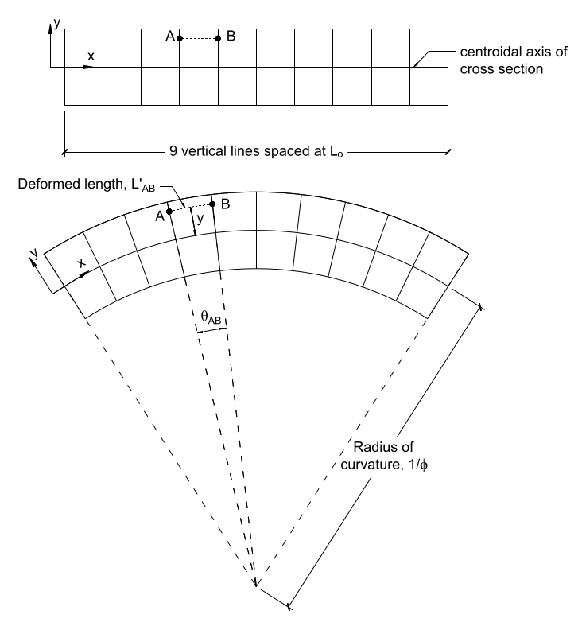

# Lecture 10, Oct 4, 2021

## Bending: Plane Sections Remain Plane

{width=50%}

* Just as in the case with tension, the moments inside a bent member remain constant throughout the member
* Consider a series of vertical lines drawn on the beam $L_0$ units apart
	* The fundamental assumption for bending is that these lines stay straight lines when the beam is bent
	* It is assumed that the horizontal length at the centroid axis does not change
	* The beam curves into an arc, with lines separating at the top and getting closer together at the bottom (described by Hooke as "plane sections remain plane")
* One way to measure how bent the beam is is to measure the angle, but that depends on the length of the beam, so to quantify the bending we introduce the *curvature* $\phi = \diff{\theta}{x}$, or in the discrete case, the angle between two vertical lines divided by the original distance along them, $L_0$
	* The *radius of curvature* $\frac{1}{\phi}$ is the radius of the circle formed by the bent beam
	* This is also equal to the rate of change of slope with respect to length
	* This measure doesn't depend on the length of the beam; no matter where we calculate it between it is the same (with the simplifying assumptions)
* **Curvature $\phi$ is a measure of bent-ness**
* Bending produces strain because the distance between vertical lines changes except at the centroid
* Note: The following calculations assume a small deformation; these equations are good for angles up to $10\degree$
* Consider the spacing between two points $L_{AB}$ located a distance $y$ above the centroid
	* The angle produced by bending is $\theta _{AB} = \phi L_0$
	* The radius of the centroid is $\frac{1}{\phi}$ so the radius to the points $A$ and $B$ is $y + \frac{1}{\phi}$
	* Therefore the new distance is $L'_{AB} = (\phi L_0)\left(y + \frac{1}{\phi}\right) = \phi yL_0 + L_0$
	* The strain between $A$ and $B$ is then $\varepsilon(y) = \frac{\Delta l}{L_0} = \frac{L'_{AB} - L_0}{L_0} = \frac{\phi yL_0 + L_0 - L_0}{L_0} = \phi y$
* $\varepsilon(y) = \phi y$ is the fundamental relationship between strain and curvature in a member
	* Notice how the strains are not constant over the cross section and depends on $y$; at the very bottom there is maximum compressive strain, at the top maximum tensile strain and at the centroid no strain

## Flexural Stiffness

* Like how tension is related to elongation for axial forces, there is a relationship between the curvature of a bent member and its carried moment
* Consider a cross-section; if we take a small slice of that cross section with area $\Delta A$, then $\Delta F = \sigma(y)\Delta A = E\phi y\Delta A$
	* Since this force doesn't pass through the centroid axis, it produces a moment $\Delta M = \Delta F \cdot d = \Delta F \cdot y = E\phi y\Delta A \cdot y = \phi Ey^2\Delta A$
	* Now we can take the integral to find the moment carried by the entire cross-section: $M = \int _A \phi Ey^2\,\dA = \phi E\int _A y^2\,\dA$
	* Recall from last lecture that for a 2d object with constant density $I_m = \rho I$ where the second moment of area $I = \int _A y^2\,\dA$
	* Therefore $M = EI \cdot \phi$
* $EI$ is the *flexural stiffness* of the member, which relates the moment (force-based quantity) to the curvature (displacement-based quantity)
	* Axial force $F \leftrightarrow$ Bending moment $M$
	* Axial stiffness $k \leftrightarrow$ Flexural stiffness $EI$
	* Displacement $\Delta l \leftrightarrow$ Curvature $\phi$
	* $F = k\Delta l \leftrightarrow M = EI\phi$

