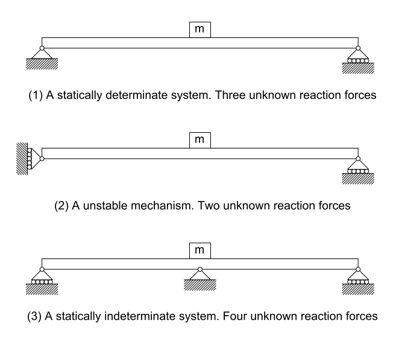

# Lecture 11, Oct 5, 2021

## Structural Analysis

* Often we want to analyze the forces in a structure in response to loads such as objects, wind, earthquakes, etc
* *Stick models* are used as simplifications, with *members* connected at *joints*
* Member types:
	* Mostly horizontal: Beams (usually with less axial compression and maybe more bending)
	* Mostly vertical: Columns (usually with a lot of axial compression)
	* ~~Diagonal: Beam-Columns~~
* Types of loads:
	* Axial loads $F_x = N$ (normal to cross section)
	* Shear loads $F_y = V$ (vertical)
	* Moments and internal bending moments $M$

## Supports

* Supports hold up the structure and create *reaction forces* to hold up the structure
* The reaction forces are closely related to the level of restraint of the support; e.g. a hinge stops all translational movement but allows rotational movement
* As the amount of restraint provided by the support increases, its ability to provide a reaction force along that degree of freedom increases
* In structural engineering, the 3 most common types of supports and connections are *rollers*, *pins*, and *fixed ends*:
	1. Rollers: Only resist translational forces in 1 direction and cannot resist forces in other directions **or moments**
	2. Pins/hinges: Cannot resist moment but resist translational movement
		* When deformed, angles may change
		* When cut for FBD, there is an internal horizontal force and vertical force that are equal and opposite between diagrams
	3. Fixed ends/rigid connections: Allows no movement
		* Even when deformed, fixed ends have angles of $90\degree$, and the beams just bend
		* When cut for FBD, there is an internal horizontal force, vertical force, and moment that are equal and opposite between diagrams
* Whenever there is no motion in a degree of freedom for a support, there is a reaction force along that degree of freedom
* Note: Supports in real life cannot be perfectly described by the 3 idealized supports above, so choosing the type that best represents real life requires engineering judgement and experience
* A *degree of freedom* in this context is how many variables are needed to describe the system
	* 3 degrees of freedom, 2 translational, 1 rotational, are used to describe a non-deformable body in 2D
	* Supports fix some of them but leave some of them free, reducing the number of degrees of freedom

## Solving for Reaction Forces -- Free Body Diagrams

* To solve for reaction forces in a structure, free body diagrams are drawn for every interaction
* The 3 key equilibrium equations are used to solve for the unknown forces: $\threepiece{\sum F_x = 0}{\sum F_y = 0}{\sum M = 0}$
	* Note: In 3 dimensions there are 3 axes of translational equilibrium and also 3 axes of rotational equilibrium $\theta _x, \theta _y, \theta _z$, together 6 degrees of freedom

## Statically Determinate Structures

{width=50%}

* A structure is *statically determinate* if its reaction forces can be directly solved for using the 3 equilibrium equations
* Forces in statically determinate structures do not depend on the stiffness of the structure
* Most simple 2D structures are statically determinate if their supports provide 3 reaction forces (since there are 3 equilibrium equations)
* Structures with fewer reaction forces than the number of equilibrium equations are called *mechanisms*, because they are *unstable* and can accelerate when subject to an applied load
	* If the system ends up being unsolvable the system would be moving since one of the degrees of freedom is not in equilibrium
	* If the system ends up being solvable, then it is not moving, but any applied force in the right direction would cause it to move
* *Statically indeterminate* structures have more reaction forces than the number of equilibrium equations, so solving them require considering other factors such as stiffness and load distribution
	* The *degree of indeterminacy* is the number of reaction forces minus the number of equilibrium equations
* (1) is a *simply supported beam* (pin on one end, roller on the other end) -- these beams can bend and change length freely

## Example: Internal Hinges

{width=50%}
{width=50%}

* Some structures are built with an internal hinge, which provide only two translational forces
* We can split the FBD at the hinge, which introduces 2 internal hinge forces, but 3 additional equilibrium equations, effectively reducing the indeterminacy by 1
* On the left: $\threecond{\sum F_x = 0}{\implies A_x - C_x = 0}{\sum F_y = 0}{\implies A_y - C_y = 0}{\sum M = 0}{\implies hC_x = 0}$
* On the right: $\threecond{\sum F_x = 0}{\implies B_x + C_x = 0}{\sum F_y = 0}{\implies B_y + C_y - P = 0}{\sum M = 0}{\implies \frac{L}{2}P - hC_x - LC_y = 0}$
* Since we have 6 equations and 6 unknowns this system is now statically determinate

