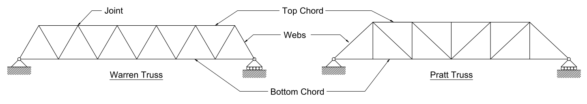
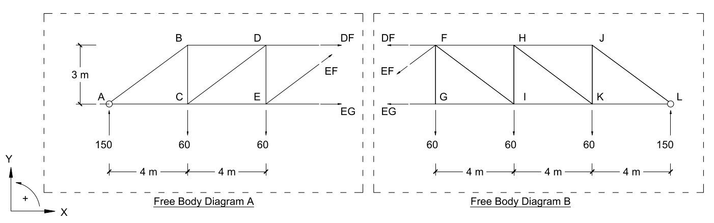

# Lecture 12, Oct 11, 2021

## Truss Bridges

* Trusses are assemblies of steel or wood connected to form lattice-like structures
* Modern truss bridges are commonly built using steel (often hollow tubes) bolted or welded together
* The cross members at the top are called wind bracings and resist horizontal loads caused by winds etc
* Why use trusses?
	1. They're light since most of their volume is air (including hollow members)
	2. They're stiff -- they deform very little under loads (the taller the truss, the stiffer it is)
	3. They're very efficient

## Design Process for Truss Bridges

Note these are *elevation views* (views from the side); there are also *plan views* that look at it from above

1. Define the truss geometry: The span, height, deck width and configuration are determined
	* Increasing the height of the truss at the midspan reduces the forces in the top and bottom chords but increases cost
	* Also includes the number of vertical and diagonal members, which comes from experience
2. Estimate the joint loads: Estimate the point loads where the deck meets the structure
	* Assumptions:
		1. All connections are modelled as hinges/pins
		2. All loads are applied at joints
		* As a result of these assumptions, all members only carry axial loads (no bending)
	* The loads are often assumed to be uniform, unless designing for trains or very short bridges where every wheel matters
	* Load estimations:
		* The total load must take into account the weight of the deck, the self-weight of the truss structure, and live loads such as people
		* $w_{total} = w_{deck} + w_{struct} + w_{live}$
		* The live load is often taken as $5.0\si{kPa}$, or $100\si{lbs/ft^2}$
		* For wood decks $w_{deck}$ can be estimated as $1.0\si{kPa}$
		* $w_{struct}$ is typically between $0.5$ to $1.0\si{kPa}$ when using hollow steel members to span distances up to $100\si{m}$
		* The joint load $P_i = w_{total}A_{trib}$ where $A_{trib}$ is the joint's *tributary area*, the area it is responsible for supporting
		* {width=70%}
3. Solve for the reaction forces and analyze all member forces
4. Size the members so they can safely resist the loads (lecture 15)
5. Repeat steps 1-4 to design cross bracing
	* Cross bracing is added to resist horizontal loads caused by wind and instability effects (lectures 16-17)
6. Calculate the stiffness of the bridge by estimating the deflection at the midspan (lecture 18)
7. Design against dynamic loads: Testing for resonance (lecture 19)
8. Check if the initial estimate of structure weight is greater than the actual structure weight
	* Initially the bridge was designed with an estimate of $w_{struct}$, so now we need to make sure that estimate was reasonable
	* If the real weight is greater than $w_{struct}$ the process must be repeated with a more conservative estimate
9. Detailed design
	* Everything before this is the preliminary design; the actual detailed process for the design is more complicated and not covered in first year

## Analysis By Method of Sections (From Lecture 13)

* With the Method of Joints, calculating forces in the middle of the bridge is a tedious process; for preliminary designs and estimates the Method of Sections can be used to get them faster
* This method uses all 3 equilibrium equations to solve for up to 3 unknown member forces that pass through a section of the truss
* The truss is cut at some location and 2 free body diagrams are constructed:
* 
* In Diagram A, $\threecond{\sum F_x = 0}{\implies DF + EF_x + EG = 0}{\sum F_y = 0}{\implies 150 - 60 - 60 + EF_y = 0}{\sum M = 0}{\implies 60 \cdot 4 - 150 \cdot 8 - 3DF = 0}$
	* The equations of equilibrium should only include the support reaction forces, the joint loads, and the unknown internal forces we're trying to solve for
	* Note point $E$ was taken for the moments, since this eliminates $EF$, $EG$ and load at $E$, leaving only 1 unknown force ($DF$) in the equation

