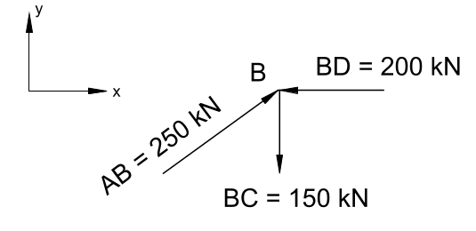

# Lecture 13, Oct 12, 2021

## Truss Analysis

* Two methods for analyzing truss bridges:
	1. Method of joints, more suitable for analyzing forces over the whole bridge; uses only the translational equilibrium equations
	2. Method of sections, more suitable for quickly analyzing forces over sections of the bridge; uses all 3 equilibrium equations
* First the joint loads are determined from the distributed area loads
* The reaction forces from the supports are then calculated using equilibrium equations
* For a simply supported bridge with a roller on one end and a pin on the other end, the vertical load is shared equally between them due to symmetry, making each vertical reaction force equal to half the total load

## Method of Joints

* The Method of Joints analyzes the bridge joint by joint
* Start at the end joints that meet the supports, since all other joints have too many unknown forces
* {width=30%}
* Once we have the free body diagrams we can calculate the forces at this joint; if force vectors form a closed loop when arranged tip-to-tail, the joint is in equilibrium
* With these forces we can now move on to other joints; note the order of joints is important, as some joints may still have too many forces to be solved
	* Since we're only using the two translational equilibrium equations, any joint that has 3 or more unknown forces is unsolvable at the moment
* Note the forces on the joints are applied *by* the members, not *to* the members; as a result, special care must be taken to tell whether a member is in tension or compression
	* Since the joint forces are applied by the members, the actual force applied to the members is the exact opposite by Newton's third law
	* {width=70%}
	* In the following image, $BD$ is in compression, and $BC$ is in tension
	* {width=25%}
* After repeating this process for half of the joints (the other half can be determined by symmetry), the final forces are presented:
* 
* Note that the sign convention is **tension is positive** and **compression is negative**

## Method of Sections

* With the Method of Joints, calculating forces in the middle of the bridge is a tedious process; for preliminary designs and estimates the Method of Sections can be used to get them faster
* This method uses all 3 equilibrium equations to solve for up to 3 unknown member forces that pass through a section of the truss
* The truss is cut at some location and 2 free body diagrams are constructed:
* 
* In Diagram A, $\threecond{\sum F_x = 0}{\implies DF + EF_x + EG = 0}{\sum F_y = 0}{\implies 150 - 60 - 60 + EF_y = 0}{\sum M = 0}{\implies 60 \cdot 4 - 150 \cdot 8 - 3DF = 0}$
	* The equations of equilibrium should only include the support reaction forces, the joint loads, and the unknown internal forces we're trying to solve for
	* Note point $E$ was taken for the moments, since this eliminates $EF$, $EG$ and load at $E$, leaving only 1 unknown force ($DF$) in the equation

