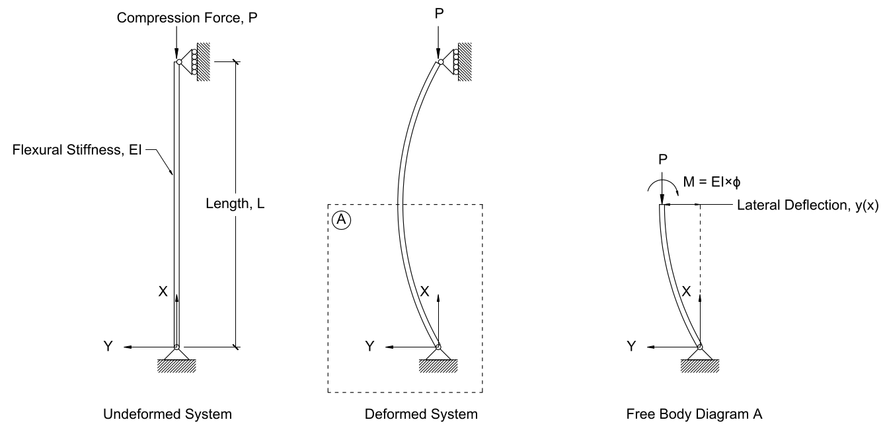
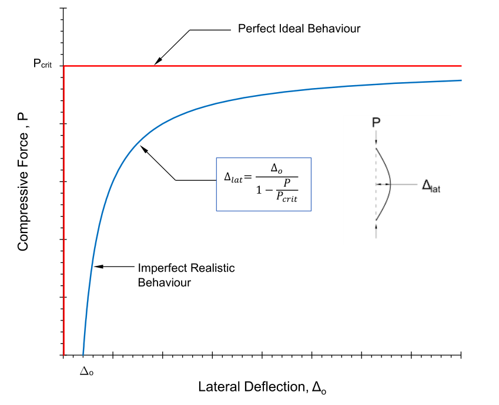

# Lecture 14, Oct 13, 2021

## Euler Buckling

{width=50%}

* Methods under compression can fail in 2 ways:
	1. *Crushing*: Typically occurs for short, stocky members; the member shortens; the force that causes crushing is the *squash load*
		* The squash load is simply $P_{c} = \sigma _{c}A$
	2. *Buckling*: Typically occurs for long, thin members; the member curves and folds
		* The load that causes this is the *Euler load* $P_e = \frac{\pi^2 EI}{L^2}$
* The original length is the longest, the buckled length is less long and the shortest length is the crushed length; since the buckled length is greater than the crushed length, it has less strain energy and so it is the lower energy state so nature prefers it
* The method in which a compressive member fails depends on the force required to cause crushing or buckling; whichever requires less force will be the method of failure

## Derivation of Euler Load

{width=80%}

* Fundamental assumptions:
	1. The material is homogeneous and linear elastic (constant Young's modulus $E$ and second moment of area $I$)
	2. The ends are free to rotate and the top is free to move vertically (i.e. a roller at the top, a pin at the bottom)
	3. The member starts straight and the ends cannot move horizontally
* At the cut, the compressive force $P$ and the vertical support are equal and in opposite directions and separated by a distance, so they form a couple; to resist it the beam carries an internal clockwise moment $M$
	* Since $P$ and the vertical support force form a couple, $Py = M = EI\phi$
	* Recall that the curvature is the derivative of the slope, which is the second derivative of displacement; since the second derivative is negative in this case, we have $\phi = -\diffn{2}{y}{x}$
	* The curvature is the negative of the second derivative; note when we have a positive slope (curvature) the beam is concave down so the second derivative is negative
		* Explained more in lecture 20
* Combine the equations to get $\frac{P}{EI}y = -\diffn{2}{y}{x}$, which is a differential equation with solution in the form of $y = A\sin(\omega x + B)$; substituting this solution yields $\omega = \sqrt{\frac{P}{EI}}$
	* Since the ends are fixed, $y(0) = 0$ and $y(L) = 0$
		* Substituting $y(0) = 0 \implies A\sin(B) = 0 \implies B = 0$
		* And then $y(L) = 0 \implies A\sin(\omega L) = 0 \implies \omega L = n\pi \implies \omega = \frac{n\pi}{L}$ for $n \in \mathbb{Z}$
	* Substitute $\frac{n\pi}{L} = \omega = \sqrt{\frac{P}{EI}} \implies \frac{n^2\pi^2}{L^2} = \frac{P}{EI} \implies P = \frac{n^2\pi^2 EI}{L^2}$
	* To obtain the smallest nonzero value for $P$ we take $n = 1$ to get $P_e = \frac{\pi^2 EI}{L^2}$

## Higher Modes of Buckling

{width=70%}

* The $n$ term in $P = \frac{n^2\pi^2 EI}{L^2}$ and $\omega = \frac{n\pi}{L} \implies y(x) = A\sin\left(\frac{n\pi}{L}x\right)$ lets us "choose" the number of half-oscillations $y$ goes through down the entire beam
* The higher modes of buckling do occur but are much more rare because the $P$ force is much greater
* Oscillations in $y$ correspond to more complex types of buckling, where instead of curving into 1 arc, the beam curves into a sine wave; this corresponds to higher modes of buckling

## Buckling of Imperfect Members

{width=50%}

* Unlike tension, buckling is an unstable equilibrium; once a member starts to buckle it will continue to weaken and curve more until it fails
* Under ideal conditions members will stay straight until the Euler load is reached, at which point they suddenly buckle and the force stays constant
* In real life, as the angle of buckling gets larger, the force required gets smaller
* However, real members are imperfect and have some initial lateral deflection at their midpoint $\Delta _0$
* Richard Southwell derived the equation $\Delta _{lat} = \frac{\Delta _0}{1 - \frac{P}{P_{crit}}}$ that relates lateral deflection $\Delta _{lat}$ to load $P$
	* The $P_{crit}$ is the critical buckling load, and for members satisfying the Euler conditions (homogeneous, elastic, roller at one end and pin at the other) this is equal to the Euler load $P_e$

