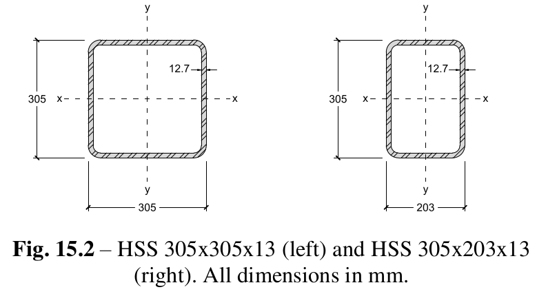

# Lecture 15, Oct 18, 2021

## Design Process for Trusses

1. Determine loading
2. Determine joint forces
3. Solve for forces in the truss (method of joints or method of sections)
4. Select the **size** and **safety** of the members

## Design of Tension Members

* Structures are designed according to the yield instead of the ultimate strength, since the savings are not worth the risks and large deformations are undesirable
* An appropriate FoS for yield is 2.0, with most steel having a $\sigma _y = 350\si{MPa}$
* Second moments of area don't need to be considered for tension members since they cannot buckle

## Design of Compression Members

* To prevent crushing/squashing, the same FoS and design process for tension members can be used
* To prevent buckling, a higher FoS of 3.0 is used because bucking is more dangerous
	* Buckling occurs more suddenly and is more unstable so the consequences are greater
	* Post-bucking strength can be 0, unlike post-yielding strength which is greater than the yield strength
	* If a member must carry a compressive force $F$, then $P_e = \frac{\pi^2 EI}{L^2} \implies I = \frac{P_eL^2}{\pi^2E} \implies I \geq 3.0\frac{FL^2}{\pi^2 E}$
* Unlike the yield stress, the Euler buckling stress $\sigma _e = \frac{P_e}{A} = \frac{\pi^2EI}{AL^2}$ does depend on the length of the member and is not a material property
	* If we set the *radius of gyration* $r = \sqrt{\frac{I}{A}}$, then $\sigma _e = \frac{\pi^2EI}{AL^2} = \frac{\pi^2E}{L^2}\frac{I}{A} = \frac{\pi^2E}{L^2}r^2 = \frac{\pi^2E}{\left(\frac{L}{r}\right)^2}$
	* $\frac{L}{r}$ is the *slenderness ratio*, a dimensionless quantity that describes how easy the member buckles; members with larger values tend to buckle instead of squash
		* Larger values means that $\sigma _e$ is smaller, so the stress required to cause buckling is smaller so buckling is more likely
	* The radius of gyration is not a physical quantity and does not actually correspond to a circle
		* Since $I$ is a property that affects the flexural stiffness of a member and $A$ affects the axial stiffness, the radius of gyration is a ratio of a member's flexural stiffness to its axial stiffness
		* If a member is more easily bent than stretched/compressed (low flexural stiffness, high axial stiffness), then $r$ will be small, which means the slenderness ratio is large and the member is more likely to buckle
		* If we had 2 point areas, both $\frac{A}{2}$, with a distance between $2r$ between them, and this had the same moment of inertia as the member, the $r$ is the radius of gyration
* {width=70%}
* For low slenderness ratios $\sigma _e$ is very high so the member fails at its yield strength; for large slenderness ratios $\sigma _e$ decreases rapidly so the member fails at a fraction of its yield strength
* The red curve is the failure stress of the member, also known as the *failure envelope*
* The blue curve instead considers the minimum of the allowable yield stress and buckling stress and is the one we should design for
* Under the blue curve is safe, between blue and red is unsafe but won't fail, and outside red will fail
* Modern design codes also limit the slenderness ratio (often to 200) to discourage the use of very slender members that are vulnerable to unexpected load changes; $\frac{L}{r} \leq 200 \implies r \geq \frac{L}{200}$

## Hollow Structural Sections (HSS)

* HSS are hollow steel tubes formed by rolling sheets of steel and come in square, rectangular, or circular cross sections; they are light, strong and stiff and often used for truss design
* HSS are strong, stiff, and light
* Height, width and thickness are the key geometric properties for HSS
* {width=50%}
* The *designation* of an HSS (the nominal dimensions) is different than the size (the actual dimensions); in reality HSS 305x203x13 will have a wall thickness of 12.7mm, not 13mm, because imperial vs metric units
* Typically one HSS size is chosen for the entire top chord or bottom chord of a bridge; the web members (which are smaller than the chords so they can connect together) can be individually sized to their loads

