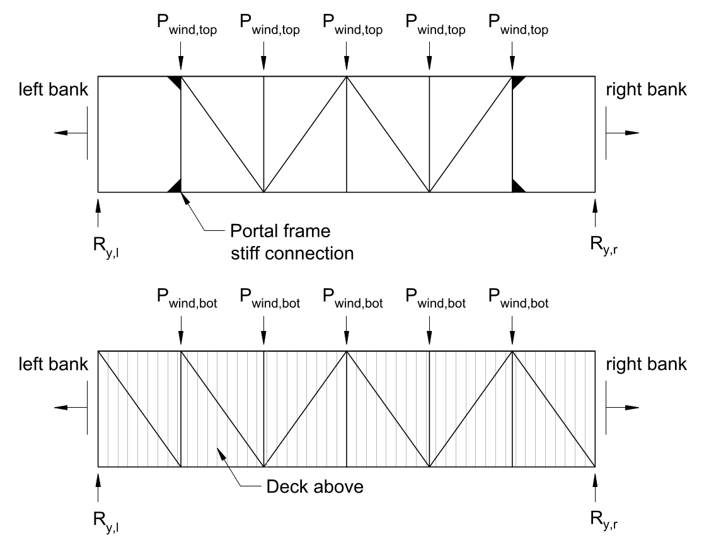
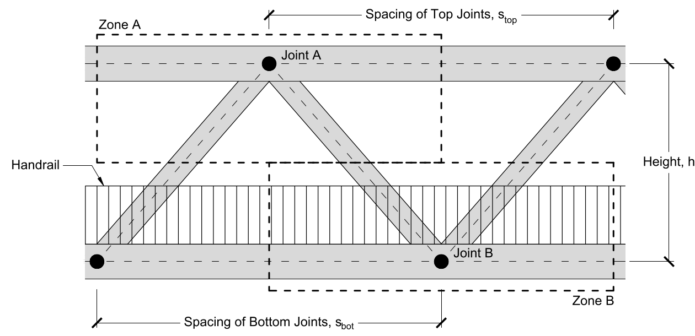

# Lecture 16, Oct 19, 2021

## Resisting Wind Loads

* Wind forces can be calculated with $F = \frac{1}{2}\rho v^2c_DA$, where $\rho$ is air density, $v$ air velocity, $A$ is the frontal area on which the wind acts, and $c_D$ is the drag coefficient
	* For boxy objects like walls and most structural members we can take a conservative value of 1.5, and assuming a wind speed of 170km/h the wind load is approximately $2.0\si{kPa}$ of horizontal load
* Cross bracing is added to connect the top chords to each other and the bottom chords to each other, just like how vertical trusses transfer gravitational load
* Wind can blow or pull away on either side, creating 4 possible loading combinations
	* Members must be designed for both tension and compression

## Solving For Forces

* In the bottom bracing, method of joints/sections can be used as usual, after first determining the reaction forces $R_{y,l}$ and $R_{y,r}$
* There are no diagonal members in the left and rightmost sections of the top cross bracing so the bridge could be entered; instead the connections are typically stiffened
* We can still analyze it using method of joints/sections by assuming that the reaction forces provided by the supports can be transferred to the stiff connections and ignoring the end sections
* Actually moving this support force to the top requires a good frame design, which is not covered in this course

## Calculating Joint Loads

* To calculate the joint loads, we need to know the frontal area of each joint; this is determined by the tributary area method, but is more complicated
* In the figure above joint B will have a greater load because of the handrail
* In joint A, we can approximate the frontal area by summing the area of each piece, which is approximated by its length times its width
* Handrails consisting of vertical members close together can be approximated by a solid surface, because the resulting turbulence from air passing through increases the drag force
* In joint B, the frontal area of the handrail is much larger than the frontal area of the HSS, so the HSS can be ignored for simplicity

