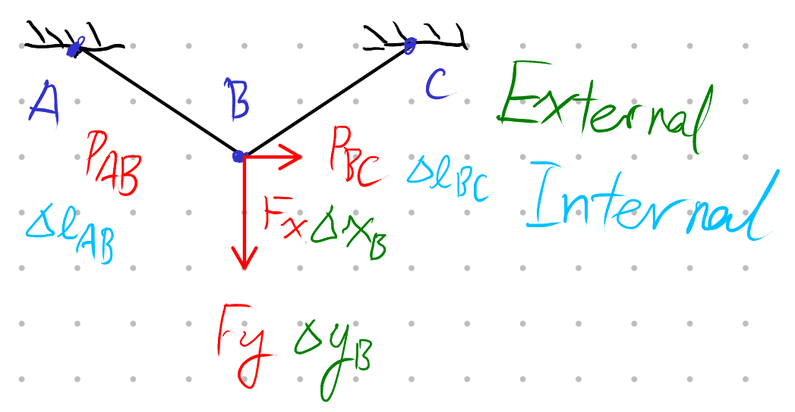
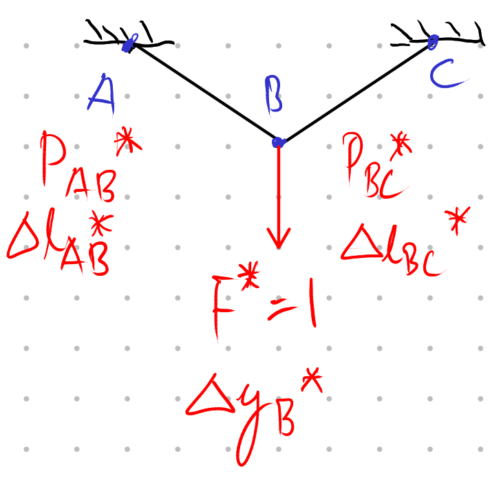
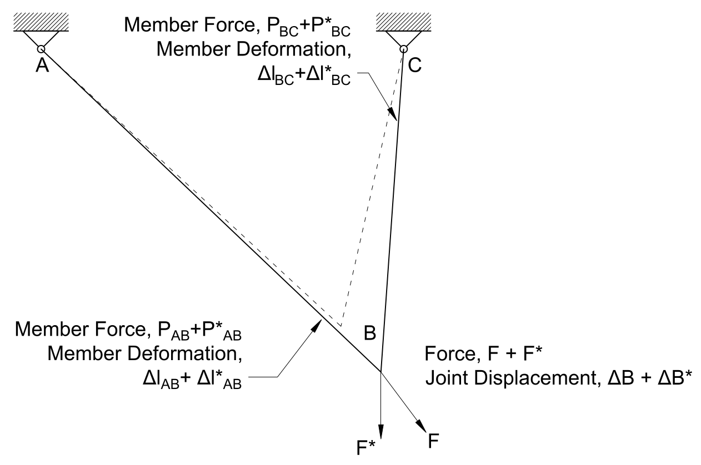

# Lecture 17, Oct 20, 2021

## Truss Deformations

{width=30%}

* When a truss is loaded, it will deform, and we need to know how much it deforms, as well as how much it vibrates
* Usually we limit the displacement to $\Delta < \frac{L}{300}$
* We need a general method to calculate the displacements of trusses
* An energy based approach can be used: by conservation of energy, the external work done $E_{ext} = E_{int}$, the internal work done
	* External work is work done by "external forces", that is, applied loads such as cars on a truss bridge; since this force moves over a distance, it does work
	* Internal work is the strain energy in each member
	* This assumes that there are no other energy sources or sinks such as friction
* {width=60%}
* $W_{ext} = W_{in} \implies \int F_x\,\dd\Delta x + \int F_y\,\dd\Delta y + \cdots = \int P_{BC}\,\dd\Delta l_{BC} + \int P_{AB}\,\dd\Delta l_{AB} + \cdots$
	* Assume Hooke's law applies, this simplifies to $\frac{1}{2}F_x\Delta x_B + \frac{1}{2}F_y\Delta y_b = \frac{1}{2}P_{AB}\Delta l_{AB} + \frac{1}{2}P_{BC}\Delta l_{BC}$
	* We know the internal forces $P_{AB}$ and $P_{BC}$ and their changes in length, so we know the right hand side
	* We also know the applied loads $F_x$ and $F_y$, so the unknowns are $\Delta x_B$ and $\Delta y_B$, but only one equation, so we need something else

## Method of Virtual Work

* For this method, we remove all the real loads, but keep the geometry, the boundary conditions, and the material properties to get us the virtual system
* We apply a single load $F^*$ onto the new virtual system
	* This load has an arbitrary value and it eventually cancels out
* The load is applied at the location of interest in the direction of interest
	* Usually we choose the middle of the structure going downwards to calculate the maximum vertical deformation in a truss
* Since $F^*$ is arbitrary, we can make it 1 for simplicity
* {width=40%}
* $W_{ext} = W_{int} \implies \frac{1}{2}F^* \Delta y_B^* = \frac{1}{2}P_{AB}^*\Delta l_{AB}^* + \frac{1}{2}P_{BC}^*\Delta l_{BC}^*$
	* The right hand side and $F^*$ are known since we can solve for them, so we have one unknown and can solve for $\Delta y_B^*$
* We have a series of displacements and a series of forces
* We can take the displacements from the real system and mix it with the forces from the virtual system and it still works
* The *principle of virtual work* says that the external energy from the **virtual** external forces moving through the **real** external displacements will be equal to the internal energy from the **virtual** internal forces moving through the **real** internal displacement
	* i.e. The forces we're going to use are the virtual ones, but the displacements are real; this allows us to solve for real displacement
* Apply the principle: $W_{ext} = W_{int} \implies F_x^*\Delta x_B + F_y^*\Delta y_B = P_{AB}^*\Delta l_{AB} + P_{BC}^*\Delta l_{BC}$
	* The $\frac{1}{2}$ doesn't just cancel out; it's more correct this way and easier too
	* In our case $F_x^* = 0 \implies F_y^*\Delta y_B = P_{AB}^*\Delta l_{AB} + P_{BC}^*\Delta l_{BC}$, and since $F^* = 1$ we now have an equation for the displacement
	* Virtual: $F_y^*, P_{AB}^*, P_{BC}^*$, which come from solving method of joints analysis of the virtual system
		* The $P_{AB}^*$ and $P_{BC}^*$s tell you how important each member's displacement is
	* Real: $\Delta y_B = ?, \Delta L_{AB}, \Delta L_{BC}$, the latter two can be solved and are the internal change in length due to the **real** loads
	* When we use this method we need to solve the system twice, once for the real loads to get the real displacements, and once with the virtual loads to get the virtual internal forces
* Overall procedure:
	1. Solve for the real internal forces in the truss (real loads)
	2. Calculate the internal changes in length for each member from the real loads ($\Delta l_{BC}$, $\Delta l_{AB}$)
	3. Remove the real loads and apply a $1\si{kN}$ virtual load at the joint of interest in the direction of interest
	4. Solve for all internal virtual forces due to the virtual load
	5. $F^*\Delta = \sum _{i = 1}^n P_i^*\Delta l_i$

## Why the Method Works

* Assuming members are linear elastic, the behaviour of the entire structure is linear and follows the superposition principle; if we combine two loads then the combined deformation is simply equal to the sum of the individual deformations
* This means we can combine the virtual load + deformation and the real load + deformation into a single system:
* {width=50%}
* We can then analyze the load-displacement graphs for both the internal and external loads:

{width=60%}

* In the graph, the red area is the work done by the real loads, and the blue area is the work done by the virtual loads
* The top graphs show the plots for external forces (in both the $x$ and $y$ directions), and the bottom graphs show the plots for internal forces (in both the left and right members); because we added an additional virtual load in only the $y$ direction, the top right graph has some blue area caused by the virtual load
* Because of superposition and conservation of energy, the combined area of the top two graphs and the combined area of the bottom two graphs are equal (internal work equals external work)
* Additionally, because the real and virtual forces can exist on their own and they also have their internal work equal external work, the total blue area in the top graph is equal to the total blue area in the bottom graph, and the total red area in the top graph is equal to the total red area in the bottom graph
* Therefore, the total purple area in the top graph is equal to the total purple area in the bottom graph; this purple area represents the product of a real displacement and a virtual force, which is why $F^*\Delta = \sum P_i^*\Delta l_i$
	* The purple area is a rectangle instead of a triangle, which is why in $F_x^*\Delta x_B + F_y^*\Delta y_B = P_{AB}^*\Delta l_{AB} + P_{BC}^*\Delta l_{BC}$, there is no $\frac{1}{2}$ multiplier

