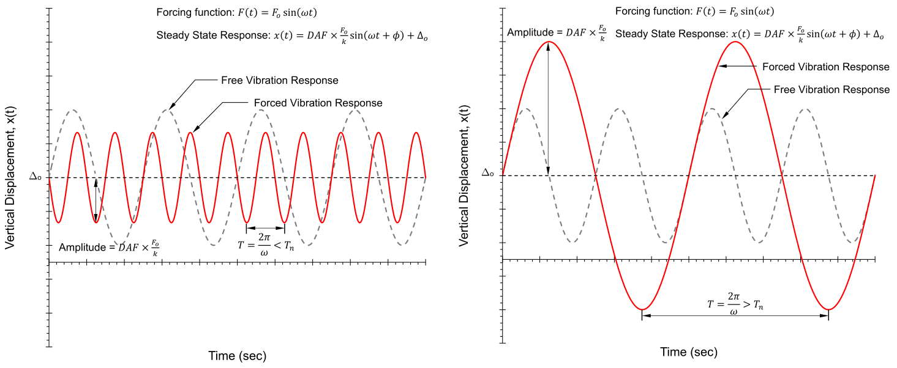

# Lecture 19, Oct 25, 2021

## Damped Free Vibrations

* Oscillating systems will eventually stop due to loss of energy by *damping*, which could be engineered or an inherent system property
* Damping is quantified by the damping ratio $\beta$, the ratio between the provided damping properties of the system and the minimum amount of damping to prevent it from oscillating completely
	* *Critical damping* is the amount of damping that can make the system stop oscillating the fastest
	* More damping (overdamped) will make the system reach equilibrium slower, and less damping (underdamped) will cause it to oscillate
* In civil structures $\beta$ range from $0$ to $0.05$
* For a damped system, the differential equation becomes $m\diffn{2}{x}{t} + 2\beta\sqrt{mk}\diff{x}{t} + kx = 0$
* The solution is an exponentially decaying sinusoid with the form $x(t) = Ae^{-\beta\omega _n t}\sin(\omega _d t + \phi) + \Delta _0$, where:
	* $A$ is the amplitude of oscillation
	* $\beta$ is the damping ratio
	* $\omega _n$ is the natural frequency $\sqrt{\frac{k}{m}}$
	* $\phi$ is the phase delay
	* $\Delta _0$ is where the system naturally settles due to gravity
	* $\omega _d$ is the *damped frequency*, related to $\omega _n$ by $\omega _d = \omega _n\sqrt{1 - \beta^2}$
		* Since $\beta$ is usually low in civil structures, $\omega _d \approx \omega _n$

## Forced Oscillations

* In reality structures may be subjected to dynamic loading due to the movement of people etc; in the simplest case the load is sinusoidal with $F(t) = F_0\sin(\omega t)$
* Substituting the dynamic load into the equation: $m\diffn{2}{x}{t} + 2\beta\sqrt{mk}\diff{x}{t} + kx = F_0\sin(\omega t)$
* The complete solution is outside the scope of this course but consists of the sum of two parts: the *transient* solution, which dominates when $t$ is small, and the *steady-state* solution, which dominates when $t$ is large and dictates the long-term behaviour of the system
* The steady state solution is more relevant to design and can be expressed as $x(t) = \text{DAF} \cdot \frac{F_0}{k}\sin(\omega t + \phi) + \Delta _0$
	* DAF is the *dynamic amplification factor*, calculated as $\frac{1}{\sqrt{\left(1 - \left(\frac{f}{f_n}\right)^2\right)^2 + \left(\frac{2\beta f}{f_n}\right)^2}}$, where $f$ is the driving frequency and $f_n$ is the natural frequency of the system
	* From the equation for the DAF we can see that the response of the system is strongly influenced by $\frac{f}{f_n}$, as it influences both the frequency and the amplitude of the response through the DAF

## Resonance

{width=50%}

* The DAF has the highest value when the driving frequency is approximately equal to the natural frequency, which leads to a very high increase in amplitude known as *resonance*
* Increasing the amount of damping increases $\beta$ and reduces the DAF, especially the peak value at resonance
* The DAF is $1$ when $\frac{f}{f_n}$ is 0, and gradually becomes 0 as the ratio $\frac{f}{f_n}$ becomes large, with a peak at $\frac{f}{f_n} = 1$

## Designing for Dynamic Effects

* To check for dynamic effects, we don't need to solve the whole system; we just need to check whether the maximum stress results in failure
* Consider a set of dynamic loads $w_{tot} = w_{sta} + w_0\sin(\omega t)$, where $w_{sta}$ is the stationary component of loading, which does not vary in time, such as the dead load of the structure and the weight of a standing crowd of people; $w_0$ and $\omega _0$ is the dynamic load caused by, for example, a crow of people walking around
* When designing a pedestrian bridge the frequency of loading caused by walking is typically assumed to be $2\si{Hz}$; therefore unless there is significant damping, having a natural frequency close to $2\si{Hz}$ can lead to large oscillations and possibly collapsing the structure
* The equivalent static load is then $w_{eq} = w_{sta} + \text{DAF} \cdot \omega _0$ as the maximum amplitude of oscillation is scaled by the DAF
* The DAF can be calculated once the damping $\beta$ and natural frequency $f_n$ are determined; using the equivalent static load we can then check whether the members can withstand the stresses
* For a point load at the midspan, the natural frequency can be estimated to be $f_n = \frac{15.76}{\sqrt{\Delta _0}}$; for a UDL at the midspan $f_n = \frac{17.76}{\sqrt{\Delta _0}}$, where $\Delta _0$ is the midspan deflection under $w_{sta}$ in mm, i.e. how much the midspan of the structure deforms with just the static load

