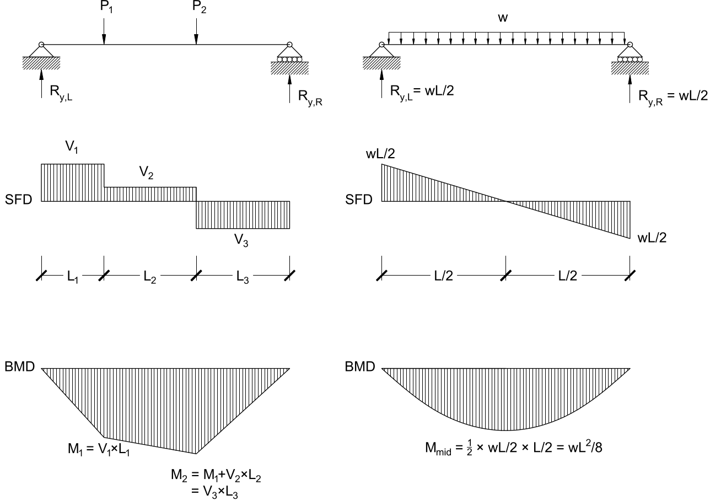

# Lecture 20, Oct 26, 2021

## Stress Resultants: Beyond Tension and Compression

{width=50%}

* By cutting a beam we expose internal forces; these forces are the *stress resultants*
* Note that the overall beam is in neither tension nor compression
* The horizontal force parallel to the longitudinal axis is the *axial load* $N$ or $P$, the vertical force perpendicular to the axis is the *shear force* $V$ and the moment is the *bending moment* $M$
	* If there is too much deformation due to the shear force, the beam will deform in a shear transform
	* We design our trusses so that both the moment and shear force are zero; in reality there is some caused by the self-weight but this is ignored
* Using the equations of equilibrium: $\threecond{\sum F_x = 0}{\implies N = R_{x,L}}{\sum F_y = 0}{\implies V = R_{y,L} - wx}{\sum M_o = 0}{\implies M = R_{y,L}x - (wx)\left(\frac{1}{2}x\right)}$
* Notice that unlike tension/compression these forces change depending on where you cut the beam, i.e. they vary over the length

## Shear Force and Bending Moment Diagrams

* It turns out that the shear force is related to the vertical applied loads $w(x)$ by $w(x) = \diff{}{x}V(x)$, and the moment is related $\diff{M}{x} = V(x)$; i.e. the shear is the derivative of bending moment, and the applied load is the derivative of shear
	* Applied loads will increase the shear; the shear force has sudden jumps at locations where there are concentrated reaction forces or loads
	* Shear forces will increase the moment
* $\Delta M = \int _A^B V(x)\,\dx$ and $\Delta V = \int _A^B w(x)\,\dx$
* Therefore we can find the graph of shear and moment over the length of a member by integrating the loads
* For a shear force diagram, imagine you're walking across the bridge from the left to the right and accumulating the loads
* For a bending moment diagram, take the area under the shear force diagram
* We know the shear force and bending moment diagrams are correct if they start and end at 0
* Upward loads cause positive shear and downward loads cause negative shear (from left to right)
* Positive bending moments are drawn below the axis and causes a positive moment (from the left to the right); negative moments are drawn above the axis and cause negative moments
* {width=40%}
* {width=50%}

