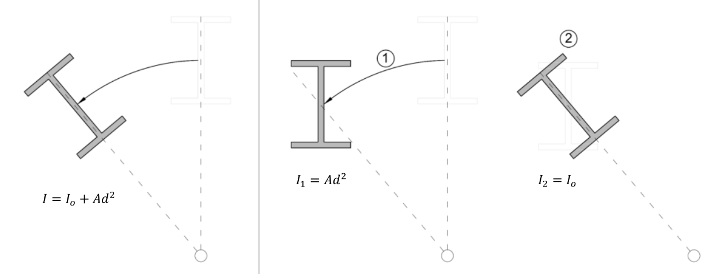
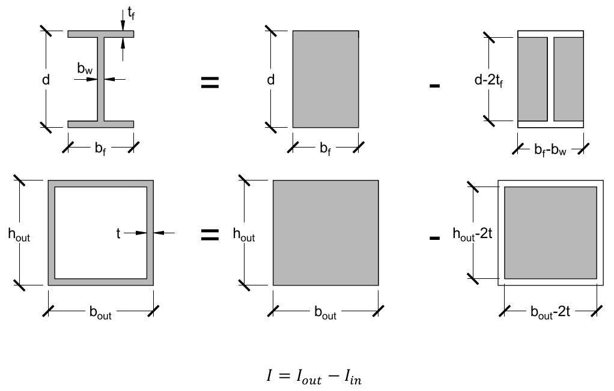

# Lecture 22, Nov 1, 2021

## Calculating the Centroidal Axis

* $\int _A y\,\dA = 0$, derived in the previous lecture, can be used to determine whether the centroidal axis has been determined correctly
	* This integral is typically not evaluated analytically and instead broken up into $\sum _{i = 1}^n y_iA_i$, where $y_i$ is the distance between the area component and the centroidal axis
* We can perform a coordinate transform $y_i = \bar{y} - y_{i,b}$, where $\bar{y}$ is the location of the area component relative to the base of the cross section and $y_{i,b}$ is the vertical distance between the base of the cross section and the centroid, so $0 = \sum (\bar{y} - y_{i,b})A_i \implies \sum \bar{y}A_i = \sum y_{i,b}A_i$; since $\bar{y}$ is a constant, $\bar{y}\sum A_i = \sum y_{i,b}A_i \implies \bar{y} = \frac{1}{A}\sum _{i = 1}^n y_{i,b}A_i$
* The centroidal axis is essentially a centre of mass
* As long as the shape can be broken up into simple shapes that we can determine the centroids of, we can use this to calculate the centroidal axis

## Parallel Axis Theorem

* For simple shapes such as rectangles $\left(\frac{bh^3}{12}\right)$ or circles $\left(\frac{\pi d^4}{64}\right)$, a simple equation for $I$ can be explicitly evaluated; more complex shapes need another method
* We can try breaking up the cross section into smaller pieces and summing them up to get the overall $I$
* When calculating $I$ for these smaller pieces, not all of them will be about their local centroidal axes; $I_0$, the second moment of area about the local centroidal axis, is not the same as $I_i$, the second moment of area about the global centroidal axis
* If the local centroidal axis is $d_i$ from the axis of rotation, then $\alignedeqntwo[t]{I_i}{\int _{A_i} (y + d_i)^2\,\dA}{\int _{A_i} (y^2 + 2d_iy + d_i^2)\,\dA}{\int _{A_i} y^2\,\dA + \int _{A_i} 2d_iy\,\dA + \int _{A_i} d^2\,\dA}{I_{0,i} + 2d_i\int _{A_i} y\,\dA + d_i^2\int _{A_i}\,\dA}{I_{0,i} + A_id_i^2}$
* This is known as the *parallel axis theorem* and allows $I$ to be calculated about an axis parallel to the local centroidal axis; applied to each piece we get $I = \sum _{i = 1}^n (I_{0,i} + A_id_i^2)$, where $I_{0,i}$ is the local second moment of area, $A_i$ is the area of each piece and $d_i$ is the distance between the centroidal axes
* The parallel axis theorem can be interpreted as the total inertia being a sum of the inertia from first translating about the global axis, and then rotating about the shape's own centroidal axis:
* {width=70%}

## Summary and Tips

* For shapes with a horizontal axis of symmetry, the local centroidal axis for all components is the same centre axis, so we can subtract components to calculate more complex shapes
* {width=70%}
* Each component shape is much simpler to calculate, and we can sum them together without having to use the parallel axis theorem because due to symmetry all their centroidal axes are the same
* In summary, to calculate flexural stresses, $\bar{y}$ and $I$ must be determined to calculate stresses, strains and curvature; the steps are as follows:
	1. Break up the cross section into simple shapes whose centroids are $y_{i,b}$ from the bottom of the member
	2. Determine the centroidal axis using $\bar{y} = \frac{1}{A}\sum _{i = 1}^n y_{i,b}A_i$
	3. Calculate the distances between the local centroids of the component areas and the global centroidal axis, $d_i$
	4. Use the parallel axis theorem to determine $I = \sum _{i = 1}^n (I_{0,i} + A_id_i^2)$

