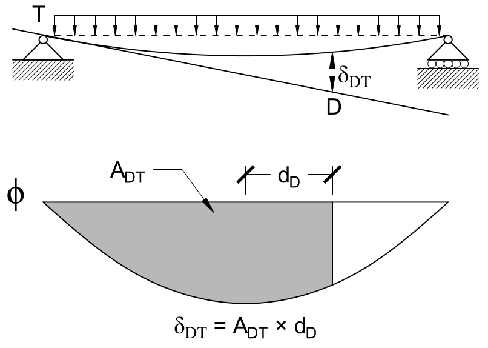

# Lecture 23, Nov 2, 2021

## Curvature Diagrams

* Like shear and moment diagrams, we can draw curvature diagrams
* Recall $\phi = \frac{M}{EI}$, so we can use this and the bending moment diagram to draw a curvature diagram (note $EI$ is usually a constant, so the BMD and curvature diagrams are usually the same shape, just scaled by a constant; $EI$ is not constant if the shape has a changing cross section or is not made of a uniform material)
	* The units of $\phi$ is $\si{rad/mm}$
	* Curvature can have jumps due to changing $EI$, but the moment diagram is always continuous
* Note that the $y$ in $\sigma = \frac{My}{I}$ is not the same as the $y$ in $\phi = \diffn{2}{y}{x}$ (for small angles only); the first is internally in the member itself, the second is the deflection of the beam ($y(x)$ is the displaced shape of the beam)
	* If angles are not small, then $\phi = \frac{\diffn{2}{y}{x}}{\left(1 + \left(\diff{y}{x}\right)^2\right)^{\frac{3}{2}}}$
	* Angles are usually very small so $\diff{y}{x}$ is small and even more so when squared; the difference it causes is usually less than the uncertainties of the material constants so it's irrelevant
* Even though we know the curvature, we still don't know the displaced shape $y(x)$; to do this we need to double integrate, but this is a lot of work
	* Integrating $\phi$ gets $\theta$, and integrating $\theta$ gets us $y(x)$
	* Example: Consider a beam with a $w\si{kN/m}$ distributed load on top; the max bending moment is $\frac{wL^2}{8}$ can can be modelled by $M(x) = \frac{x(L - x)w}{2}$
		* The curvature is $\frac{x(L - x)w}{2EI} = \frac{wxL}{2EI} - \frac{wx^2}{2EI}$
		* $\theta = \int \phi\,\dx = \frac{wx^2L}{4EI} - \frac{wx^3}{6EI} + C_1$
		* $y = \int \theta\,\dx = \frac{wx^3L}{12EI} - \frac{wx^4}{24EI} + C_1x + C_2$
		* Using our initial conditions, $C_2 = 0$ and $C_1 = -\frac{wL^3}{24EI}$
		* To test this we can evaluate at $x = \frac{L}{2}$, since the structure is symmetric the slope should be 0 at this point
		* $y(x) = \frac{wx^3L}{12EI} - \frac{wx^4}{24EI} - \frac{wL^3x}{24EI}$
		* Note the signs might be weird
	* Even though it might be easy in this case, it is usually very hard; in this case we had a single continuous equation for the bending moment, but if we had point loads or other more complex loading types there will be lots of pieces in the moment equation
	* The moment equation is usually hard to obtain
* To get the shape more easily, we can use the two Moment Area Theorems

## First Moment Area Theorem ($\theta$)

* Since curvature $\phi = \diff{\theta}{x}$ the change in slope over the change in length, so by the fundamental theorem of calculus, the change in slope between two points $\Delta \theta _{AB}$ is the integral of the curvature
	* Note $\theta(x)$ is the slope of the beam at $x$
* $\Delta \theta _{AB} = \int _A^B \phi(x)\,\dx$ is the first Moment Area Theorem, which states that **the change in slope between any two sections of a deflected beam is equal to the area under the curvature diagram between those two sections**
* Note that since this method only gives us the change, we need a point where the slope is known
* Signs are not automatic and must be determined using intuition

## Second Moment Area Theorem ($\Delta$)

* $\Delta = \int \theta\,\dx$ so we can do an integration-like process
* $\theta$ is the area under the curve between two regions plus a constant $C_1$
* $\Delta = \int (A + C_1)\,\dx$
* If we pretend that $A$ is not a function of $x$, then we get $Ax + C_1x + C_2$
* But since $A$ is a function of $x$, we have to multiply by $\bar{x}$ instead of $x$ for $A\bar{x} + C_1x + C_2$, where $\bar{x}$ is the distance to the **centroid of the area under the curvature diagram**
* $C_1x + C_2$ is a line, which tells us that our answer is going to have a linear offset
* Geometrically this line is the tangent to the displaced shape at $A$
* Note $\delta _{BA}$ has the displacement at $B$, the tangent at $A$, and the area under the curvature diagram between $A$ and $B$
* If the area under the curve is complicated we can break it up into pieces and have $\delta _{BA} = \sum _{i = 1}^n A_id_i$, where $A_i$ is the area of each piece and $d_i$ is the horizontal distance between $B$ and the centroid of the piece $i$
* **For any two points A and B along the deflected beam, the tangential deivation of point B, $\delta _{BA}$, is equal to the product of the area under $\phi(x)$ betweeen A and B, and the distance from the centroid of the diagram between $A$ and $B$, to $B$ (i.e. the first moment of area about point $D$)**

{width=50%}

{width=50%}

## Areas and Centroids of Common Shapes

* When using these two theorems, the areas and centroids of many different shapes are needed; these are available in the appendix
* If the cross sections are more complex but can be broken down into a number of common shapes, then we can still apply the two Moment Area Theorems and sum up the contributions from each piece
* $\twopiece{\Delta\theta _{AB} = \sum {i = 1}^n \left[\int \phi(x)\,\dx\right]_i}{\delta _{DT} = \sum _{i = 1}^n \left[\bar{x}\int \phi(x)\,\dx\right]_i}$

