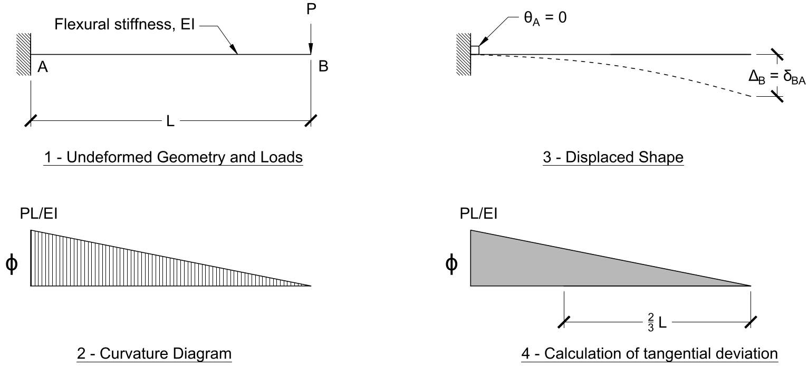
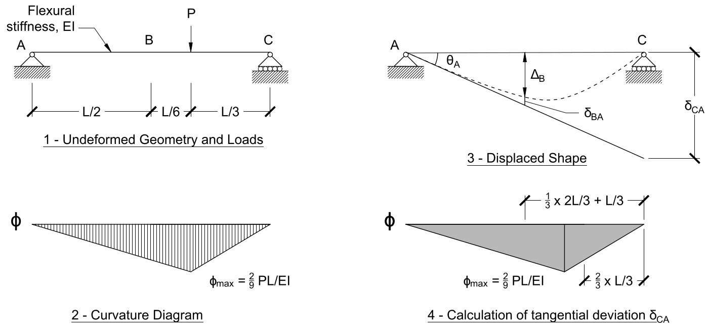

# Lecture 24, Nov 3, 2021

## Using Moment Area Theorems to Analyze Structures

* Although the MATs allow us to calculate change in slope and tangential deflection, we still don't know the absolute slope or deflection at a point unless we also use other information about the structure
* Generally to analyze the displacements and slopes of a loaded member the steps are:
	1. Calculate the reaction forces
	2. Draw the shear force, bending moment, and curvature diagrams
	3. Sketch out and estimate the approximate shape of the deformed member
	4. Identify locations where the deflection and slope are known by considering supports and loading conditions (e.g. locations where the tangent is horizontal)
	5. Calculate slope and displacement at a location of interest by using the known location and the MATs

## Case 1: Known Horizontal Tangent due to Support Conditions

* Consider a cantilever with a point load at its tip; since it is attached by a fixed end, the tangent at the support will always be horizontal
* The max bending moment is at the support, with magnitude $PL$; thus the area under the curvature diagram is $\frac{1}{2}L\frac{PL}{EI} = \frac{PL^2}{2EI}$, which is the slope at the tip
* Since the tangent is horizontal at the support, if we calculate $\delta$ from this point, the tangential displacements are just the real displacements
* The tip displacement is $\Delta = \left(\frac{1}{2}L\frac{PL}{EI}\right)\left(\frac{2}{3}L\right) = \frac{PL^3}{3EI}$ (note $\frac{2}{3}L$ is because the centroid of this triangle is $\frac{1}{3}L$ from the left side, so the distance between that and our point of interest is $\frac{2}{3}L$)

## Case 2: Known Horizontal Tangent due to Symmetry

* When the loading is symmetric, there is a horizontal tangent in the middle
* The slope at the right support is equal to the area under the diagram between $C$ and $D$, since the tangent is horizontal at $C$: $\theta _D = \frac{1}{2}\frac{L}{2}\frac{PL}{4EI} = \frac{PL^2}{16EI}$
* We can also use the tangential deviation from $C$ to calculate displacements; suppose we want to know the upwards displacement of $E$, then $\Delta E = \delta _{EC} - \delta _{DC}$
	* For $\delta _{EC}$ the region has area $\frac{PL^2}{16EI}$; the centroid of the area we're considering is at $\frac{L}{3 \cdot 2}$ to the right of the midpoint, so the distance of $E$ from this is $\frac{3}{2}\frac{L}{2} + \frac{L}{2} = \frac{5L}{6}$, so $\delta _{EC} = \frac{PL^2}{16EI}\frac{5L}{6} = \frac{5PL^3}{96EI}$
	* Similarly $\delta _{DC} = \frac{PL^2}{16EI}\left(\frac{2}{3}\frac{L}{2}\right) = \frac{PL^3}{48EI}$
	* Their difference is then $\Delta _E = \frac{PL^3}{32EI}$

## Case 3: No Known Horizontal Tangents

* We can still estimate the displacements and slopes by determining the tangential derivation of supports
* If the displacements are small then $\theta A \approx \frac{\delta _{CA}}{L}$
* To calculate the tangential derivation we divide the area under the curvature diagram into two triangles:
	* Left piece has a width of $\frac{2L}{3}$ so an area $\frac{1}{2}\frac{2L}{3}\frac{2PL}{9EI}$; the centroid of this piece is located $\frac{1}{3}\frac{2L}{3}$ to the left of the end of the piece, so the distance of $C$ from the centroid is $\frac{2L}{9} + \frac{L}{3}$
	* Right piece has a width of $\frac{L}{3}$ so an area $\frac{1}{2}\frac{L}{3}\frac{2PL}{9EI}$; the centroid is $\frac{1}{3}\frac{L}{3}$ to the right, so the distance from $C$ is $\frac{2}{3}\frac{L}{3}$
	* Together $\delta _{CA} = \left(\frac{1}{2}\frac{L}{3}\frac{2PL}{9EI}\right)\left(\frac{2L}{9} + \frac{L}{3}\right) + \left(\frac{1}{2}\frac{L}{3}\frac{2PL}{9EI}\right)\left(\frac{2}{3}\frac{L}{3}\right) = \frac{4PL^3}{81EI}$
* $\theta _A$ is now known and can be used as a reference if we want to find the slope somewhere along the member
* To calculate the deflection, use the tangential deviation from $A$, and use similar triangles
	* Example: To calculate the deflection at $B$, $\theta _A = \frac{\delta _{CA}}{L} = \frac{\Delta _B + \delta _{BA}}{\frac{1}{2}L}$; $\delta _{BA}$ can be obtained by using MAT2 again

