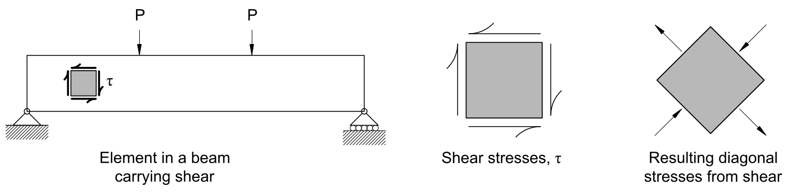
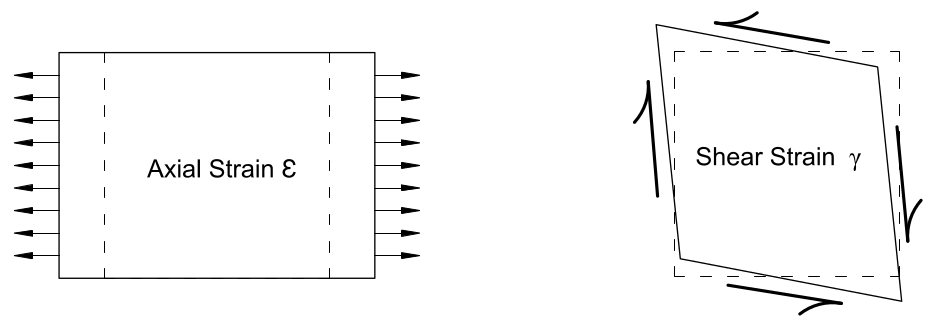
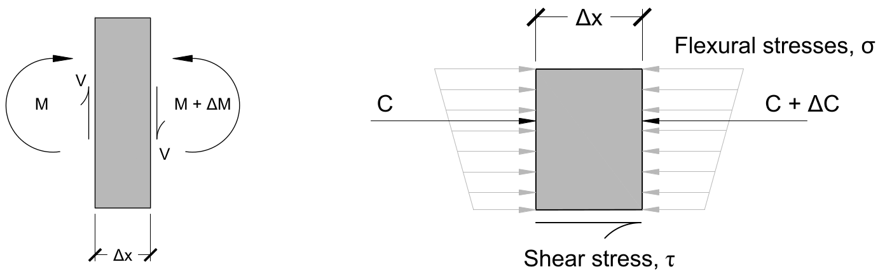

# Lecture 25, Nov 15, 2021

## Shear Stresses

{width=80%}

* Shear stress, denoted by $\tau$, like axial stress, is also equal to the force over an area: $\tau = \frac{V}{A}$
	* Force here is the shear force
	* Area here is related, but not equal to, the cross sectional area of the beam
* In the figure above, a section is cut from a beam; there are vertical shear stresses on the left and right sides, which satisfy vertical equilibrium, but since they form a couple and produce a moment, *complementary shear stresses* exist on the top and bottom faces to satisfy rotational equilibrium
* These shear stresses and complimentary shear stresses can be resolved into diagonal tension and compression
	* Shear stresses can be transformed into diagonal axial stresses and back again, but for beam design the shear stresses can be used directly
* While axial stresses tend to cause the material to extend or contract and change volume, shear stresses tend to change the shape of the material while maintaining its volume
	* Shear stresses are usually denoted $\gamma$
	* Axial stresses come from forces perpendicular to the cross section and changes squares to rectangles (deforms and gets longer)
	* Shear stresses come from forces parallel to the cross section and deform a square into a parallelogram
	* For a linear elastic material, there are no axial stresses produced by shear
* {width=50%}
* Shear stresses cause different modes of failure; in wooden members, adjacent elements can slide past each other; in more brittle materials such as concrete diagonal cracking may occur; finally diagonal compressive shear stresses may lead to diagonal buckling
* 
* If we look at a small section cut in the middle of the beam, the shear stresses on the top and bottom of the cut are always the same as the left and right sides
	* Horizontal shear stresses always comes with vertical shear stresses
	* Shear stresses are 0 at the top and bottom of the beam

## Shear Deformations

* Consider a square section, with 4 targets marked at the 4 corners; after this section is deformed by shear, the distance between one pair of diagonals got logger and the other distance between the other pair of diagonals got shorter
* Inside shear is both tension and compression, so it causes materials to elongate and contract at the same time
* Notice the way the concrete beam failed in the image above; the diagonal failure is because there is diagonal tension

## Jourawski's (Zhuravskii's) Equation

* Since shear force is the derivative of bending moment, where there is shear force, there will be a change in bending moment
* Consider a beam with width $b$ and second moment of area $I$, with a cut $\Delta x$ units wide in the diagram above; the right side has a higher bending of $M + \Delta M$
* In the right diagram, the cut is further cut at some depth; the higher moment on the right side creates higher flexural stresses and causes a net horizontal force of $\Delta C$ to the left
* If we cut it at a depth of $y_0$, $\Delta C = \int _{y_0}^{y_{top}} \sigma(y)\,\dy = \int _{y_0}^{y_{top}} \frac{\Delta My}{I}\,\dy = \frac{\Delta M}{I}\int _{y_0}^{y_{top}} y\,\dy = \frac{\Delta M}{I}Q$
	* $Q$ is the quantity $\int _{y_0}^{y_{top}} y\,\dy$, which is a first moment of area about the centroidal axis of the membe
* For this member to be in equilibrium, there must be a shear force on its underside also with magnitude $\Delta C$; since $\tau = \frac{V}{A} \implies V = \tau A = \tau b\Delta x$
	* The area over which the shear stress acts is the beam's width times the length of the cut
* Therefore, $\frac{\Delta M}{I}Q = \Delta C = \tau b\Delta x \implies \tau = \frac{\Delta MQ}{Ib\Delta x} = \tau\frac{Q}{IB} \cdot \frac{\Delta M}{\Delta x}$, and as $\lim _{\Delta x \to 0} \frac{\Delta M}{\Delta x} = \diff{M}{x} = V$, we have $\tau = \frac{VQ}{Ib}$
	* This equation lets us calculate the shear stress and is called *Jourawski's Equation*
* $\tau = \frac{VQ}{Ib}$ computes the horizontal shear force, but since the vertical shear forces are always the same it also computes the vertical shear forces

## Calculating $Q$

{width=40%}

* Recall that $\bar{y} = \frac{\int _A y\,\dA}{\int _A\,\dA} \implies \int _A y\,\dA = \bar{y}\int _A\,\dA = \bar{y}A$
* Therefore we can calculate $Q$ for a certain depth by first finding $A$, the area of the cross section above the depth of interest, then determine the distance between the centroidal axis of the section of interest and the centroidal axis, $d$, and using $Q = Ad$
* For more complex regions we can break it up into simpler components and use $Q = \int _{i = 1}^n A_id_i$
* We don't care about when $Q$ is negative since the direction of the shear stress doesn't matter, so $Q$ is always an absolute value
* The integral for $Q$ can be evaluated from the top of the cross section or the bottom: $\int _{y_{bot}}^{y_0} y\,\dA = \int _{y_0}^{y_{top}} y\,\dA$
	* This is because $\int _{y_{bot}}^{y_0} y\,\dA + \int _{y_0}^{y_{top}} y\,\dA = \int _{y_{bot}}^{y_{top}} y\,\dA$, but the first moment of area about the centroidal axis is always zero
	* Therefore $\int _{y_{bot}}^{y_0} y\,\dA = -\int _{y_0}^{y_{top}} y\,\dA$, but because we don't care about the sign of $Q$, we can say that they're equal

## Distribution of Shear Stresses

* Like flexural stresses, shear stresses are nonconstant over the cross section since $Q$ depends on the depth that the shear force is being calculated
* In general, $Q$ has the following properties:
	1. $Q$ varies parabolically over the height of the member
	2. $Q$ and thus $\tau$ is zero at the very top and bottom of the member
	3. $Q$ is maximized at the centroidal axis of the member
* If we integrated the shear stresses across $y$ we will get the shear force $V$

