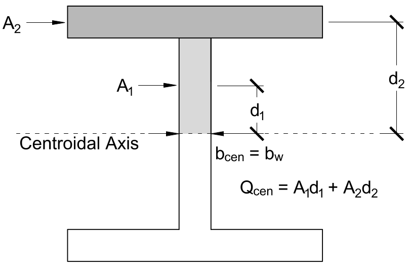
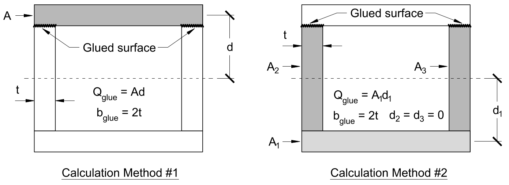
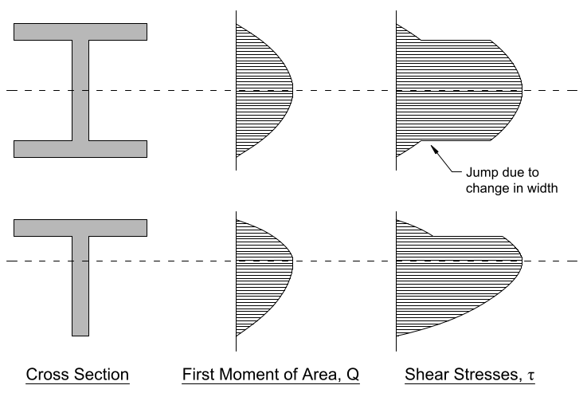

# Lecture 26, Nov 16, 2021

## Shear Stresses in Complex Shapes

{width=40%}

* Jourawski's equation can still be used: $\tau = \frac{VQ}{Ib}$
* $Q$ must now account for the geometry more carefully; complex shapes can be broken up into pieces, and $Q = \sum _{i = 1}^n A_id_i$, where $A_i$ is the area of each piece and $d_i$ are the distance between the centroid of the piece and the centroid of the cross-section
	* While $A$ is always positive, $d$ is signed
	* However in the end $Q$ will always be positive since we don't care about the direction of shear stress
* $b$ is the width of the cross section at the location of interest
* Since $Q$ can be calculated from either the top or the bottom, we can do either one; it's not always the easiest to calculate $Q$ from the side it's the closest to
* $Q$ has units of $\si{mm}^3$

## Glued Components

{width=60%}

{width=60%}

* Larger cross sections are often created by fastening together smaller components, so shear resistance at the joint is crucial
* For horizontal glued surfaces, the same procedure is used for $Q$, and $b$ is taken to be the combined width of the interfacing surfaces
* For vertical glued surfaces, $b$ is taken to be the total width of the vertical glued surfaces, but now $Q$ is calculated for the area of the cross section which will slide longitudinally if the glue fails
	* In the example, since the piece will slide on both glue joints if it fails, we consider $b$ to be the total width of both of the joints
* Shear flow: imagine if you poured water down the shape, how does it go to the bottom? Shear stresses point in the same direction
	* Example: For an I beam the shear flow goes horizontally when in the flange and then vertically down the stem
	* If the direction of shear flow goes perpendicular through the glue section then we need to consider shear stresses in that direction (vertical or horizontal)

## Shear Stress Distribution

{width=60%}

* $\tau$ increases when $Q$ increases or when $b$ decreases, so a sudden decrease of width in the cross section will result in a sudden jump in $\tau$
* When determining the maximum shear stress in members with the varied length, check both the centroid, where $Q$ is maximized, and the narrowest location, where $b$ is minimized

