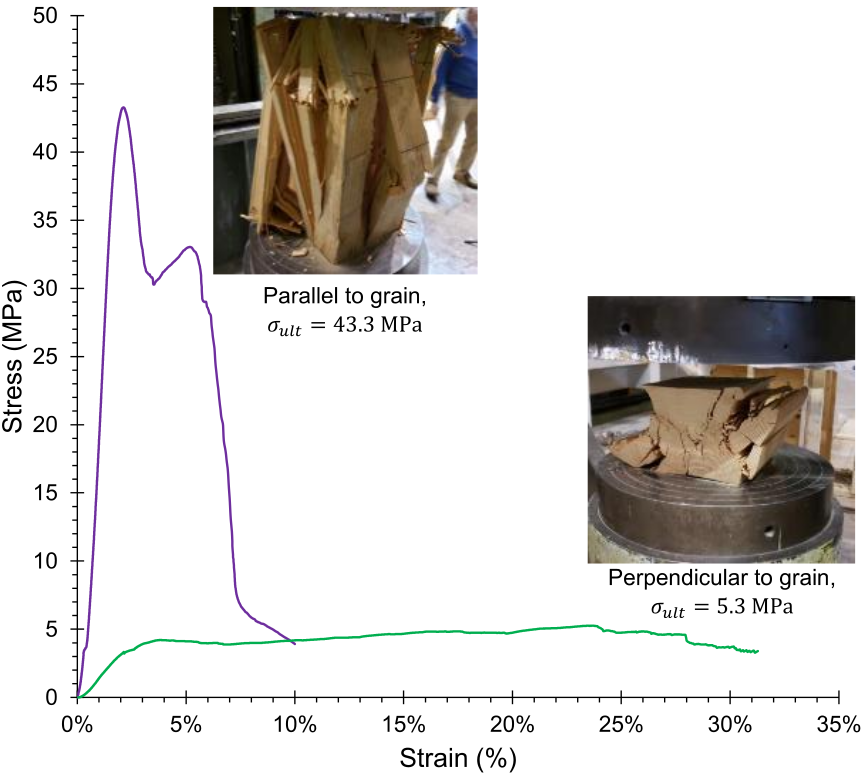

# Lecture 27, Nov 27, 2021

## Wooden Beams

* Timber are the structure parts of wood that can be used to make stuff
* There are two types of wood: *softwoods*, which are easy to work with and less strong, and *hardwoods*, which are stronger, stiffer, heavier and harder to work with than softwoods
* Since softwoods are cheaper and easier to work with, they're more often used in construction
* Hardwoods consist of densely packed fibre which makes it hard and stiff
	* Cells in hardwood are smaller and cells in softwood are larger
	* Softwoods grow faster because of this and are cheaper and easier to cut
* Since wood has a grain direction, it is an *anisotropic* material (different mechanical properties in different directions), unlike steel, which is an *isotropic* material (same properties regardless of direction)
	* Furthermore wood is also an *orthotropic* material, since the strength differs parallel vs perpendicular to the grain, which are two orthogonal directions; orthotropic materials are a subset of anisotropic materials
	* Nature optimizes trees to resist stresses along the direction of the grain

## Response to Loading

{width=70%}

* Wooden members tend to perform better when loaded like how a tree would in nature; they're much better at resisting axial forces and bending moments acting parallel to the grain
* When loaded perpendicular to the grain, wood is a lot softer and more ductile and makes for a good material to support delicate objects
* Wooden beams are strong in bending because flexural stresses act parallel to the grain, but are susceptible to shear since the fibres can slide past each other (see image in previous lecture)
* There are also often cracks in the wood along the grain due to shrinkage when the timber is prepared, further weakening it on the axis perpendicular to the grain

## Designing With Wood

* Since wood is not an engineered product, it has great variability in its mechanical properties, even when pieces are cut from the same tree, which presents a challenge in engineering
* The distribution of failure stresses for wood follow a normal distribution; the weakest specimen are only half the average strength
* In order to account for the variability, the 5th percentile strength (i.e. the maximum failure strength of the weakest 5% of specimen) is typically used in design with a factor of safety of 1.5
* The 5th percentile strength is typically weaker in smaller members, since they're influenced more by the presence of knots and other defects
* When determining member strength, the 5th percentile Young's modulus, $E_{05}$, should be used, since we want to design for safety; when determining the deflection, the average Young's modulus, $E_{50}$, should be used, because when calculating deflections there are typically multiple members involved, which will average out the values
* These values are shown for both small and big members of various species of wood in the appendix
* For buckling use the 5th percentile $E$, for moment area theorems use the average $E$

