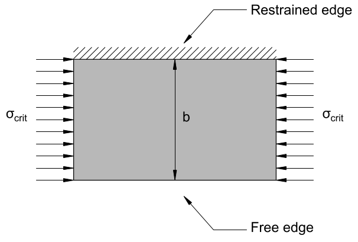
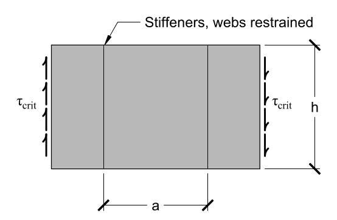

# Lecture 28, Nov 22, 2021

## Thin-Walled Box Girders

* Hollow structural members are efficient as they have high flexural stiffness even though they weigh much less than a solid member
* In additional to the normal modes of failure such as yielding and buckling of the whole structure, they can also fail by *local buckling* of the thin walls instead of the whole structure itself (discussed in later lectures)
* The top and bottom of the tube can be reinforced with vertical stiffeners to resist the high flexural stresses
* These members can fail in the following methods in compression:
	1. Crushing when compressive yield/ultimate strength is reached
	2. Global buckling, when the entire member buckles and sticks out to the side
	3. Local buckling, when only parts of the member buckle but the overall structure does not (imagine crushing a flimsy cardboard tube)

## Local Buckling

{width=20%}

{width=40%}

* When we're dealing with members made of thin pieces, they can fail in another buckling method
* For a plate with a width $b$ and thickness $t$ and length $L$, if the sides are unrestrained, the critical buckling stress according to the Euler equation is $\sigma _{crit} = \frac{\pi^2 E}{12}\left(\frac{t}{L}\right)^2$
	* $P = \frac{\pi^2 EI}{L^2}$ and $I = \frac{bt^2}{12} \implies \sigma _{crit} = \frac{P}{bt} = \frac{\pi^2 EI}{btL^2} = \frac{\pi^2 Ebt^3}{12btL^2} = \frac{\pi^2 Et^2}{12L^2} = \frac{\pi^2 E}{12}\left(\frac{t}{L}\right)^2$
* If the sides are restrained like in the second figure, the critical stress is $\sigma _{crit} = \frac{k\pi^2 E}{12(1 - \mu^2)}\left(\frac{t}{b}\right)^2$
	* This came from an extension of Euler buckling into two dimensions; $k$ depends on the loading conditions and the boundary conditions (i.e. how the edges of the plane are restrained)
	* $\mu$ is the Poisson's ratio of the material, a measure of how much it deforms in the direction orthogonal to the applied load
		* If the material has a strain in the $x$ direction, then $\varepsilon _y = -\mu\varepsilon _x = -\mu\frac{\sigma _x}{E}$, i.e. the material contracts along the $y$ axis to make up for the change in length
		* Since the material is restrained in the $y$ axis, $\sigma _y = -\mu\sigma _x$ since there needs to be a stress in the $y$ direction to keep the $y$ strain zero
		* This additional $y$ stress then carries over to the $x$ axis as an additional stress $\mu^2\sigma _x$, and since it acts in the opposite direction as the applied stress, the net $x$ strain is now $\varepsilon _x = \frac{\sigma _x(1 - \mu^2)}{E}$; this is where the factor of $1 - \mu^2$ in the equation comes from
		* Therefore $\frac{\sigma _x}{\varepsilon _x}\frac{1 - \mu^2}{E} = 1 \implies \frac{\sigma _x}{\varepsilon _x} = E_{eff} = \frac{E}{1 - \mu^2}$
		* For 2D conditions, the effective $E$ is $\frac{E}{1 - \mu^2}$
	* Notice that when comparing this to the equation for unrestrained edges (global buckling), $E$ is replaced by $\frac{E}{1 - \mu^2}$, there is an added factor of $k$, and now we're using $b$, the shorter edge, instead of $L$
* This situation can happen when you fold something into a tube; the top of the tube effectively has both its edges restrained from buckling in the out of plane direction
* Under these conditions the plate buckles into a 3D shape, with two dimensions both buckling into sine waves, making the situation much more complicated

## Plate Buckling Equations

* For the plate in the figure above, with sides restrained from movement both in and out of the plane, $k = \left(\frac{1}{n} \cdot \frac{L}{b} + n\frac{b}{L}\right)^2$
	* This comes from buckling in 2 dimensions where $z(x, y) = A\sin\left(\frac{mx\pi}{b}\right)\sin\left(\frac{n\pi y}{L}\right)$
		* It turns out that the smallest buckling forces comes from when $n = 1$ in the short direction (the width), and $n$ in the long direction doesn't really matter
	* $n$ is the number of half cycles which the buckled plate assumes, which is like the mode of buckling in the Euler equation
	* Even though it takes on a range of values depending on $\frac{L}{b}$ and $n$, the lowest possible value is 4
	* The lower bound of the buckling stress used for design is then $\sigma _{crit} = \frac{4\pi^2 E}{12(1 - \mu^2)}\left(\frac{t}{b}\right)^2$
* {width=30%}
* For the situation above where only one boundary is restrained, the critical stress is greatly reduced, with $k = 0.425$, i.e. $\sigma _{crit} = \frac{0.425\pi^2 E}{12(1 - \mu^2)}\left(\frac{t}{b}\right)^2$
* {width=30%}
* For the situation above where the load varies linearly, $k = 6$, i.e. $\sigma _{crit} = \frac{6\pi^2 E}{12(1 - \mu^2)}\left(\frac{t}{b}\right)^2$
* {width=30%}
* For the situation above, with the plate restrained from buckling in the out-of-plane direction by vertical stiffeners spaced $a$ apart, the critical shear stress is $\tau _{crit} = \frac{5\pi^2 E}{12(1 - \mu^2)}\left(\left(\frac{t}{h}\right)^2 + \left(\frac{t}{a}\right)^2\right)$
	* In this situation, the plate is effectively restrained from buckling in the z direction on all 4 sides

