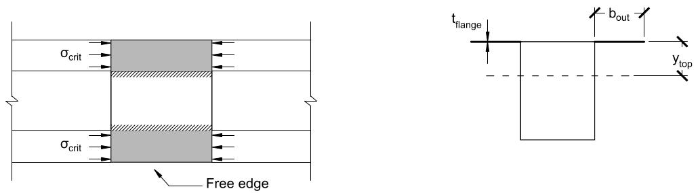

# Lecture 29, Nov 23, 2021

# Design of Thin-Walled Box Girders

* For a thin-walled box girder we already know of 4 methods of failure:
	1. Tensile failure of the walls due to flexural tension
	2. Compressive failure of the walls due to flexural compression
	3. Shear failure of the walls
	4. Shear failure of the fastening material (glue, screws, etc)
* For the first two we use $\sigma = \frac{My}{I}$ and for the last two we use $\tau = \frac{VQ}{Ib}$
* Taking into account thin wall buckling adds an additional 4 methods of failure (note: compressive flange is the top part, the webs are of the rest of the box):
	5. Buckling of the compressive flange between the webs
		* This is the part of the top piece that's between the web pieces (the middle, i.e. top of the box)
		* 
		* Since it's restrained on both sides, we use the equation $\sigma = \frac{4\pi^2 E}{12(1 - \mu^2)}\left(\frac{t}{b}\right)^2$ to determine the critical buckling stress, with the real flexural stress calculated by $\sigma = \frac{My}{I}$
	6. Buckling of the tips of the compressive flange
		* This is the rest of the top piece (the edges, i.e. the part of the top piece that's not a part of the box)
		* 
		* Since it's restrained on only one side, we use the equation $\sigma = \frac{0.425\pi^2 E}{12(1 - \mu^2)}\left(\frac{t}{b}\right)^2$
	7. Buckling of the webs due to flexural stresses
		* This is the vertical webs, from the centroid up to the top, or from the bottom to the centroid
		* 
		* Since flexural compression at the centroid is 0 and varies linearly as we move to the top/bottom and the piece is restrained on both sides, we use $\sigma = \frac{6\pi^2 E}{12(1 - \mu^2)}\left(\frac{t}{b}\right)^2$ ($\sigma$ here is the maximum compressive stress, taken where $y$ is maximized)
	8. Shear buckling of the webs
		* 
		* For shear buckling we use $\tau _{crit} = \frac{5\pi^2 E}{12(1 - \mu^2)}\left(\left(\frac{t}{h}\right)^2 + \left(\frac{t}{a}\right)^2\right)$
* Note: Even though there are two webs, when calculating the critical buckling stress for the webs, we still only use the width of one web, because each web can buckle independently of each other

## Design Considerations

* The matboard is much stronger in tension than in compression, so the design could utilize this
	* This might be hard to do because sometimes the top is in compression and sometimes the bottom is in compression
	* We can vary the cross-section
* Adding more material on one side brings the centroid closer to that side, so the compression stress will be smaller
* In a zone where the top is in compression, the top can be reinforced with more material to resist more compression and bring the centroid closer to that side to make the stress smaller
	* e.g. doubling the top thickness and removing the bottom surface
* Where the bottom is in compression, the cross section would need to be optimized
	* e.g. add a compression flange on the bottom, causing a big increase to I and prevent local buckling of the bottom parts of the webs

