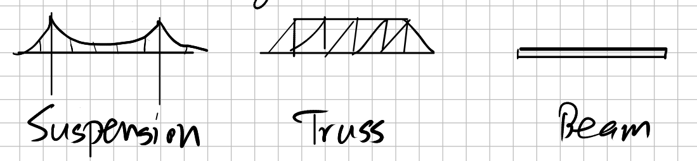
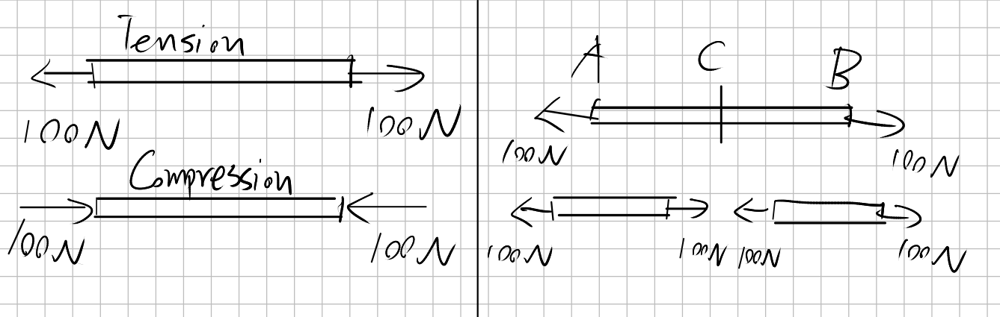
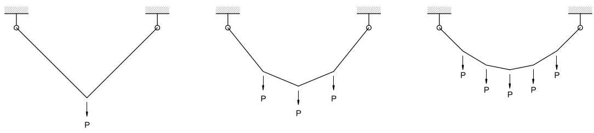
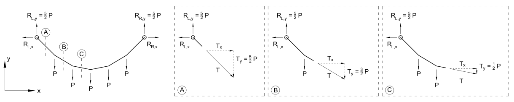

# Lecture 3, Sep 15, 2021

## Types of Bridges

* Suspension bridges consist of cables held up by towers, with the weight of the bridge being connected to the main cable using vertical cables
* The weight of the main bridge is transferred to the cable, which is then transferred to the towers and then the ground

## Internal Forces

* Tension forces pull on both sides of an element, and tries to make it longer
	* If each end is being pulled with a $100\si{N}$ force, the tension is still $100\si{N}$, not $200$
	* The element "transmits" the force from one end to the other end
* Compression forces push in on the element, trying to make it shorter
* Key idea: **If the entire structure is in equilibrium, all its constituent parts are also in equilibrium.**
	* Example: If a beam is being pulled on each end with $100\si{N}$ and thus in equilibrium, we can break it apart at an arbitrary point, and expose an internal force; the internal forces will also be $100\si{N}$ and balance out the forces at the ends; this is the reason why tension is $100$ and not $200$

## Cable Structure

* When a cable is attached at the ends and only supporting its own weight, it takes the shape of a **catenary** (modelled by $y = \cosh(e^{\frac{x}{a}} + e^{-\frac{x}{a}}) + b$, $a$ = span, $b$ = vertical offset, not a parabola)
	* This is a different shape from uniform loading because the load per unit length of cable is constant, not load per unit length of the span; so at the ends, there is more load per $x$ distance
* If we add loads much heavier than the weight of the cable itself onto the cable, then the effect of the cable's weight will be negligible and the cable becomes **piecewise linear**
* Typically in a suspension bridge the horizontal spacing between loads is constant (not the cable length between loads)
* When the weights are uniformly loaded, the cable takes the shape of a *parabola*

## Forces

* Consider a suspension bridge uniformly loaded with 7 masses each with weight $P$

* At the endpoints, the vertical component of force is equal to half of the total weight of the bridge due to symmetry
* In each segment, the horizontal component of tension remains the same and is equal to the tension at the ends
* In the 2 end segments, the vertical component of force is equal to the endpoints; then as you move in to the middle of the bridge, each segment has vertical tension reduced by $P$, with the middle segments having tension $\frac{1}{2}P$

