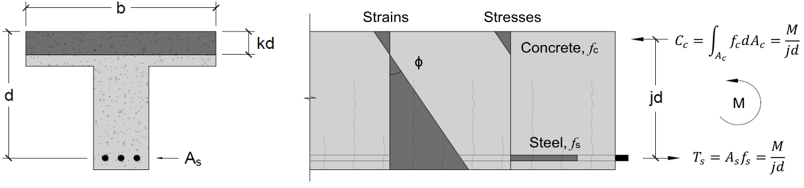
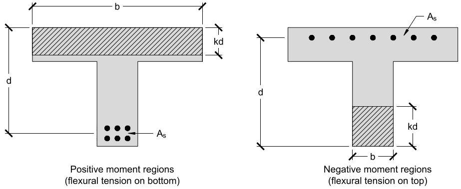

# Lecture 32, Dec 1, 2021

## Flexural Behaviour of Reinforced Concrete

{width=50%}

* Concrete beams are reinforced on the side experiencing tension for bending to have the steel carry the tension (longitudinal reinforcing bars)
* They should be as far away from the neutral axis as possible to be efficient, but they can't be exposed since that leads to corrosion
	* The part between the reinforcing bar and the outside of the concrete is the *cover* and is typically $40\si{mm}$
	* There are also often hooks (bent sections) on the ends to make the bars harder to take out
	* The steel balances out the moment caused by the concrete compression, so it's the most efficient to make the steel far away from the neutral axis
* There are 3 phases when reinforced concrete is subjected to bending:
	1. Linear elastic: For small loads, the concrete can take the tension and the behaviour is linear elastic (Navier's equation can be used, as well as all the equations we're learned thus far)
	2. Cracked elastic: For larger loads, the concrete fails from tension; the steel carries the tension and the concrete carries the compression; stresses are still small enough that the behaviour is linear elastic, but now with a different slope
		* The neutral axis is no longer the centroidal axis
		* This is where most service loads lie in
	3. Nonlinear: For even larger loads, the steel will begin to yield and the concrete will begin to crush; behaviour in this phase is complex
		* This region is incompatible with the allowable stress method we're using so we don't consider it for now
* For underreinforced beams, yield happens first and then crushing happens; overreinforced beams crush first and may yield later, or may not yield at all
	* Underreinforced concrete is better because the yielding provides a warning, while the overreinforced concrete does not have it
* Cracks are not a problem for reinforced concrete, in fact they're designed with cracking in mind
* Reinforced concrete is a composite structure, with different materials carrying different loads

## Analysis of Cracked Elastic Response

* Terminology:
	* Depth: $h$ is the overall concrete member depth (height of the cross section); $d$ is the *effective depth* (from the compression face to the centroid of the longitudinal reinforcement)
		* If there are multiple layers of reinforcing bars then $d$ is the distance to their combined centroid (e.g. with 2 layers, the centroid is somewhere in between)
	* {width=50%}
	* $b$ is defined as the width of the compression side of the cross section
	* $A_s$ is the *area of reinforcement*, the total cross-sectional area of the rebar
	* $kd$ is the depth of compression of the cracked section
	* $jd$ is the vertical distance between the compressive and tensile forces and is called the *flexural lever arm*
* Assumptions:
	1. Plane sections remain plane, so longitudinal strains vary linearly over the height
	2. Concrete does not carry any tensile stresses
	3. The steel is bonded to the concrete perfectly, so the concrete and steel strains are always equal
	4. No axial load $N = 0$
	5. Hooke's Law still applies
	6. The flexural compression depth is in the top flange
* The longitudinal strain is still $\varepsilon = \phi y$, but $y$ is no longer the distance from the centroidal axis of the cross section; the neutral axis of the cracked member is different because the concrete can't carry tensile stresses
	* To find the new neutral axis we need to solve for the conditions to make the net axial force 0
	* Everything above the neutral axis is compression carried by the concrete, everything below the neutral axis is tension carried by the steel
* Let $kd$ be the distance from the top to the neutral axis ($d$ is the distance from the top to the reinforcing steel bars); then $\varepsilon = \phi y \implies \phi = \frac{\varepsilon}{y} = \frac{\varepsilon _{c,top}}{kd} = \frac{\varepsilon _{c,top} + \varepsilon _s}{d}$, where $\varepsilon _{c,top}$ is the compressive strain at the top and $\varepsilon _s$ is the tensile strain in the steel
* Rearranging: $\varepsilon _{c,top} = \phi kd \implies \varepsilon _s = \phi d - \varepsilon _{c,top} = \phi d - \phi kd = \phi d(1 - k)$
	* Stresses can be solved for once these strains are known
	* Compressive stress in the concrete is 0 at the neutral axis and maximum at the top
	* Steel carries tensile stress at the location of the bars
* The net compressive force in the concrete can be found by integration: $C_c = \int _{A_c} f_c\dd A_c = \int _{A_c}E_c\varepsilon _c\dd A_c = \frac{1}{2}bkdE_c\varepsilon _{c,top}$
* The net tensile force in the steel can be found by multiplying the steel stress by the area: $T_s = f_sA_s = E_s\varepsilon _sA_s$
* A member in pure bending has no net axial force so $\frac{1}{2}bkdE_c\varepsilon _{c,top} = E_s\varepsilon _sA_s \implies \frac{1}{2}\phi bk^2d^2E_c = \phi E_sA_sd(1 - k)$
	* $k$ can be solved: $\frac{1}{2}k^2 + k\frac{E_s}{E_c}\frac{A_s}{bd} - \frac{E_s}{E_c}\frac{A_s}{bd} = 0$
	* Define the *modular ratio* $n = \frac{E_s}{E_c}$, the ratio of the Young's modulus of reinforcing steel to concrete
	* Define the *quantity of longitudinal reinforcement* $\rho = \frac{A_s}{bd}$
	* Using these quantities, $\frac{1}{2}k^2 + kn\rho - n\rho = 0$
* $k = \sqrt{(n\rho)^2 + 2n\rho} - n\rho$
* To find $M$, note that $C_c$ and $T_s$ form a couple, so $M = C_cjd = T_sjd$
	* $jd$ is the vertical distance between the compressive and tensile forces and is called the *flexural lever arm*
	* Since concrete stresses are triangular, the equivalent force is located at $\frac{kd}{3}$
	* $jd = d - \frac{1}{3}kd \implies j = 1 - \frac{1}{3}k$
* Using this we can find a link between the bending moment and stress in reinforcement: $M = T_sjd = A_sf_sjd \implies f_s = \frac{M}{A_sjd}$
	* So the strain is $\varepsilon _s = \frac{M}{E_sA_sjd}$
* We can also find the curvature: $\frac{M}{E_sA_sjd} = \varepsilon _s = \phi d(1 - k) \implies \phi = \frac{M}{A_sE_sjd^2(1 - k)}$
* Concrete stress: $f_c = E_c\varepsilon _c = E_c\phi kd = E_ckd\frac{M}{A_sE_sjd^2(1 - k)} = \frac{k}{1 - k}\frac{M}{nA_sjd}$
* The maximum moment that can be carried without yielding is $M_{yield} = A_sf_yjd$ where $f_y$ is the yield stress of the steel

## Summary of Design Process

1. Make SFD, BMD, determine maximum moment that must be carried
2. Estimate area of steel required
	* Using a provided $d$, estimate $k \approx \frac{3}{8}$ and $j \approx \frac{7}{8}$
	* Use the fact that $M_{yield} = A_sf_yjd \implies A_s = \frac{M}{f_yjd}$
	* If the max allowable stress in the steel is $\alpha f_y$, then $A_s = \frac{M}{\alpha f_yjd}$
	* Note the max allowable steel stress is typically taken to be $0.6f_y$
3. Determine the number of bars needed so the area requirement is met
4. Calculate $k$ using $k = \sqrt{(n\rho)^2 + 2n\rho} - n\rho$, where $n = \frac{E_s}{E_c}, \rho = \frac{A_s}{bd}$
5. Calculate the flexural lever arm $jd = d\left(1 - \frac{1}{3}k\right)$
6. Check to ensure that the steel stress $f_s = \frac{M}{A_sjd}$ is less than the max allowable stress
	* Max allowable steel stress is $0.6f_y$ (factor of safety of 1.67)
7. Check to ensure that the concrete stress $f_c = \frac{k}{1 - k}\frac{M}{nA_sjd}$ is less than the max allowable stress
	* Max allowable concrete stress is typically taken to be $0.5f_c'$ (factor of safety of 2)

