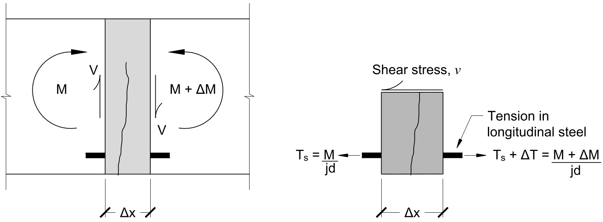
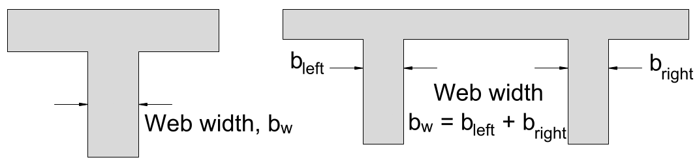
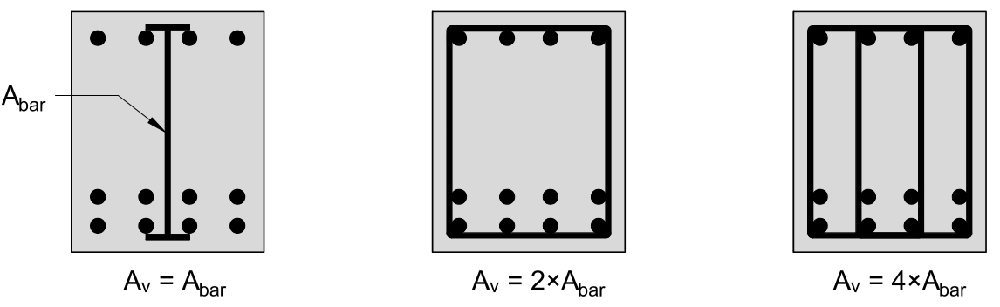
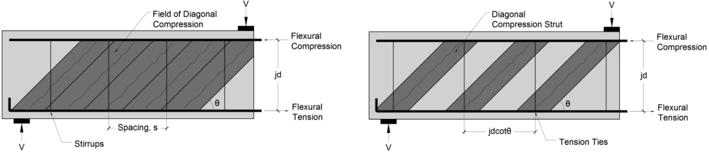

# Lecture 33, Dec 6, 2021

## Reinforced Concrete Under Shear

* Shear causes diagonal tension, which could easily cause diagonal cracks to form
	* Bending cracks are vertical, shear cracks are diagonal
* Once concrete is cracked diagonally, there are two ways it can carry shear stresses:
	1. Aggregate interlock: The rough crack surfaces due to the aggregate (rock pieces) lock against each other, along with the longitudinal steel carry tension across the crack
	2. Shear reinforcement (aka stirrups or transverse reinforcement): Steel reinforcement bars perpendicular to the longitudinal reinforcement carry tension across the crack
		* It would be more effective to make these diagonal to be perpendicular to the tension direction, but doing so makes it much harder to construct
* Shear failures can be very aggressive and sudden so they're very dangerous (compared to yielding of longitudinal steel)

## Shear Equation

{width=70%}

* Jourawski's equation can no longer be used because the concrete's tensile capacity is severely reduced
* Recall that $M = T_sjd$ where $jd$ is the flexural lever arm (vertical distance between the centroid of the flexural stresses and the centroid of the tensile stresses)
* Consider a longitudinal slice as shown above, then $M = T_sjd \implies V = \diff{M}{x} = \frac{\Delta T_sjd}{\Delta x} \implies \Delta T_s = \frac{V\Delta x}{jd}$
* Shear stress $\tau$ acts over an area with length $\Delta x$ and width $b_w$ (top right figure), so to satisfy equilibrium, $vb_w\Delta x = \Delta T_s = \frac{V\Delta x}{jd} \implies v = \frac{V}{b_wjd}$
	* {width=50%}
	* Note that $b_w$ may consider adjacent webs
* Shear failure happens when $v > v_c + v_s$, where $v_c$ is the shear strength from aggregate interlock, and $v_s$ is the shear strength from the steel shear reinforcement
	* $V_c = v_cb_wjd$ and $V_s = v_sb_wjd$ where the capital $V$s are the shear forces
* If the member can't fail under shear tension, then the diagonal shear compression may also cause crushing of the concrete; the shear stress at which this occurs is defined as $v_{max} = 0.25f_c'$ by the Canadian concrete design code ($f_c'$ is the compressive strength of concrete)
	* The failure shear force for concrete crushing is $0.25f_c'b_wjd$
	* We don't consider buckling in this case because typically the concrete is thick enough that buckling isn't an issue
* In summary the shear failure force $V_r$ is equal to the sum of the concrete strength and steel strength, and this sum is less than $V_{max}$
	* To provide an adequate factor of safety steel strength terms are multiplied by $0.6$ and concrete strength terms $0.5$ (FoS of $1.67$ in steel, $2$ in concrete; this is because steel is manufactured under controlled conditions, while concrete is cast outdoors so has more variability)
	* $V_r = 0.5V_c + 0.6V_s \leq 0.5V_{max}$
* {width=50%}
* Shear forces at reactions and point loads are typically not used because the added compression prevents the member from failing in shear tension at that location
	* Typically shear forces a distance $d$ from the reaction or point load is used ($d$ is the distance from the steel reinforcement and compression face, the same one used in flexural design)

## Shear Capacity Without Shear Reinforcement

* Members without shear reinforcement rely solely on $v_c$ (aggregate interlock) to carry shear once the concrete is cracked
* As the member depth increases, the cracks tend to get larger, which makes aggregate interlock less effective (referred to as the *size effect*)
* The shear strength of concrete without shear reinforcement is $v_c = \frac{230\sqrt{f_c'}}{1000 + 0.9d}$, so $V_c = v_cb_wjd = \frac{230\sqrt{f_c'}}{1000 + 0.9d}b_wjd$
	* Once again units have to be $\si{MPa}$ and $\si{mm}$ in this empirical equation

## Shear Capacity With Shear Reinforcement

{width=50%}

{width=80%}

* Shear reinforcement bars are perpendicular to the longitudinal reinforcement and are commonly inserted by bending bars to form U shapes or hoops (*stirrups*)
* The *area of shear reinforcement* $A_v$ is the total cross-sectional area of the vertical bars
* Shear reinforcement provides shear strength $V_s$ and controls the crack width, thus making aggregate interlock more effective and increases $V_c$ as well
* The shear stress can be simplified into diagonal compression of angle $\theta$ and converted into a truss model, with height $jd$ and shear reinforcement spaced $s$ apart
	* The vertical tension members in this model are spaced $jd\cot\theta$ apart
	* $\frac{A}{jd\cot\theta} = \frac{A_v}{s} \implies A = \frac{A_vjd\cot\theta}{s}$
	* Failure occurs when the stress in these bars reach the yield stress, so $V_s = Af_y = \frac{f_yA_vjd}{s}\cot\theta$
	* The Canadian design code assumes diagonal stresses at $\theta = 35\degree$, thus $V_s = \frac{A_vf_yjd}{s}\cot 35\degree$
	* The shear strength attributed to the steel is $v_s = \frac{V_s}{b_wjd} = \frac{A_vf_y}{b_ws}\cot 35\degree$
* For small amounts of shear reinforcement $V_c$ is unchanged, but if $\frac{A_vf_y}{b_ws} \geq 0.06\sqrt{f_c'}$, then $v_c = 0.18\sqrt{f_c'} \implies V_c = 0.18\sqrt{f_c'}b_wjd$
	* Note that if there's less than this amount of shear reinforcement, we essentially treat $V_s = 0$, because if there's not enough shear reinforcement then they may not cross the cracks so they might not work at all

## Summary

* To evaluate the shear strength of a member:
	1. Obtain SFD, BMD, and determine max shear force $V$ (at least $d$ away from a reaction force or point load), calculate $k$, $j$
	2. Check the amount of shear reinforcement to determine the right equation to use: $V_c = \twocond{\frac{230\sqrt{f_c'}}{1000 + 0.9d}b_wjd}{\frac{A_vf_y}{b_ws} < 0.06\sqrt{f_c'}}{0.18\sqrt{f_c'}b_wjd}{\text{otherwise}}$
	3. If there is shear reinforcement, $V_s = \frac{A_vf_yjd}{s}\cot 35\degree$
	4. Calculate the shear strength: $V_r = V_c + V_s \leq V_{max} = 0.25f_c'b_wjd$
	5. Check for failure, when $V = V_r$
* To design shear reinforcement:
	1. Obtain SFD, BMD, max $V$, $k$, $j$
	2. Check if $V \geq 0.5V_{max} = 0.5 \cdot 0.25f_c'b_wjd$; if so then the cross-section is too small and needs to be resized
	3. Check whether $V < 0.5V_c = 0.5\frac{230\sqrt{f_c'}}{1000 + 0.9d}b_wjd$; if so then aggregate interlock alone can handle the shear, so the design is complete
	4. Provide the minimum amount of shear reinforcement, $\frac{A_vf_w}{b_ws} = 0.06\sqrt{f_c'} \implies s = \frac{A_vf_y}{0.06\sqrt{f_c'}b_w}$, and then check whether $V < V_r = 0.5V_c + 0.6V_s = 0.5 \cdot 0.18\sqrt{f_c'}b_wjd + 0.6\cdot\frac{A_vf_yjd}{s}\cot 35\degree$
	5. If the shear capacity is still too low, then determine the minimum $s$ needed to make $V = V_r$: $s = \frac{0.6\cdot A_vf_yjd\cot 35\degree}{V - 0.5 \cdot 0.18\sqrt{f_c'}b_wjd}$

