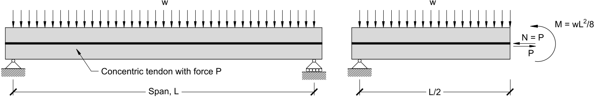
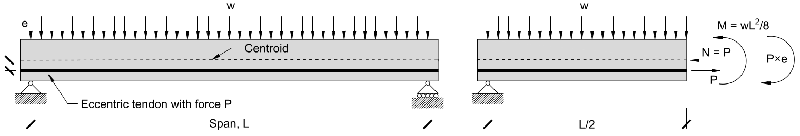
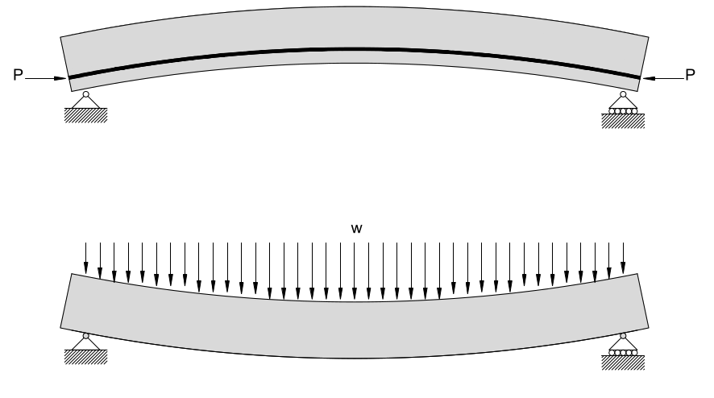

# Lecture 35

## Prestressed Concrete

* Prestressed concrete is a form of *active reinforcement* (as opposed to *passive reinforcement*) where the steel reinforcement inside the concrete is prestressed and carries significant tension before any external loads are applied
	* Tensile forces in the steel causes compression of the concrete
	* The steel is in an active state of tension and is always engaged, not just after the concrete cracks
	* Uses high-strength steel and high-strength concrete, so the steel can be strong enough to compress the concrete and the concrete does not crush under the steel compression and regular loads
	* The prestressed reinforcement is referred to as *tendons*
* *Pre-tensioning* casts concrete around strands of steel that are being pulled so when the concrete sets, the ends of the steel are cut and the embedded parts compress the concrete
* *Post-tensioning* casts hollow ducts into the concrete, and after the concrete sets steel is inserted into the ducts, and then stressed and anchored
* Deformations in prestressed concrete are much smaller since significant forces are required to overcome the tension in the steel
* In typical loads the prestressed concrete does not crack
* Total stress in the concrete can be calculated as the sum of the stress from prestressing and the stress from external loads

## Calculating Stresses

* Under typical loads the concrete is uncracked and so behaves linear elastically, so we can simply sum the stresses if this is the case
	* Note that if the stresses calculated exceeds the tensile strength of the concrete, then it will crack, and more advanced methods are needed
* If the tendon is lined up with the centroid and has force $P$, then they don't cause a bending moment, and the stress at any depth can be found by summing the stress from the tendon and Navier's equation
	* $\sigma _{c,top} = -\frac{P}{A} - \frac{My_{top}}{I}$
	* $\sigma _{c,bot} = -\frac{P}{A} + \frac{My_{bot}}{I}$
	* Note $\frac{P}{A}$ is negative since the tendon force is compressive; sign conventions assume positive bending moment means top is in compression
* {width=50%} 
* Eccentric tendons are more effective when designing for bending, since the prestressing force opposes the bending moment
* To resist the prestressed load the concrete carries an equal and opposite axial force at the centroid; this force and the tendon force form a couple with lever arm $e$, so there is an internal bending moment that must resist this
* With eccentric tendons, we sum the stress from the prestressing, from the bending moment caused by external load, and the bending moment caused by the couple of the prestressing force and axial reaction force
	* $\sigma _{c,top} = -\frac{P}{A} + \frac{(Pe - M)y_{top}}{I}$
	* $\sigma _{c,bot} = -\frac{P}{A} - \frac{(Pe - M)y_{bot}}{I}$
* Where bending moment is low, the stresses caused by the tendon eccentricity can actually crack the top of the member, so it's common to curve the tendons, and have the eccentricity vary according to the bending moment demand

