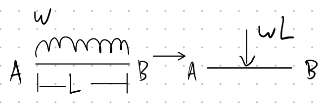
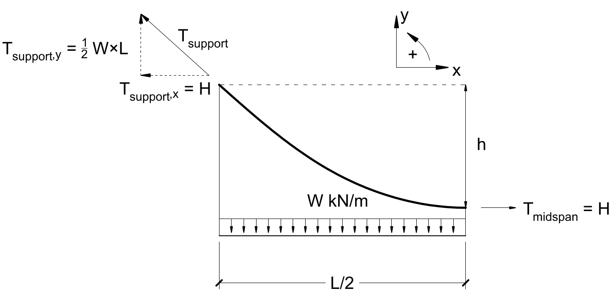

# Lecture 4, Sep 20, 2021

## Free Body Diagrams

* Requirements:
	1. An FBD must be *free*, i.e. it must be floating in space and not connected to any external things, e.g. the ground (we cut them out of the diagram)
	2. All external forces must be included
	3. All forces at cut locations (internal forces) must also be included
	4. Include body forces, maybe (self-weight)
	5. Do the calculations based on undeformed geometry
		* This is why an FBD tells you you *can* push on a rope, so watch out
* All FBDs will be in equilibrium

## Distributed Loads

* Forces can be "smeared out": point loads can be replaced by a big uniformly distributed load (UDL), symbol $w$ with units $\si{kN/m}$ (force per unit distance/area)
* With free body diagrams we can replace an UDL with an equivalent resultant $wL$ at the midpoint of the UDL
	* {width=30%}
	* Note not all distributed loads are uniform; in this case we put the force at the centroid $\frac{\int _a^b w(x)x\,\dx}{\int _a^b w(x)\,\dx}$ with the equivalent force equal to $\int _a^b w(x)\,\dx$

## Designing Structures

0. Select the type of structure
1. Estimate the geometry and the loads (based on the 3rd principle of engineering!)
2. Perform the analysis, which tells you how the internal forces are distributed
	* This is the big one for this course
3. Select standard shapes or create new ones to safely carry the loads
	* Now you know how much the structure weighs
4. Iterate: With the new knowledge of the structure's forces and weights, re-estimate the geometry, loads, shapes, etc

## Designing Suspension Bridges

* {width=70%}
* Find the *load path*: how does the load go to the ground?
	* The load path goes from the car, to the deck, to the hangers, to the main cables, to the towers and then the ground

### Designing the Main Cables (Force Analysis)

{width=50%}

* The FBD is drawn from the tower to the midspan
* Since at the midspan the cable is horizontal, the tension force at point $B$ only has a horizontal component $H$
* $\sum F_x = 0 \implies H - T_{supp,x} = 0 \implies H = T_{supp,x}$
* $\sum F_y = 0 \implies T_{supp,y} - w\frac{L}{2} = 0 \implies T_{supp,y} = \frac{wL}{2}$
* For sum of moments, take moments around point $A$ and counterclockwise to be positive
* $\sum M = 0 \implies \cancel{T_{supp,x} \cdot 0} + \cancel{T_{supp,y} \cdot 0} + Hh - \frac{wL}{2} \cdot \frac{L}{4} = 0 \implies H = \frac{wL^2}{8h}$
	* Note: The uniform load is equivalent to a load of $wL$ at the midpoint, which is $\frac{L}{4}$ since midspan is $\frac{L}{2}$ long
	* $H$ can be shifted so it acts directly under $A$ and $w$ can be shifted so it acts directly to the right of $A$; this does not change the moment due to the nature of moments (cross products: the area of the parallelogram does not change when its sides are shifted)

### Example: Golden Gate Bridge

* $L = 1280\si{m}$, $h = 143\si{m}, w = 370\si{kN/m}$
* $\frac{L}{h} = 8.95$ (between $8$ and $10$)
* $T_{supp,y} = 237\si{MN}$
* $H = 530\si{MN}$
* $T_{max} = \sqrt{237^2 + 530^2} = 580\si{N}$ or $290\si{MN}$ per cable

