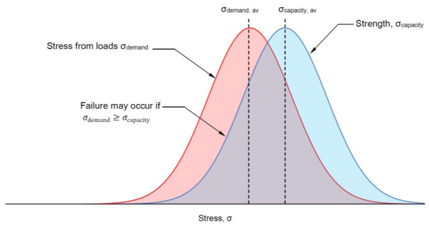

# Lecture 7, Sep 27, 2021

## Safety

* Types of forces
	1. Dead loads -- Things that can't move -- e.g. self-weight, added features (e.g. asphalt on a suspension bridge, chairs in this lecture hall, often called *superimposed* dead loads)
		* Generally well-known during design, low-uncertainty
	2. Live loads -- Things that can move -- e.g. cars, people, wind
		* Generally more uncertain and unpredictable
		* To design for these, we look for worst cases
* Once we know the types of load, we make a best guess
	* For some things we take the average, e.g. cars
* {width=50%}
* The basic safety equation: $\sigma _{demand} < \sigma _{capacity}$, i.e. your structure should be able to handle more stress than demanded
	* This just tells you whether the structure will fall down, not whether it is safe
	* $\sigma _{capacity}$: Yield or ultimate strength?
		* Generally if we have a yield strength $\sigma _y$, we should use that, because the ultimate strength of e.g. steel is hard to measure and uncertain
	* Stress demand and capacity usually follow a normal distribution (bell curve); there might be structural imperfections leading to uncertainties in dead loads, and material imperfections might lead to uncertainties in stress capacity
		* This means that even if the average $\sigma _{demand}$ is greater than the average $\sigma _{capacity}$, they might still overlap
		* The overlap is where the uncertainties make the stress demand greater than the capacity and so the structure fails
		* We want to minimize this overlap but it is not possible to make this zero (size of overlap is related to *risk* of failure)
* A safe structure has $\sigma _{demand} < \sigma _{capacity}$ and a low risk of it being otherwise
* 2 ways to deal with risk:
	1. Limit states design (very complicated and an entire course on its own)
	2. Allowable stress design (this course), aka working stress design
		* Key concept: Factor of Safety $\text{FoS} = \frac{\sigma _{capacity}}{\sigma _{demand}}$
			* If this number is less than $1$, it will fall down
			* If this number is greater than "some specified number", then it is safe
				* This "some specified number" can be determined using limit states design
				* In the 1800s this would be 3-10 based on consequences for failure and warning (e.g. for ductile metals like steel the FoS can be lower since there is a lot of warning before it fails)
				* In the 1960s FoS of 2 is typical
				* Today, with more control on the materials, the FoS is typically about 1.7
				* e.g. The Brooklyn bridge built in the 1980s has an FoS of 5, the Golden Gate bridge has 2.68, the Akashi Kaikyo bridge has 2.25; numbers go down over time because materials are more well understood and uncertainties decrease
* Allowable stress: $\frac{\sigma _y}{\text{FoS}}$ and this is the amount of stress that the structure is allowed to take
	* In this class the FoS will be given

