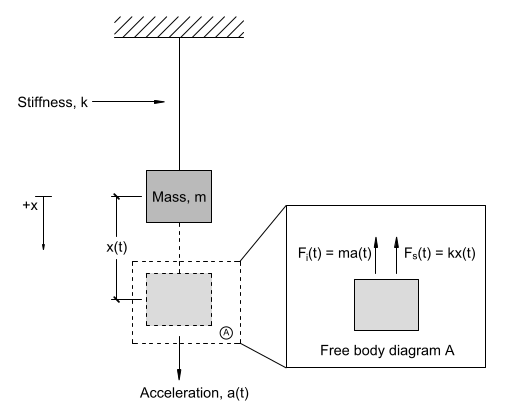

# Lecture 8, Sep 28, 2021

* Types of oscillations:
	1. Mechanical
		* Springs -- we'll be looking at this for this lecture
		* Earthquakes
		* Sound transmission
		* Machine vibration
	2. Electrical
		* Power generation and transmission
		* Electromagnetic (communications)
		* Photonics

## Dynamic Equilibrium

* Oscillating systems are not in static equilibrium, so we cannot use our usual methods
* We can apply D'Alembert's Principle: Convert dynamic equilibrium ($a \neq 0$) to equivalent static equilibrium by introducing a fictitious *inertial force*
	* This inertial force is $F_i = ma$ and acts in the opposite direction of acceleration
	* Think of it as inertia resisting acceleration
	* By doing this we can convert it into a static system where $\sum F = 0$, and we no longer have to consider time
	* The inertial force is fictitious but consistent with physics
	* $\sum F = ma \implies \sum F - ma = 0 \implies \sum F - F_i = 0$ if $F_i = ma$ is considered a force
	* Example: centrifugal force is not a real force but we still feel it

## Free Vibration Without Gravity in One Dimension

{width=40%}

* Consider a mass attached to a spring; ignoring all resistance, if the mass is pulled down and then released, the system is in free vibration
* The system can be modelled by a second-order linear homogeneous DE: $ma(t) + kx(t) = 0 \implies mx''(t) + kx(t) = 0$
* This has solution $x(t) = A\sin(\omega _nt + \phi)$, where $A$ is amplitude, $\omega _n$ is the natural angular frequency, and $\phi$ is the phase delay
	* If we substitute back this solution, we get $\omega _n = \sqrt{\frac{k}{m}}$
	* This shows that the frequency is dependent only on the mass and spring stiffness, not on anything else
	* We can express the natural frequency in terms of Hz: $f_n = \frac{1}{2\pi}\omega _n = \frac{1}{2\pi}\sqrt{\frac{k}{m}}$ (because $2\pi$ radians represent a full rotation/cycle)
	* The natural period period is then $\frac{1}{f_n} = 2\pi\sqrt{\frac{m}{k}}$, with units of seconds
	* The amplitude $A$ and phase shift $\phi$ can be determined using the initial conditions (Initial Value Problem)

## Adding Gravity

* If we introduce gravity, the equation becomes inhomogeneous: $ma(t) + kx(t) = 0 \implies mx''(t) + kx(t) = mg$
* The modified solution has form $x(t) = A\sin(\omega _n t + \phi) + \Delta _0$, where $k\Delta _0 = mg \implies \Delta _0 = \frac{mg}{k}$
	* Essentially the system will now oscillate around this shifted point instead, but other properties remain the same
	* The general solution to an inhomogeneous linear ODE is the general solution to the homogeneous DE plus a particular solution; intuitively in this case $x = \Delta _0$ represents the particular solution, where the force of the spring and gravity are in balance and no initial movement, so the system stays in that equilibrium forever

## Other Methods for Calculating $\omega$

* $\omega _n$ and $f_n$ are important properties of the structure as it allows us to determine whether the structure is susceptible to time-varying loads (resonance)
* Measuring $k$ can be difficult, so we can compute $f_n$ from the static displacement $\Delta _0$ instead:
	* $k\Delta _0 = mg \implies k = \frac{mg}{\Delta _0}$
	* $f_n = \frac{1}{2\pi}\sqrt{\frac{k}{m}} = \frac{1}{2\pi}\sqrt{\frac{mg}{\Delta _0} \cdot \frac{1}{m}} = \frac{1}{2\pi}\sqrt{\frac{g}{\Delta _0}} \approx \frac{15.76}{\sqrt{\Delta _0}}\si{Hz}$
	* Note: This assumes $\Delta _0$ has units of $\si{mm}$

