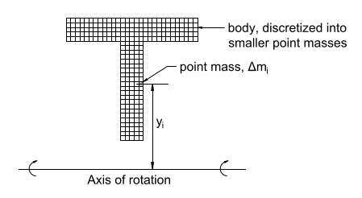
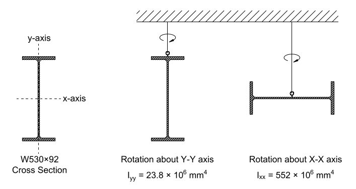

# Lecture 9, Sep 28, 2021

## Relationship Between Moment and Angular Acceleration

* If we apply a pure moment $M$, what is the angular acceleration of the mass?
	* If the lever arm is $y$ then $M = Fy$
	* The angular acceleration is related to the translational acceleration: $a = \alpha y$
	* If we combine them with $F = ma$: $M = Fy = (m\alpha y)y = m\alpha y^2 = (my^2)\alpha$
	* The $my^2$ term is the angular equivalent of mass, the *moment of inertia* $I_m$
* $M = I_ma$ is the rotational analogue of Newtons second law, and $I_m$ has units of mass times length squared

## Calculating the Moment of Inertia

* To determine $I_m$ for non-point masses, we can break the object into smaller pieces:
	* {width=30%}
	* $I_m = \sum I_{m, i} = \sum \Delta m_iy_i^2$
* We can get the exact moment of inertia by taking an integral: $I_m = \int _M y^2\,\dd m$ where $M$ is the entire mass
* For a 2-dimensional object with uniform density $\rho$ this reduces to $\rho \int _A y^2\,\dA$
* The integral term $\int _A y^2\,\dA$ is known as the *second moment of area* $I$, with dimensions of length to the power of 4

## Properties and Physical Interpretation of the Moment of Inertia

* From the formula we can see that $I$ depends on the axis of rotation, and masses further from the axis of rotation contribute more to the moment of inertia
* {width=50%}
* Example: $\text{W530}\times\text{92}$ I-beam ($530\si{mm}$ nominal height, $92\si{kg/m}$ weight); the moment of inertia about the y axis is much lower because the masses are closer to the axis

## Example Calculation

* Example: Calculate the second moment of area for a rectangle rotating about its middle axis
* $\dA = b\,\dy$ where $b$ is the width of the rectangle
* $I = \int _{-\frac{h}{2}}^{\frac{h}{2}} by^2\,\dy = \left[\frac{1}{3}by^3\right]_{-\frac{h}{2}}^{\frac{h}{2}} = \frac{bh^3}{12}$

