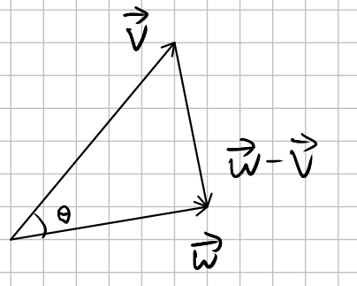
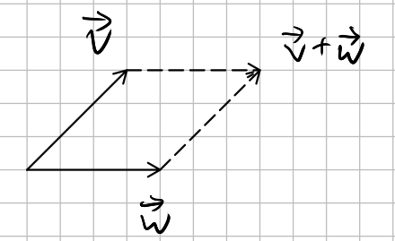
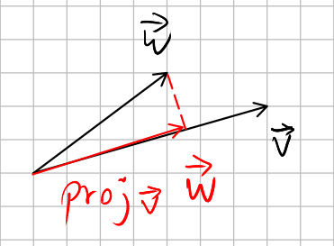

# Lecture 3, Sep 20, 2021

## Properties of the Dot Product

* Dot products are **distributive**, **commutative**, and **associative** (with scalars: $c(\vec{v} \cdot \vec{w}) = c\vec{v} \cdot \vec{w} = \vec{v} \cdot c\vec{w}$)
* The dot product of a vector with itself is the square of its length: $\vec{v} \cdot \vec{v} = v_1^2 + v_2^2 + v_3^2 = \norm*{\vec{v}}^2$

## Geometric Meaning of the Dot Product

* {width=50%}
* $\norm*{\vec{w} - \vec{v}}^2 = (\vec{w} - \vec{v}) \cdot (\vec{w} - \vec{v}) = \vec{w} \cdot \vec{w} - 2\vec{w} \cdot \vec{v} + \vec{v} \cdot \vec{v} = \norm*{\vec{w}}^2 + \norm*{\vec{v}}^2 - 2\vec{w} \cdot \vec{v}$
	* Apply the cosine law: $\norm*{\vec{w} - \vec{v}}^2 = \norm*{\vec{w}}^2 + \norm*{\vec{v}}^2 - 2\norm*{\vec{w}}\norm*{\vec{v}}\cos \theta$
	* Therefore: $\vec{w} \cdot \vec{v} = \norm*{\vec{w}}\norm*{\vec{v}}\cos \theta \implies \cos \theta = \frac{\vec{w} \cdot \vec{v}}{\norm*{\vec{w}}\norm*{\vec{v}}}$
* Since cosine has range $[-1, 1]$, this means the dot product can be negative; when the dot product is negative $\theta < \frac{\pi}{2}$ so the two vectors are in the same direction
* When $\vec{v} \cdot \vec{w} = 0$, then $\cos \theta = 0 \implies \theta = \frac{\pi}{2}$ so $\vec{v}$ and $\vec{w}$ are orthogonal

## Two Important Inequalities

1. *Triangle Inequality*: $\norm*{\vec{v} + \vec{w}} \leq \norm*{\vec{v}} + \norm*{\vec{w}}$
	* {width=30%}
	* $\norm*{\vec{v} + \vec{w}}^2 = (\vec{v} + \vec{w}) \cdot (\vec{v} + \vec{w}) = \vec{v} \cdot \vec{v} + \vec{w} \cdot \vec{w} + 2\vec{v} \cdot \vec{w} = \norm*{\vec{v}}^2 + \norm*{\vec{w}}^2 + 2\norm*{\vec{v}}\norm*{\vec{w}}\cos \theta$
	* Replace $\cos \theta$ with its least upper bound $1$: $\norm*{\vec{v} + \vec{w}}^2 \leq \norm*{\vec{v}}^2 + \norm*{\vec{w}}^2 + 2\norm*{\vec{v}}\norm*{\vec{w}} = (\norm*{\vec{v}} + \norm*{\vec{w}})^2$
	* Take the square root: $\norm*{\vec{v} + \vec{w}} \leq \norm*{\vec{v}} + \norm*{\vec{w}}$
2. *Cauchy-Schwartz-Bunyakovsky Inequality*: $\abs*{\vec{v} \cdot \vec{w}} \leq \norm*{\vec{v}}\norm*{\vec{w}}$

## Projections

* Key concept: **Orthogonality**: Two vectors are orthogonal iff $\vec{v} \cdot \vec{w} = 0$
* To get the components/coordinates of a vector we project it onto $\ihat, \jhat, \khat$, etc (standard projections)
* The projection of $\vec{w}$ onto $\vec{v}$, $\proj _{\vec{v}}\vec{w}$ is a vector parallel to $\vec{v}$ that is as close as $\vec{w}$ as possible:
	* {width=30%}

