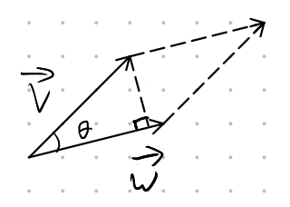

# Lecture 4, Sep 22, 2021

## Computing Projections

{width=30%}

* $\vec{u} = \proj _{\vec{v}} \vec{w}$
* $\vec{u}$ has certain properties:
	1. $\vec{u} \parallel \vec{v} \iff \vec{u} = c\vec{v}$
	2. $(\vec{w} - \vec{u}) \perp \vec{v} \iff (\vec{w} - \vec{u}) \cdot \vec{v} = 0$
* Combine the equations to find $c$: $(\vec{w} - c\vec{v}) \cdot \vec{v} = \vec{w} \cdot \vec{v} - c\norm*{\vec{v}}^2 = 0 \implies c = \frac{\vec{w} \cdot \vec{v}}{\norm*{\vec{v}}^2}$
* Therefore $\vec{u} = \proj _{\vec{v}} \vec{w} = \frac{\vec{w} \cdot \vec{v}}{\norm*{\vec{v}}^2}\vec{v}$ or $\frac{\vec{w} \cdot \vec{v}}{\vec{v} \cdot \vec{v}}\vec{v}$
* Alternatively $\frac{\vec{w} \cdot \vec{v}}{\norm*{\vec{v}}^2}\vec{v} = \frac{\vec{w} \cdot \vec{v}}{\norm*{\vec{v}}}\frac{\vec{v}}{\norm*{\vec{v}}} = \frac{\vec{w} \cdot \vec{v}}{\norm*{\vec{v}}}\hat{v}$

## Cross Products (aka Vector Products)

* Given $\vec{v} = \cvec{v_1}{v_2}{v_3}, \vec{w} = \cvec{w_1}{w_2}{w_3}$, $\vec{u} = \vec{v} \times \vec{w} = \cvec{v_2w_3 - v_3w_2}{-v_1w_3 + v_3w_1}{v_1w_2 - v_2w_1}$
* The result of the cross product $\vec{u}$ is orthogonal to both $\vec{v}$ and $\vec{w}$, and has magnitude equal to the area of the parallelogram created by $\vec{v}$ and $\vec{w}$
* Properties of the cross product:
	1. Distributive: $\vec{v} \times (\vec{w} + \vec{z}) = \vec{v} \times \vec{w} + \vec{v} \times \vec{z}$
	2. Anti-commutative: $\vec{v} \times \vec{w} = -(\vec{w} \times \vec{v})$
	3. Associative with scalars: $c\vec{v} \times \vec{w} = \vec{v} \times c\vec{w} = c(\vec{v} \times \vec{w})$
	4. $\vec{v} \times \vec{0} = \vec{0} \times \vec{v} = 0$
	5. **Not** associative with itself: $(\vec{v} \times \vec{w}) \times \vec{z} \neq \vec{v} \times (\vec{w} \times \vec{z})$
* The direction of $\vec{u}$ follows the right-hand rule: index finger in the direction of $\vec{v}$, middle finger in the direction of $\vec{w}$, then the thumb will be pointing in the direction of $\vec{u} = \vec{v} \times \vec{w}$
	* Alternatively start at $\vec{v}$ and curl towards $\vec{w}$
* Lagrange identity says that $\norm*{\vec{v} \times \vec{w}}^2 = \norm*{\vec{v}}^2\norm*{\vec{w}}^2 - (\vec{v} \cdot \vec{w})^2$
	* Use direct proof approach and use the definition of the cross product to brute force the proof
	* Visualization: Suppose $\theta$ is the angle between $\vec{w}$ and $\vec{v}$; then $\norm*{\vec{v} \times \vec{w}}^2 = \norm*{\vec{v}}^2\norm*{\vec{w}}^2 - (\norm*{\vec{v}}\norm*{\vec{w}}\cos \theta)^2 = \norm*{\vec{v}}^2\norm*{\vec{w}}^2(1 - \cos^2 \theta) = \norm*{\vec{v}}^2\norm*{\vec{w}}^2\sin^2 \theta$
	* Therefore $\norm*{\vec{v} \times \vec{w}} = \norm*{\vec{v}}\norm*{\vec{w}}\sin \theta$ (absolute value not needed because $\sin \theta \geq 0$ for $0 \leq \theta \leq \pi$)
		* Similar to the dot product which is $\vec{v} \cdot \vec{w} = \norm*{\vec{v}}\norm*{\vec{w}}\cos \theta$
	* This corresponds to the area of the parallelogram defined by $\vec{v}$ and $\vec{w}$:
		* {width=20%}
		* The base length is $\norm*{\vec{w}}$, and the height is $\norm*{\vec{v}}\sin \theta$, so the magnitude of the cross product is the area of this parallelogram
* The dot product is a measure of how much the vectors are parallel; the cross product is a measure of how much the vectors are orthogonal

