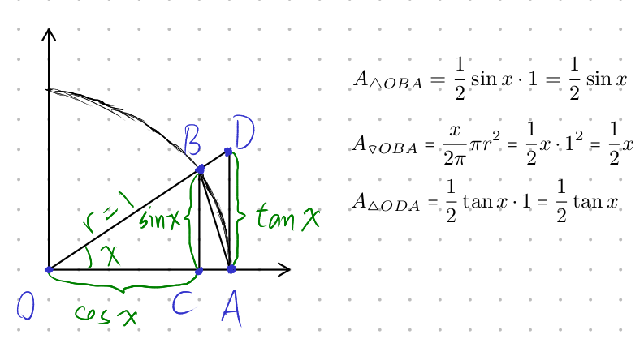

# Lecture 11, Oct 4, 2021

## Derivatives of Trig Functions

* In cases of $\frac{0}{0}$ our intuition fails
* Prove $\lim _{x \to 0} \frac{\sin x}{x} = 1$ and $\lim _{x \to 0} \frac{1 - \cos x}{0} = 0$
	* We can't use the product limit theorem because $\lim _{x \to 0} \frac{1}{x}$ does not exist
	* {width=70%}
	* $A_{\triangle OBA} \leq A_{\downslice OBA} \leq A_{\triangle ODA} \implies \sin x \leq x \leq \tan x \implies 1 \leq \frac{x}{\sin x} \leq \frac{1}{\cos x} \implies \cos x \leq \frac{\sin x}{x} \leq 1$
	* We can use the sandwich theorem since $\cos 0 = 1 \implies \lim _{x \to 0} \frac{\sin x}{x} = 1$
	* $\alignedeqntwo[t]{\lim _{x \to 0} \frac{\cos x - 1}{x}}{\lim _{x \to 0}\frac{(\cos x - 1)(\cos x + 1)}{x(\cos x + 1)}}{\lim _{x \to 0} \frac{\cos^2 x - 1}{x(\cos x + 1)}}{\lim _{x \to 0}\frac{-\sin^2 x}{x(\cos x + 1)}}{\lim _{x \to 0}\frac{\sin x}{x}\lim _{x \to 0}\frac{-\sin x}{\cos x + 1}}{1 \cdot \frac{\lim _{x \to 0} -\sin x}{\lim _{x \to 0}{\cos x + 1}}}{\frac{0}{2}}{0}$
* $\alignedeqntwo[t]{\diff{}{x}\sin x}{\lim _{h \to 0}\frac{\sin(x + h) - \sin x}{h}}{\lim _{h \to 0}\frac{\sin x\cos h + \cos x\sin h - \sin x}{h}}{\lim _{h \to 0}\frac{\sin x(\cos h - 1) + \cos x\sin h}{h}}{\lim _{h \to 0}\sin x \lim _{h \to 0}\frac{\cos h - 1}{h} + \lim _{h \to 0}\cos x\lim _{h \to 0}\frac{\sin h}{h}}{0 \cdot \sin x + 1 \cdot \cos x}{\cos x}$
* $\alignedeqntwo[t]{\diff{}{x}\cos x}{\lim _{h \to 0}\frac{\cos(x + h) - \cos x}{h}}{\lim _{h \to 0}\frac{\cos x\cos h - \sin x\sin h - \cos x}{h}}{\lim _{h \to 0}\frac{\cos x(\cos h - 1) + \sin x\sin h}{h}}{\lim _{h \to 0}\cos x \lim _{h \to 0}\frac{\cos h - 1}{h} - \lim _{h \to 0}\sin x\lim _{h \to 0}\frac{\sin h}{h}}{0 \cdot \cos x - 1 \cdot \sin x}{-\sin x}$

## Chain Rule (Composite Function Derivative Theorem)

* The chain rule theorem: $(f(u(x)))' = f'(u)u'(x)$ or $\diff{f}{x} = \diff{f}{u} \cdot \diff{u}{x}$
	* Simple proof, assuming $u(x) \neq u(a)$ when $x$ and $a$ are close:
		* $\alignedeqntwo[t]{(f(u(x)))'}{\lim _{a \to x}\frac{f(u(a)) - f(u(x))}{a - x}}{\lim _{a \to x}\frac{f(u(a)) - f(u(x))}{u(a) - u(x)} \lim _{a \to x}\frac{u(a) - u(x)}{a - x}}{\diff{f}{u}\diff{u}{x}}$

## Implicit Differentiation

* Sometimes there is no explicit expression for $y(x)$ and we only have an implicit relation, e.g. $x^3y^7 - x^2 + y^2 = 0$
* We can find $y'(x)$ here using implicit differentiation and apply the "$\diff{}{x}$ operator" to both sides
* Using implicit differentiation we can prove that the power derivative theorem works for any rational number
	* Set $u(x) \equiv x^{\frac{p}{q}}$ where $p$ and $q$ are integers; note $u^q = x^p$
	* Set $f(u) \equiv u^q = x^p$; note $f(u(x))$ is a composite function
	* $\diff{f}{x} = \diff{f}{u}\diff{u}{x} \implies px^{p - 1} = qu^{q - 1}\diff{u}{x} \implies u' = \frac{px^{p - 1}}{qu^{q - 1}}$
	* $u = x^{\frac{p}{q}} \implies u^{q - 1} = x^{\frac{p}{q}(q - 1)} = x^{p - \frac{p}{q}}$
	* $u' = \frac{px^{p - 1}}{qu^{q - 1}} = \frac{p}{q}\frac{x^{p - 1}}{x^{p - \frac{p}{q}}} = \frac{p}{q}x^{\frac{p}{q} - 1}$

## Higher Derivatives

* Assuming $s'(t)$ exists, it is a function itself, so we can also take its derivative
* $s'(t)$ is the *first derivative*, $s''(t)$ is the *second derivative*, the derivative of the derivative, and so on
* In Newtonian notation $(s'(t))' = s''(t)$, in Leibniz $\diff{}{t}\diff{s}{t} = \diffn{2}{s}{t}$ and so on for higher orders
	* With Leibniz we can use unit checking to check for potential mistakes; by putting the exponent on $t$ but not $s$ in $\diffn{2}{s}{t}$ we know the units for $t$ are squared but the units for $s$ are not

