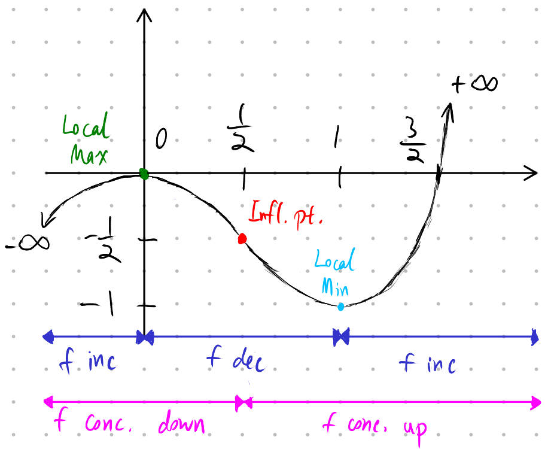

# Lecture 16, Oct 18, 2021

## Curve Sketching

* Checklist:
	1. Find:
		* Domain, range
		* $\lim _{x \to \pm \infty} f(x)$
		* End points if they exist
		* Vertical/horizontal/slant asymptotes
	2. Find intercepts ($x$ value where $f = 0$, $f$ value where $x = 0$)
	3. Establish whether $f(x)$ is:
		* Even or odd
		* Periodic
	4. Find $f'(x)$, then:
		* Find all critical points $c$ and $f(c)$ and find local max/min
		* Find ranges where $f(x)$ is increasing and decreasing
		* Find vertical tangents (reminder: vertical tangent is when derivative is infinity but function is continuous)
	5. Find $f''(x)$, then:
		* Find where $f(x)$ is concave up/down and points of inflection
			* Note: $f(x)$ has to be continuous at a point of inflection
		* Use the second derivative test to confirm local max/min from the last step
	6. Find the absolute maximum/minimum if they exist
* Example: $f(x) = 2x^3 - 3x^2$ (note $f(x) = x^2(2x - 3)$)
	1. Domain is all $x$, no asymptotes, no end points, $\lim _{x \to +\infty} f(x) = +\infty$, $\lim _{x \to -\infty} f(x) = -\infty$ so range is all reals
	2. $f(x) = 0$ when $x = 0, \frac{3}{2}$, $x = 0$ when $f = 0$
	3. Not symmetric or periodic
	4. $f'(x) = 6x^2 - 6x = 6x(x - 1)$
		* Critical points: $x = 0, 1$
		* $f' > 0$ for $x > 1 \implies f(x)$ increasing for $x > 1$
		* $f' < 0$ for $0 < x < 1 \implies f(x)$ decreasing for $0 < x < 1$
		* $f' > 0$ for $x < 0 \implies f(x)$ increasing for $x < 0$
		* $f(1)$ is a local minimum, $f(0)$ is a local max
		* No vertical tangents or cusps
	5. $f''(x) = 12x - 6 = 6(2x - 1)$
		* Inflection point at $x = \frac{1}{2}$
		* $f'' > 0$ for $x > \frac{1}{2}$ so $f$ is concave up for $x > \frac{1}{2}$
		* $f'' < 0$ for $x < \frac{1}{2}$ so $f$ is concave down for $x < \frac{1}{2}$
	6. No absolute max/min since range is all reals

{width=70%}

## Numerical Root Finding Methods

* Sometimes we might want to find the roots of a complicated polynomial; for polynomials of degree 5 and above no formula exists, but there exist numerical methods that can get us approximate values
* Method of Successive Bisections
	* By trial and error, find $a < b$ such that $f(a) > 0 > f(b)$ or $f(a) < 0 < f(b)$
	* If $f$ is continuous, then by the IVT, $f(c) = 0$ for some $a < c < b$
	* For each step:
		1. Calculate the halfway point between $a_i + b_i$, denoted $x_{hi}$
		2. Calculate $f(x_{hi})$; if $f(x_{hi}) > 0$ then we can pick $a_{i + 1} = x_{hi}$ and keep $b$ the same
			* Conversely if $f(x_{hi}) < 0$ we keep $a$ the same but pick $b_{i + 1} = x_{hi}$
	* For each step the possible range for $c$ is cut in half; eventually the range is small enough that the difference between $a$ and $b$ does not matter
	* This method always converges
* Newton's Method
	* Easier to use and faster
	* However, $f(x)$ must be differentiable, and this method may not converge if initial guess is too far off
	* Procedure:
		1. Start with an initial guess of $x_1$
			* This must be a good guess, otherwise will not converge
		2. Compute $f(x_1)$ and $f'(x_1)$ to find the tangent line: $y_t(x) = f(x_1) + f'(x_1)(x - x_1)$
		3. Find where the tangent line approximation intersects the x-axis: $f(x_1) + f'(x_1)(x_2 - x_1) = 0 \implies x_2 = x_1 - \frac{f(x_1)}{f'(x_1)}$
		4. Repeat the procedure until estimate is as close to the true root as desired
	* If the tangent line at $x$ is not a good approximation of the function's behaviour, then the next iteration can give a worse number (e.g. if there is a local max between your guess and the root)
	* This method may also fail for some particular functions, e.g. $x^{\frac{1}{3}}$
* Generally, try Newton's Method first, and if it does not converge, try different guesses or try the bisection method

## Antiderivatives

* Definition: $F(x)$ is an antiderivative of $f(x)$ if $F'(x) = f(x)$
* Unlike derivatives, not every function has an antiderivative; (educated) guessing is always involved
* The test for whether $F(x)$ is an antiderivative of $f(x)$ is the rigorous part, but finding $F(x)$ itself is not (like limits)
* $F(x) + C$ is the most general antiderivative of $f(x)$ because antiderivatives are not unique
* Properties to be memorized:
	1. $af(x) \to aF(x) + C$
	2. $f(x) + g(x) \to F(x) + G(x) + C$
	3. $x^n \to \frac{1}{n + 1}x^{n + 1} + C$ for $n \neq -1$
	4. $\cos x \to \sin x + C$
	5. $\sin x \to -\cos x + C$
	6. $\sec^2 x \to \tan x + C$

