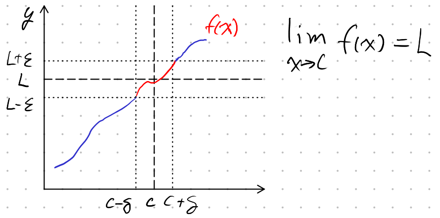

# Lecture 5, Sep 20, 2021

## Rigorous Definition of the Limit

* Test-definition (a type of implicit definition) for a new number $\lim _{x \to c} f(x)$, given:
	1. $c$, some particular value of $x$
	2. $f(x)$, which may be undefined at $c$, but is defined for all $x$ near $c$
	3. $L$, a candidate value for the limit
* Imposed: Some small positive $\varepsilon > 0$; we don't have the exact value and will have to allow for any $\varepsilon > 0$
* Test: Find some $\delta > 0$, such that for all $0 < \abs{x - c} < \delta$, $\abs{f(x) - L} < \varepsilon$
	* i.e. Find some $\delta$ such that all $x$ within the $x$-band have corresponding values of $f$ that fall in the $y$-band
* If the test passes, then the limit exists and $\lim _{x \to c} f(x) = L$
* Since $\abs{x - c} > 0$, $x$ is never really equal to $c$, so we can simplify situations such as $\frac{x}{x}$ when $c = 0$ legitimately

{width=50%}

## General Process

1. $\varepsilon > 0$ is imposed (it is **given** so we can and have to work with it)
2. Find a set of $x$ values for which $\abs{f(x) - L} < \varepsilon$
	* Example: Prove $\lim _{x \to 0} \frac{10x + 5x^2}{x} = 10$
	* Here $\abs*{\frac{10x + 5x^2}{x} - 10} = \abs{10 - 5x - 10} = \abs{5x} = 5\abs{x} < \varepsilon$
	* Notice how the $x$ can be cancelled out rigorously now since $x$ is not allowed to be zero
3. Look for a set of $x$ values you will specify by $0 < \abs{x - c} < \delta$
	* Example: $0 < \abs{x - 0} = \abs{x} < \delta$
4. Plug \textcircled{3} into the left hand side of \textcircled{2} and do algebraic manipulation until you get $\abs{f(x) - L} <$ some expression involving only $\delta$
	* Example: If $5\abs{x} < \varepsilon$ for \textcircled{2} and $\abs{x} < \delta$, then $5\abs{x} < 5\delta$
5. Guess $\delta$ in terms of $\varepsilon$ and plug back in to get $\abs{f(x) - L} <$ some expression involving $\varepsilon$, and then make the right hand side $< \varepsilon$
	* Example: Choose $\delta = \frac{1}{5}\varepsilon$, substitute into $5\abs{x} < 5 \implies 5\abs{x} < \varepsilon$
	* Now we've found (one of the) $\delta$ values for any given $\varepsilon$ such that $\abs{f(x) < L} < \varepsilon$ for all $0 < \abs{x - c} < \delta$, so we can conclude $\lim _{x \to c} f(x) = L$
6. Compact: Given $\varepsilon > 0$, take $\delta = \cdots$ then when $0 < \abs{x - c} < \delta$, $\abs{f(x) - L} < \varepsilon$, therefore $\lim _{x \to c} f(x) = L$

## Example

* Prove $\lim _{x \to 0} x^3 = 0$
	* $\abs{x^3 - 0} = \abs{x^3} = \abs{x}^3 < \varepsilon$
	* $0 < \abs{x - 0} = \abs{x} < \delta$
	* $\abs{x}^3 < \delta^3$
	* Take $\delta = \sqrt[3]\varepsilon \implies \abs{x}^3 < \varepsilon$; QED
	* Note the choice of $\delta$ is not unique; anything that does the job is fine!

