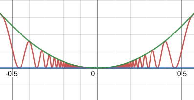

# Lecture 7, Sep 23, 2021

## Limit Theorems

* Limit theorems let us rigorously prove much more complicated limits, such as polynomials, by breaking it into manageable pieces, each provable with the epsilon-delta definition
* Some limit theorems: (assume $\lim _{x \to c} f(x) = L$ and $\lim _{x \to c} g(x) = M$ are given; **both limits need to exist**)
	1. Additivity Limit Theorem: $\lim _{x \to c} [f(x) + g(x)] = L + M$
		* Proof:
			* Required $\abs{f(x) + g(x) - L - M} < \varepsilon$ when $0 < \abs{x - c} < \delta$
			* $\abs{f(x) + g(x) - L - M} = \abs{(f(x) - L) + (g(x) - M)} \leq \abs{f(x) - L} + \abs{g(x) - M}$ (triangle inequality)
			* We are given that $\lim _{x \to c} f(x) = L$ and $\lim _{x \to c} g(x) = M$, therefore:
				* For some $\varepsilon _f = \frac{\varepsilon}{2}$, there is $0 < \abs{x - c} < \delta _f$ such that $\abs{f(x) - L} < \varepsilon _f = \frac{\varepsilon}{2}$
				* For the same $\varepsilon _f$, there is $0 < \abs{x - c} < \delta _g$ such that $\abs{g(x) - M} < \varepsilon _f = \frac{\varepsilon}{2}$
			* If $x$ is inside both $\delta _f$ and $\delta _g$ bands, then $\abs{f(x) + g(x) - L - M} \leq \abs{f(x) - L} + \abs{g(x) - M} < \frac{\varepsilon}{2} + \frac{\varepsilon}{2} = \varepsilon$
			* Therefore by picking $\delta = \min(\delta _f, \delta _g)$, $0 < \abs{x - c} < \delta \implies \abs{f(x) + g(x) - L - M} < \varepsilon$, and the limit is proved!
	2. Product Limit Theorem: $\lim _{x \to c} f(x)g(x) = LM$
		* Proof:
			* From the limits given: For some $\varepsilon _f = \sqrt{\varepsilon} > 0$ there is $0 < \abs{x - c} < \delta _f \implies \abs{(f(x) - L) - 0} < \varepsilon _f$ and $0 < \abs{x - c} < \delta _g \implies \abs{(g(x) - M) - 0} < \varepsilon _g$
			* Therefore if $\delta = \min(\delta _f, \delta _g)$ then $0 < \abs{x - c} < \delta \implies \abs{(f(x) - L) - 0}\abs{(g(x) - M) - 0} < \sqrt{\varepsilon}\sqrt{\varepsilon} = \varepsilon$, so $\lim _{x \to c} (f(x) - L)(g(x) - M) = 0$
			* $0 = \lim _{x \to c} (f(x) - L)(g(x) - M) = \lim _{x \to c} \left[f(x)g(x) - f(x)M - g(x)L + LM\right] = \lim _{x \to c} f(x)g(x) + \lim _{x \to c} -Mf(x) + \lim _{x \to c} -Lg(x) + \lim _{x \to c} LM$ by the additive theorem
			* Therefore $\lim _{x \to c} f(x)g(x) = -\lim _{x \to c} -Mf(x) - \lim _{x \to c} -Lg(x) - \lim _{x \to c} LM = ML + LM - LM = ML$ (by $\lim _{x \to c} cf(x) = c\lim _{x \to c} f(x)$, ~~proof of which is left as an exercise to the reader~~)
	3. Polynomial Limit Theorem: $\lim _{x \to c} P_n(x) = P_n(c)$ for polynomials $P_n(x)$
		* This can be trivially proven using the product and additivity limit theorems
	4. Rational Function Limit Theorem: $\lim _{x \to c} \frac{f(x)}{g(x)} = \frac{L}{M}$ if $M \neq 0$
		* Proof not included because I'm tired, see [this link](https://tutorial.math.lamar.edu/classes/calci/limitproofs.aspx).
	5. Root Limit Theorem: $\lim _{x \to c} \sqrt[n]{f(x)} = L^\frac{1}{n}$
* Other limit theorems:
	6. Sandwich (aka Squeeze) Limit Theorem: If $\lim _{x \to c} f(x) = \lim _{x \to c} h(x) = L$ and $f(x) \leq g(x) \leq h(x)$ near but not necessarily at $c$, then $\lim _{x \to c} g(x) = L$
		* $g(x)$ may be a very complicated function, but we might be able to find simple functions $f(x)$ and $h(x)$ that bound $g(x)$ near $c$ for which we can easily find the limits of

## Applying Limit Theorems

* Example: $\alignedeqn[t]{\lim _{x \to -2} \frac{x^2 - x - 6}{x^2 - 4}}{\lim _{x \to -2} \frac{(x - 3)(x + 2)}{(x - 2)(x + 2)}}{\lim _{x \to -2} \frac{x - 3}{x - 2}}{\frac{\lim _{x \to -2} x - 3}{\lim _{x \to -2} x - 2}\text{ (rational function LT)}}{\frac{5}{4}\text{ (polynomial LT)}}$
* Rigorously logical proofs justify every line by citing an axiom or proven theorem
* Example of using the Sandwich Theorem: $\lim _{x \to 0} x^2\cos^2 \frac{1}{x^2}$
	* Can't use the product LT because $\lim _{x \to 0} \cos^2 \frac{1}{x^2}$ DNE (the function just oscillates faster and faster)
	* Find bounding functions: $0 \leq \cos^2 \frac{1}{x^2} \leq 1 \implies 0 \leq x^2\cos^2 \frac{1}{x^2} \leq x^2$
	* Define $f(x) \equiv 0, g(x) \equiv x^2\cos^2 \frac{1}{x^2}, h(x) \equiv x^2$
	* $\lim _{x \to 0} f(x) = 0$ and $\lim _{x \to 0} h(x) = 0$ by the polynomial LT, therefore $\lim _{x \to 0} g(x) = 0$
	* Graph: {width=30%}

