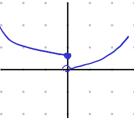
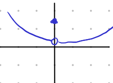

# Lecture 8, Sep 27, 2021

## Continuity & Discontinuity

* The formal definition of continuity at a point is $f(x)$ is continuous at $c$ iff $\lim _{x \to c} f(x) = f(c)$
* Types of discontinuity:
	1. Jump discontinuity: {width=10%}
	2. Removable discontinuity: {width=10%}
	3. $\lim _{x \to c}\ DNE$ or $f(c)\ DNE$

## Continuity Theorems

* Many important theorems hold true only for continuous functions, so it is important to be able to prove that functions are continuous
	* e.g. Continuity implies integrability; if $f(x)$ is continuous on $[a, b]$ then $\int _a^b f(x)\,\dx$ is guaranteed to exist (note: it might not be able to be expressed using already defined mathematical operations, but it must exist)
* There are continuity theorems just like limit theorems:
	1. Additivity Continuity Theorem: $f(x)$ and $g(x)$ continuous at $c \implies f(x) + g(x)$ continuous at $c$
		* Proofs are trivial using the corresponding limit theorems
	2. Product Continuity Theorem: $f(x)$ and $g(x)$ continuous at $c \implies f(x)g(x)$ continuous at $c$
	3. ...
* Composite Function Continuity Theorem: Given $g(x)$ is continuous at $a$ and $f(x)$ is continuous at the number $g(a)$, then $f(g(x))$ is continuous
	* Using this we can test continuity for nested expressions, e.g. $f(x) = \tan\left(\frac{\pi x^2}{4}\right)$ at $x = 1$

## One-Sided Continuity

* Just like limits, continuity can also be one-handed
* $f(x)$ is continuous on the left at $c$ iff $\lim _{x \to c^-} f(x) = f(c)$; $f(x)$ is continuous on the right at $c$ iff $\lim _{x \to c^+} f(x) = f(c)$
* e.g. $f(x) = \twocond{1 + x^2}{x \geq 0}{x^2}{x < 0}$ is continuous from the right at $0$ and discontinuous from the left at $0$

## Continuity On an Interval

* $f(x)$ is continuous on the open interval $(a, b)$ iff $f(x)$ is continuous for all $x \in (a, b)$
* $f(x)$ is continuous on the closed interval $[a, b]$ iff $f(x)$ is continuous for all $x \in (a, b)$ **and** $f(x)$ is continuous from the right at $a$ **and** $f(x)$ is continuous from the left at $b$
	* Notice that this doesn't require $f(x)$ to be continuous on both sides at $a$ and $b$; just one-handed continuity is okay

## Intermediate Value Theorem

* Given $f(x)$ continuous on $[a, b]$ and $f(a) < C < f(b)$ or $f(a) > C > f(b)$, there exists some $c \in [a, b]$ such that $f(c) = C$
* The point it that continuous functions don't "skip over" $y$ values; without irrationals and transcendentals the IVT cannot be satisfied so continuity breaks
* Using this we can prove that there exists a number $\sqrt{2}$ such that $\sqrt{2}\sqrt{2} = 2$, which is much harder to do with CORA alone
	* Take $f(x) = x^2$, which is continuous over $[1, 2]$ by the Polynomial CT
	* $f(1) = 1 < 2 < f(2) = 4$ so by the IVT there exists some number $1 < c < 2$ such that $c^2 = 2$
* We can also define transcendentals: $\sin x = 0$ at $x = \pi$, so take $f(x) = \sin x$ and find a point where $\sin x > 0$ and a point where $\sin x < 0$, so this implies that somewhere in this range there exists a $c$ such that $\sin c = 0$
* The IVT is only true because of the existence of irrational numbers, so it could be used to "create" the irrationals; instead of having CORA, we could have started with an Intermediate Value *Axiom* and then proved the Completeness of the Reals *Theorem*, but this is messy because we would need to first define functions

## Bonus: Proof of the IVT

* Proof from pages 50-52 of supplement
* Lemma: Given $f(x)$ continuous on $[a, b]$ and $f(a) < 0 < f(b)$, there exists a number $a < c < b$ for which $f(c) = 0$
	* Let $S$ be the set of all numbers $x \in [a, b]$ such that $f(x) < 0$
	* We know that $S$ contains $x$ in some interval $[a, a + \delta)$
		* Because $\lim _{x \to a^+} f(x)$ exists, if we take $\varepsilon = \abs{f(a)}$, then $\abs{f(x) - f(a)} < \abs{f(a)} = -f(a)$ for $a < x < a + \delta$
		* Therefore $\abs{f(x) - f(a)} < \abs{f(a)} \implies f(a) - \abs{f(a)} < f(x) < f(a) + \abs{f(a)} \implies 2f(a) < f(x) < 0$, and since $f(x) < 0$, $x \in S$
	* This means that $S$ is nonempty and bounded above, so by CORA it has a least upper bound $c$
	* It is not possible for $f(c) > 0$:
		* Suppose $f(c) > 0$
		* There exists $\delta > 0$ such that $\abs{x - c} < \delta \implies \abs{f(x) - f(c)} < f(c)$ (in this case $\varepsilon = f(c)$, which is assumed positive)
		* $\abs{f(x) - f(c)} < f(c) \implies f(c) - f(c) < f(x) < f(c) + f(c) \implies 0 < f(x)$, when $c - \delta < x \leq c$ or $c \leq x < c + \delta$
		* Since $f(x) > 0$ for $c \in (c - \delta, c)$, these values are not in $S$ and thus are upper bounds of $S$; but this contradicts the assumption that $c$ is the least upper bound, so $f(c) > 0$ is not possible
	* Similarly $f(c) < 0$ is also not possible, so by process of elimination $f(c) = 0$ (note: $f(c)$ has to exist since $c \in [a, b]$ and $f(x)$ is continuous over that range)
* Now suppose we define $g(x) \equiv f(x) - C$, then $f(a) < C \implies g(a) = f(a) - C < 0$, and $C < f(b) \implies 0 < f(b) - C = g(b)$ and by addition CT $g(x)$ is continuous over $[a, b]$; therefore there exists some $c$ such that $g(c) = 0 \implies f(c) = C$ by the lemma
* Similarly this can be proven for the case where $f(a) > f(b)$

