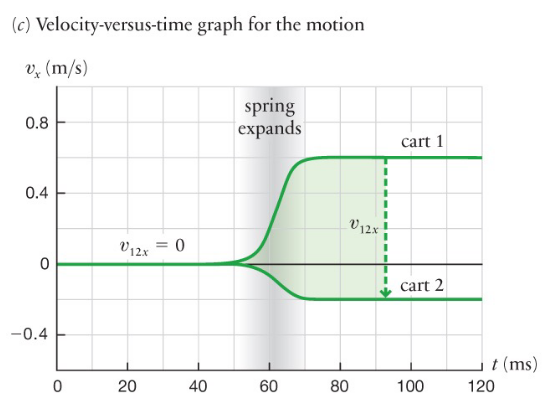

# Lecture 10, Sep 30, 2021

## Coefficient of Restitution

* $e = 1 + \frac{2\Delta E_{int}}{m_1\Delta v_1 v_{2,1i}}$ (from $K_i = \Delta E_{int} + K_f$)
	* $v_{2, 1i}$ is always less than zero
		* If the two carts are heading towards each other then $v_{2, 1i} = v_{1i} - v_{2i}$ is positive, but $\Delta v_1$ is negative since cart 1 slows down
	* Since the term on the right is always less than zero, any $\Delta E_{int} \neq 0$ will result in a $e$ less than 1
	* $e \neq 1$ is a result of change in internal energy $\Delta E_{int} \neq 0$
	* When $\Delta E_{int} < 0$, $e > 1$, and this is an explosive separation (energy is introduced into the system)

## Explosive Separations

* Cases where $e > 1$, kinetic energy is introduced (from the internal energy of the explosive/spring/etc)
* {width=50%}
* Solve for $v_{1f}$ and $v_{2f}$ with $v_{1i} = v_{2i} = 0$
	* $E_{spring} = -\Delta E_{int}$
	* $\alignedimp[t]{\Delta K + \Delta E_{int} = 0}{K_f - K_i + \Delta E_{int} = 0}{K_f = -\Delta E_{int}}{K_f = E_{spring}}{\frac{1}{2}(m_1v_{1f}^2 + m_2v_{2f}^2) = E_{spring}}$
	* $\alignedimp[t]{m_1v_{1f} + m_2{v_2f} = 0}{v_{2f} = \frac{-m_1}{m_2}v_{1f}}{\frac{1}{2}\left(m_1v_{1f}^2 + m_2\left(\frac{-m_1}{m_2}v_{1f}\right)^2\right) = E_{spring}}{v_{1f}^2 = \frac{2E_{spring}}{m_1 + \frac{m_1^2}{m_2}}}$

## Reference Frames and Relativity

* Note: The relativity we're talking about assumes $v \ll c$
* How does motion vary from different perspectives? Are energy, momentum, etc conserved?
* Right now limited to observers with constant velocity difference
* $\vec{v}_{A,B}$ is the velocity of $A$ as observed by $B$
* Define all speeds relative to an observer: $\vec{v}_{o,r} = \diff{}{t}(\vec{r}_o - \vec{r}_r) = \diff{}{t}\Delta \vec{r}_{r \to o}$ (reference $r$, object $o$)
* Physics that work regardless of perspective:
	* Velocity of objects \xmark
	* Momentum of objects \xmark (because velocities are different)
	* Total kinetic energy \xmark (because velocities are different)
	* Where things happen \xmark
	* When things happen \cmark (but not in special relativity)
	* Relative velocities \cmark
	* Change in momentum \cmark
	* Loss of kinetic energy \cmark (because they agree on $\Delta v$)
	* Increase of internal energy \cmark
	* Conservation of momentum \cmark
	* Conservation of energy \cmark
* Change in kinetic energy holds across perspectives
	* $k_1 = \frac{1}{2}m_1v_1^2, k_2 = \frac{1}{2}m_2v_2^2$
	* Observers will agree on $\Delta v_1$ and $\Delta v_2$
	* Frame A:
		* $\Delta K_A = K_{A,f} - K_{A,i} = \frac{1}{2}m_1(v_{A1f}^2 - v_{A1i}^2)$

