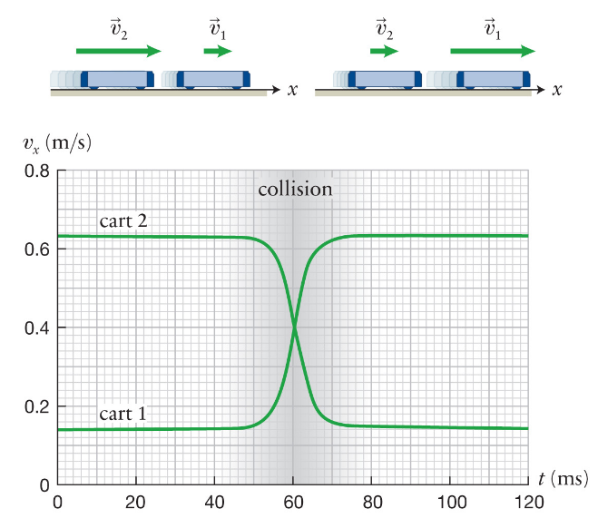
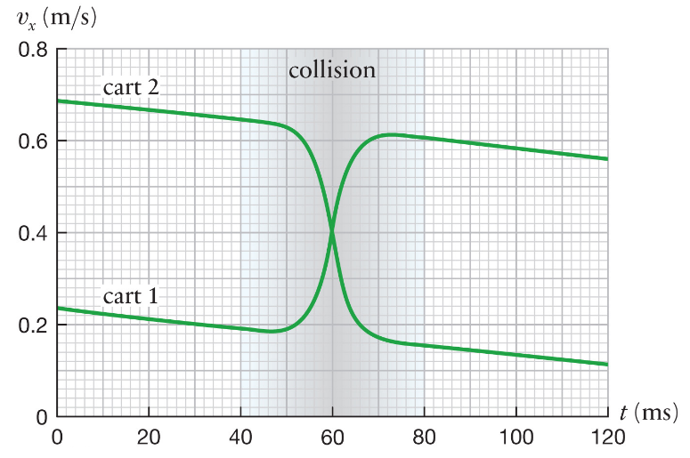

# Lecture 6, Sep 22, 2021

## Collisions and Inertia

{width=50%}

* Consider two identical carts on an airtrack undergoing elastic collision; in an ideal work the two carts will always exchange speeds, regardless of their initial speeds
* If one cart is twice as heavy as the other, after the collision the lighter cart will lose twice as much speed as the heavier cart (possibly reversing)
* From this we can observe that inertia is proportional to the mass of the cart; we can also determine the inertia of an object by colliding it with a known mass
	* The ratio of the velocity changes is the inverse ratio of the masses; e.g. if object 2 had a velocity change that is twice as much as object 1, then it is half as massive
* If friction is introduced, the straight parts have a downward slope determined by the friction
	* {width=30%}
	* This might differ depending on the type of friction, e.g. kinetic vs viscous friction
* With this we can define inertia: $\frac{m_u}{m_s} \equiv -\frac{\Delta v_{sx}}{\Delta v_{ux}} \implies m_u \equiv -\frac{\Delta v_{sx}}{\Delta v_{ux}}m_s$
	* A one kilogram mass is the inertial standard $m_s$
	* **Mass is a way to measure inertia/mass is inertia**

## Momentum

* We can rearrange the equations to get $m_u\Delta v_u + m_s\Delta v_s = 0$, leading us to define *momentum* as $p_x \equiv mv_x$
* Since $m_u\Delta v_u + m_s\Delta v_s = 0 \implies m_u(v_{uf} - v_{ui}) + m_s(v_{sf} - v_{si}) = 0 \implies m_uv_{ui} + m_sv_{si} = m_uv_{uf} + m_sv_{sf}$, momentum is conserved; change in momentum of $s$ is balanced by change in momentum of $u$
	* $\Delta p_u + \Delta p_s = 0 \iff p_{ui} + p_{si} = p_{uf} + p_{sf}$
* We can use this formula and go back to the carts before ($s$ is the standard cart, $d$ is the double cart): $\Delta p_s + \Delta p_d = 0 \implies m_s\Delta v_s + m_d\Delta v_d \implies \Delta v_d = -\frac{m_s}{m_d}\Delta v_s = -2\Delta v_s$

