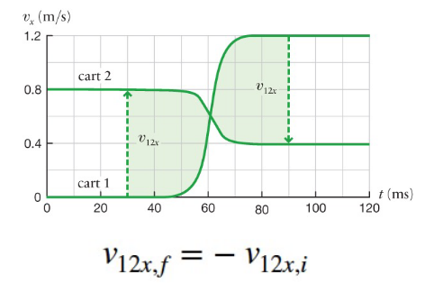

# Lecture 9, Sep 29, 2021

## Identifying and Choosing Closed Systems

* A closed system is any system that does not transfer energy in/out of it
* Identify all objects that change state or state of motion, and group them together to make a closed system

## Elastic Collisions in Isolated and Closed Systems

* The difference in speed remains the same after an elastic collision
* Relative speed remains the same but relative velocity is negated
* {width=30%}
* Conservation of momentum, conservation of energy and elastic collisions can be derived from each other
	* $\alignedimp[t]{k_i = k_f}{\frac{1}{2}m_1v_{1i}^2 + \frac{1}{2}m_2v_{2i}^2 = \frac{1}{2}m_1v_{1f}^2 + \frac{1}{2}m_2v_{2f}^2}{m_1(v_{1f}^2 - v_{1i}^2) = m_2(v_{2f}^2 - v_{2i}^2)}{m_1(v_{1f} + v_{1i})(v_{1f} - v_{1i}) = m_2(v_{2f} + v_{2i})(v_{2f} - v_{2f})}{\Delta p_1(v_{1f} + v_{1i}) = \Delta p_2(v_{2f} + v_{2i})}$
* In an elastic collision $k_i = k_f$
* Energy is measured in Joules: $1\si{J} = 1\si{kg \cdot m^2/s^2} = 1\si{m \cdot kg \cdot m/s^2} = 1\si{N \cdot m}$

## Quantifying (In)Elastic Collisions

* We can quantify how elastic a collision is with the *coefficient of restitution*: $e \equiv \frac{v_{12f}}{v_{12i}}$
* The coefficient of restitution is the ratio between the final difference in *speed* and initial difference in *speed*
* The coefficient of restitution is positive, even though the direction of velocity reverses in an elastic collision
* Elastic collisions have $e = 1$, while totally inelastic collisions have $e = 0$

