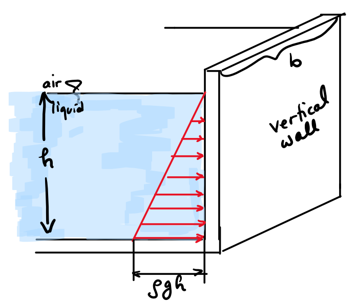
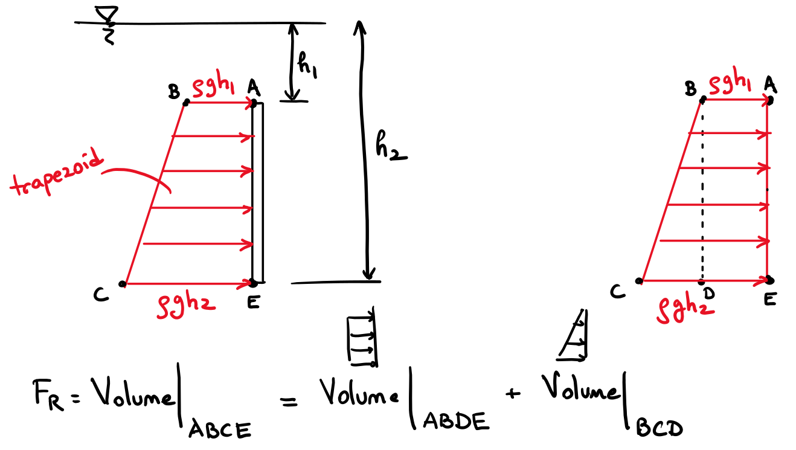
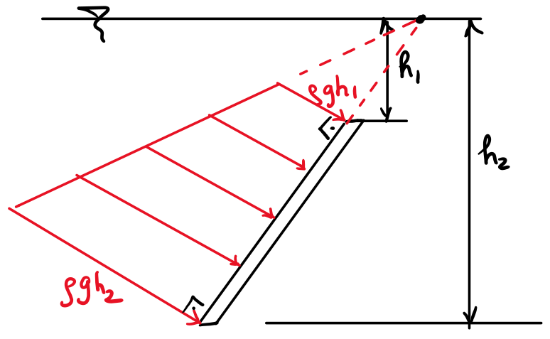

# Lecture 25, Nov 3, 2022

## Measuring Pressure

* Pressure values must be states with respect to a reference
	* For gauge pressure, this is the local atmospheric pressure or the reference pressure for the gauge
	* For absolute pressure, this is with respect to the absolute zero pressure reference, with is a vacuum
	* Absolute pressure is the sum of gauge and atmospheric pressures
	* Gauge pressure can be positive or negative, but absolute pressure can never be negative
* Manometers can be used to measure pressure
	* Mercury barometers are usually used to measure atmospheric pressure
		* Pressure at the mercury level in the tube $P_A = P_{atm} - \rho _{\ce{Hg}}gh = P_{vapour} \approx 0$
	* Piezometers are vertical tubes open at the top; use the level of the liquid to measure the pressure of the liquid in the container
		* $P_A - \rho gh_1 = P_{atm}$
		* Pressure in the container must be greater than that of the atmosphere
		* The fluid inside must be liquid, and the pressure measured must be small
* A U-tube manometer can be used to measure pressures in a gas; a gauge liquid is used

## Hydrostatic Forces on Submerged Surfaces

* We know:
	1. The force of pressure is always normal to a surface
	2. No shear stresses
	3. For an incompressible fluid at rest, the pressure varies linearly with depth
* If we want to find the total pressure force on a *planar* surface:
	1. Using integration, we can use a double integral
		* $\vec F_p = \iint _A \dd\vec F_p = \iint _A -p\vec n\,\dA$
	2. Using moment of inertia (will not be using in this course)
	3. "Pressure Prism" concept allows us to skip integration using geometry
		* The pressure force can be found by finding the volume of the "pressure prism"
			* One side is the pressure, the other side is the area
		* This force acts at the centroid of the prism (not the centroid of the object it acts on!)
		* This is the easiest when we have a vertical surface, in which case we get a triangular prism; if the surface does not extend up to the fluid surface, we have a trapezoid
			* The two sides of the triangle are $\rho gh_1$ and $\rho gh_2$ if we consider gauge pressure
			* For the trapezoid, the area is easy but the centroid is hard, so we can break it up into a triangular and rectangular prism, both of which we know the centroids of, and analyze the pressure as 2 forces
		* When the surface is not vertical, make sure the pressure forces are normal to the surface!

{width=40%}

{width=80%}

{width=40%}

