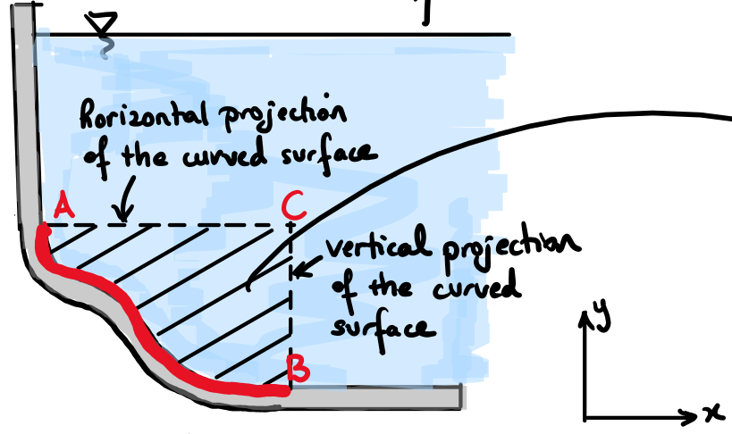

# Lecture 26/27, Nov 4, 2022

## Hydrostatic Forces on Curved Surfaces, Integration Method

1. Integration
	* $\vec F_p = \iint _A -p\vec n\,\dS$
	* 3 methods:
		1. Do it in 2 dimensions and parametrize the curve
		2. Do it in 3 dimensions, parametrize the surface
		3. Do it in 3 dimensions, parametrize the surface and use the moment formula $\vec M_0 = \vec r \times \vec F = -p(\vec r \times \vec n)$
2. Graphical method
	* Considers the equilibrium of the fluid volume enclosed by the curved surface of interest and the horizontal and vertical projections of the surface passing through the 2 ends of the curved surface
	* Consider the forces acting on the fluid region, we can draw a free body diagram
	* There are pressure forces on the 3 sides, the curved surface, the horizontal projection, and the vertical projection, as well as the weight of the fluid inside
		* The pressure force on the horizontal projection is constant
		* The pressure force on the vertical projection is similar to a vertical pressure prism
		* The weight is a single force due to gravity
	* Because the fluid is at rest or rigid body motion the forces on this fluid region are in equilibrium, so we can find the force on the planar surface by the sum of the pressure forces on the other 2 sides
	* The force on the curved region is at angle $\alpha = \tan^{-1}\frac{F_{RV}}{F_{RH}}$ with magnitude $F_R = \sqrt{F_{RH}^2 + F_{RV}^2}$
		* $F_RH = F_x$, $F_{RV} = F_y + w$ because we need to account for weight
	* The location of application can be found by taking the moment about a convenient axis on the surface over which it acts
		* Note for a curved surface *above* a liquid, weight acts in the opposite direction compared to pressure
	* If the surface is circular, then the resulting pressure force will pass through the centre of the circle
		* Since pressure force is always normal to the surface, all the individual pressure forces will pass through the centre, so the overall force must also pass through the centre

{width=50%}

