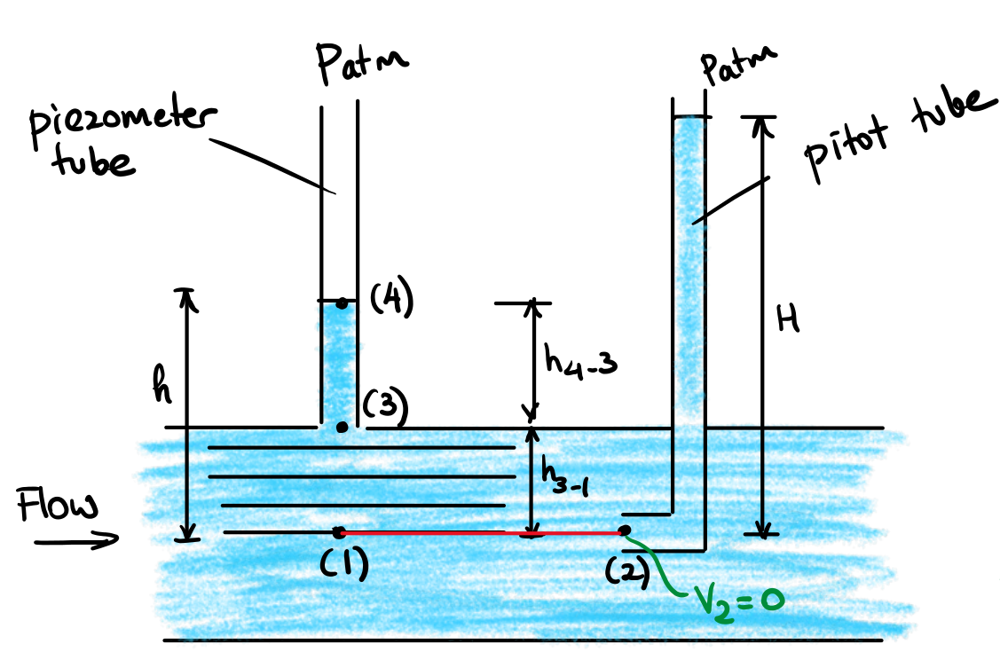

# Lecture 32/33, Nov 25, 2022

## Bernoulli's Equation

* Under the assumption of incompressible flow (constant $\rho$) we can integrate Euler's equation and obtain Bernoulli's equation
* $\frac{V^2}{2} + gz + \frac{p}{\rho} = \text{const}$
* Bernoulli's equation is an energy conservation equation; all terms have units of energy per unit mass
	* $\frac{V^2}{2}$ is kinetic energy per unit mass
	* $gz$ is potential energy per unit mass
	* $\frac{p}{\rho}$ is pressure energy per unit mass

\noteSummary{For steady, inviscid flow along a streamline, Euler's equation is given by $$V\,\dV + g\,\dz + \frac{1}{\rho}\,\dd p = 0$$ If the flow is also incompressible, then Bernoulli's equation applies: $$\frac{V^2}{2} + gz + \frac{p}{\rho} = \text{const}$$}

* Note that Euler's/Bernoulli's equation only works along a streamline!
* Additionally since they rely on energy conservation, between the two points there must be no heat loss and no shaft work
* If we apply the same analysis normal to the streamline we get $\frac{\dd p}{\rho} + \frac{V^2}{R}\,\dd n + g\,\dz = 0$
	* For a straight streamline $R \to \infty$ and we just have $\frac{\dd p}{\rho} + g\,\dd z = 0$
	* If the flow is incompressible we can integrate this and get $p_1 - p_2 = \rho g(z_2 - z_1)$, which is the hydrostatic equation, but this time for a straight, incompressible flow

## Static, Dynamic, Total and Stagnation Pressures

* Multiplying the Bernoulli equation by $\rho$ we get $p + \rho\frac{V^2}{2} + \rho gz = P_T$
	* $p$ is the static pressure, the pressure in the flow that does not incorporate any dynamic effects
	* $\rho\frac{V^2}{2}$ is the dynamic pressure, the pressure rise when the fluid is stopped isentropically
	* $\rho gz$ is the hydrostatic pressure (but not exactly, since it depends on the reference level for $z$)
	* $P_T$ is the total pressure
	* $p + \rho\frac{V^2}{2}$ is the stagnation pressure, the pressure observed when the fluid is brought to a stop (includes both the static and dynamic pressures)

{width=50%}

* Static and stagnation pressures can be measured through a piezometer tube and a pitot tube, from which the flow velocity can be calculated

## Reynolds Transport Theorem

* Two approaches of examining the flow:
	* Control volume approach (Eulerian): consider a region fixed in space, which fluid can flow in or out of
	* System approach (Lagrangian): consider a fixed collection of fluid particles, which moves with the flow
* Equations used in solid analysis (e.g. Newton's laws) apply to systems, but for fluids it's easier to use control volumes; Reynolds Transport Theorem links the two approaches
* Let $B$ be some mass dependent property and $B = mb$ where $b$ is that property per unit mass
	* $B_{sys} = \int _{sys} b\rho\dd\Vbar \implies \diff{B_{sys}}{t} = \diff{}{t}\int _{sys}b\rho\dd\Vbar$
	* $B_{cv} = \int _{cv} b\rho\dd\Vbar \implies \diff{B_{cv}}{t} = \diff{}{t}\int _{cv}b\rho\dd\Vbar$

\noteEqn{Reynolds Transport Theorem: $$\diff{B_{sys}}{t} = \diff{B_{cv}}{t} + \oiint _{S} \rho b\vec{V} \cdot \dd\vec A$$ where $\dd\vec A = \vec n\dA$ and $S$ is the boundary of the control volume}

* In the simplified case of single-inlet, single-outlet, 1D flow along a streamtube, $\diff{B_{sys}}{t} = \diff{B_{cv}}{t} + \dot B_{out} - \dot B_{in} = \diff{B_{cv}}{t} + \dot m_{out}b_{out} - \dot m_{in}b_{in}$
* Using this we can derive the most general form of the continuity equation as $\diff{}{t}\iiint _{V} \rho\,\dV + \oiint _{S} \rho\vec V \cdot \dd\vec A = 0$
* Note the selection of control volume can make a problem easier; e.g. in the case of a body moving through a fluid, it's often best to have the control volume move with the body, so flow inside the control volume is steady

