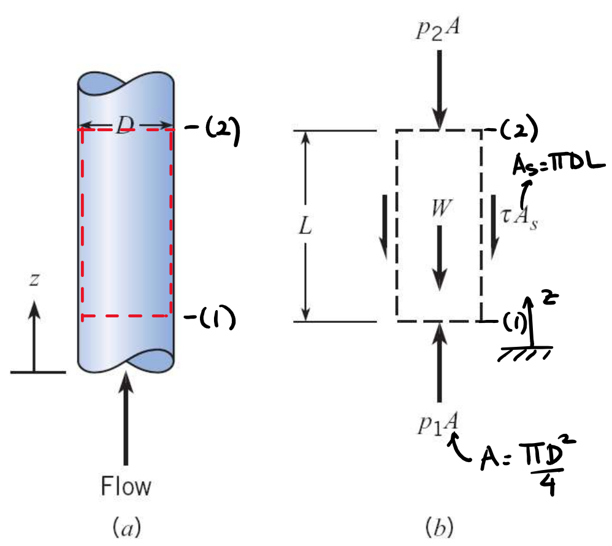

# Lecture 34, Dec 1, 2022

## Momentum Equation

* The Eulerian form of the momentum equation: $\sum \vec F_{cv} = \diff{}{t}\vec M_{cv} + \dot{\vec M}_{out} - \dot{\vec M}_{in}$
	* For a steady flow, $\sum F_{cv} = \dot{\vec M}_{out} - \dot{\vec M}_{in}$
* In a 1D problem: $\sum \vec F_{cv} = \sum \dot m_{out}\vec V_{out} - \sum \dot m_{in}\vec V_{in}$
* We draw force diagrams of forces acting on the control volume similar to a free body diagram for solid analysis
* Example: Flow inside a pipe
	* The forces acting on the control volume would include the shear force on the walls $\tau\pi DL$, the net pressure force $(p_1 - p_2)\pi\frac{D^2}{4}$, and weight $\rho g\pi\frac{D^2}{4}L$
	* However if we make the control volume bigger than the pipe wall, we no longer have shear forces; however we'd get a force due to the rest of the pipe wall, and the weight of the pipe material

{width=50%}

* Choice of the control volume depends on what information we want to find
* When expressing pressure forces acting on control surfaces, we ignore atmospheric pressure, because it cancels out

