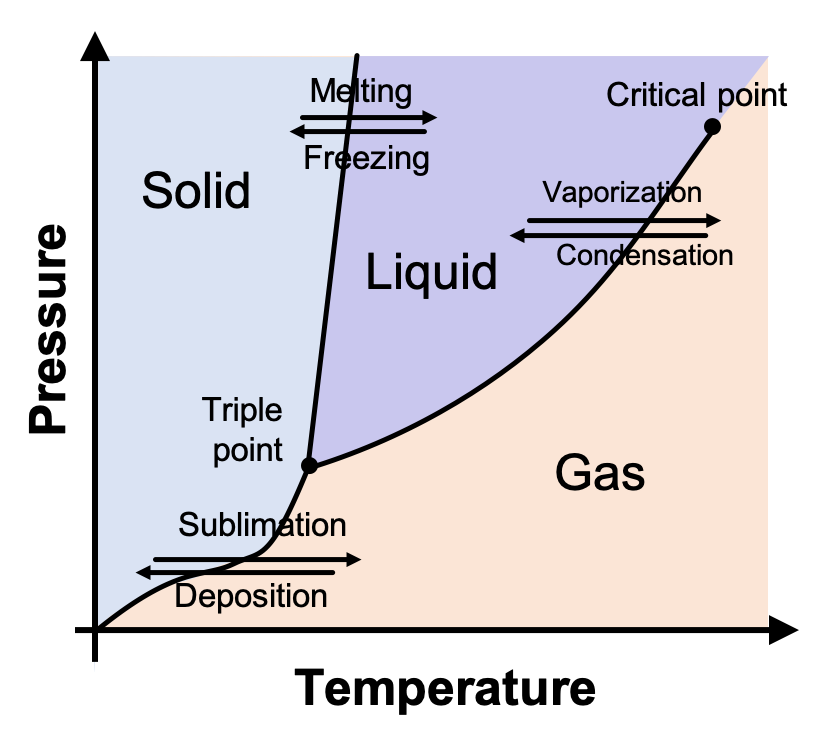
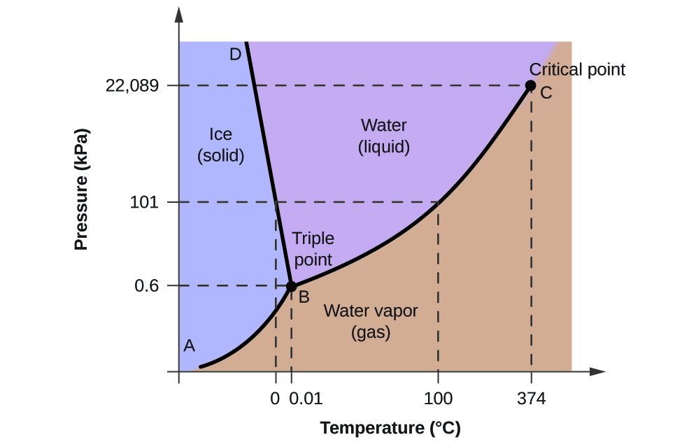

# Lecture 14, Oct 11, 2022

## Gibbs-Duhem Equation

* How do we evaluate $g$ in terms of known quantities?
	* We want $g(T, P)$ because in the end these are the only things we can directly measure
* $G = H - TS = U + PV - TS \implies \dd G = \dd U + P\dV + V\dd P - T\dd S - S\dd T$
	* Using the Gibbs equation $\dd U = T\dd S - P\dd V + g\dd m$ and substitute this in
	* $\dd G = T\dd S - P\dd V + g\dd m + P\dV + V\dd P - T\dd S - S\dd T = g\dd m + V\dd P - S\dd T$
	* Since $G = gm \implies \dd G = g\dd m + m\dd g \implies g\dd m + m\dd g = g\dd m + V\dd P - S\dd T$
	* $m\dd g = V\dd P - S\dd T \implies \dd g = v\dd P - s\dd P$, known as the Gibbs-Duhem Equation

\noteDefn{The Gibbs-Duhem Equation: $\dd g = v\dd P - s\dd T$}

## Phase Equilibrium

* Intuitively as we heat the system the pressure should increase
	* Plotting $P$ vs $T$ gives us a line; every point along this line is an equilibrium state
	* For every $P_{sat}$ saturation pressure we have a corresponding saturation temperature $T_{sat}$
	* Can we derive this line?
* At equilibrium $g_f = g_g$; suppose we change temperature by $\dd T$ and pressure by $\dd P$ and get a new equilibrium
	* At the new equilibrium $g_f + \dd g_f = g_g + \dd g_g \implies \dd g_f = \dd g_g$
	* Using the Gibbs-Duhem equation: $v_f\dd P - s_f\dd T = v_g\dd P - s_g\dd T$
		* Note $\dd P$ and $\dd T$ are the same for the liquid and gas
	* $\diff{P}{T} = \frac{s_g - s_f}{v_g - v_f}$ is the slope of our $P$-$T$ curve, however $s_f, s_g$ are hard to determine
		* It's easier to work with $h$ because it's the latent heat, which can be looked up
* We now want a relationship between $h$ and $s$
	* $h = u + Pv \implies \dd h = \dd u + P\dd v + v\dd P$
	* Using the Gibbs equation: $T\dd s = \dd u + P\dd v \implies \dd h = T\dd s + v\dd P$
	* Since the system is in equilibrium, $\dd P = \dd v = 0$ and $\dd h = T\dd s, T = T_{sat}, P = P_{sat}$
	* $\dd s = \frac{\dd h}{T} \implies s_2 - s_1 = \int \frac{\dd h}{T} = \frac{h_2 - h_1}{T}$ since $T$ is a constant
		* This makes sense because $Q_{12} = h_2 - h_1$, because entropy generation in this system can only be due to heat added, which goes directly to enthalpy

\noteDefn{The latent heat of vaporization $h_{fg} = h_g - h_f$ \tcblower This can be looked up in a table for specific substances}

\noteDefn{The Clapeyron Equation (applies to any two phases): $\diff{P}{T} = \frac{h_{fg}}{T(v_g - v_f)}$}

* Note we never made any assumptions about the phases, so this equation applies for any two phases (e.g. liquid-solid, gas-solid)

## Liquid-Vapour Equilibrium

* If we assume that this is a liquid and gas, then we can assume $v_f \ll v_g$
* Also assume the vapour is an ideal gas, so $v_g = \frac{RT}{P}$
* Putting this back into the equation we get $\diff{P}{T} = \frac{h_{fg}P}{RT^2}$
* Assume $h_{fg}$ is constant, then $\int \frac{\dd P}{P} = \frac{h_{fg}}{R}\int \frac{\dd T}{T^2}$
* $\ln P = -\frac{h_{fg}}{RT} + C$ is the Clausius-Clapeyron Equation

\noteDefn{The Clausius-Clapeyron Equation (only applies for liquid-vapour systems): $\ln P = -\frac{h_{fg}}{RT} + C$}

* This means $P_{sat} = c\exp\left(-\frac{h_{fg}}{RT_{sat}}\right)$
* If we know one state, we can calculate the entire curve
	* e.g. for water at $P_{sat} = 1\si{atm}$, $T_{sat} = 100\si{\degree C}$, so we can calculate $c$ to get the entire curve
* Example: in a pressure cooker $P_{sat}$ is high, so $T_{sat}$ is also high and cooks the food faster

## Solid-Liquid Equilibrium

* Denote solid phase by subscript $s$, so $\diff{P}{T} = \frac{h_{sf}}{T(v_f - v_s)}$ where $h_{sf}$ is the latent heat of fusion
	* Is this slope greater or less than zero?
	* $v_f - v_s$ is the only thing that can be negative
* Suppose we have a liquid and we put a solid in it, which sinks to the bottom, then $\rho _s > \rho _f \implies v_s < v_f$ and $v_f - v_s > 0$
	* For most solids, they are denser than their liquid counterparts, so $\diff{P}{T} > 0$
* One big exception is water, which has $\rho _f > \rho _s \implies \diff{P}{T} < 0$
* For most solids, the separation between solid and liquid and liquid and vapour both have positive slopes on a $P$-$T$ diagram
	* The solid-vapour boundary also has a positive slope
* We can have phase transitions across any of the 3 boundaries
* The point at which all 3 boundaries meet is the *triple point*, the point where liquid, solid, and vapour are in equilibrium
	* At the triple point, we can have boiling and freezing at the same time!

{width=50%}

* For water this is at $(0.01\si{\degree C}, 61.73\si{Pa})$
* The triple point is *invariant*, so we can use it for calibration of instruments

{width=70%}

* For water/ice, if we increase the pressure, the melting point decreases
	* This is why if we apply pressure on ice, the ice around that pressure point melts (regelation)
	* This is also how skates work
* If we want to dry something, we can either increase the temperature (oven drying), or decrease the pressure (vacuum drying)
	* However both of these methods don't work well for delicate things like cells
	* Freeze drying decreases the temperature first, and then decrease the pressure; the moisture sublimates directly and delicate structures are preserved due to the freezing

