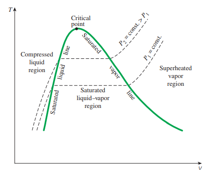
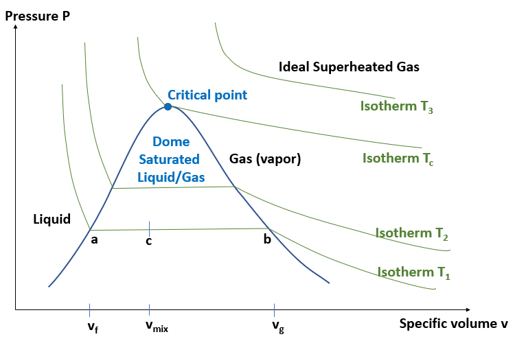

# Lecture 15, Oct 13, 2022

## Phase Change in Constant Pressure Systems

* Consider a system with a liquid with temperature $T$ and volume $V$; heat the system under constant pressure
	* Eventually we will reach $T_{sat}$, and the system has a combination of a vapour and liquid
	* Eventually all the liquid changes into vapour, and the vapour expands as an ideal gas
	* A plot of $T$ against $v$ will show an increasing line up to $T_{sat}$, then the temperature stays constant, but volume increases substantially, until all the liquid changes into vapour and the temperature increases again
* $v_f$ is the specific volume of the saturated liquid, $v$ at $T_{sat}$; $v_g$ is the specific volume of the saturated vapour, $v$ when all the liquid changes into vapour
	* A higher pressure increases $v_f$ but decreases $v_g$
	* If we keep increasing pressure, these will eventually meet; this is known as the *critical pressure*
	* At the critical pressure we no longer have a horizontal line in the middle but just an inflection point
* If we draw a line through all the $v_f, v_g$ for various pressures, we get the *vapour dome*

{width=40%}

* Where $T < T_{sat}$ we have a *subcooled liquid*; where $T > T_{sat}$ we have a *superheated vapour*
	* In the middle, the horizontal line where $T = T_{sat}$, we have the *saturated mixture*
* Since $v_f = v_g$ at the critical point, we can regard it as one phase, as a *supercritical fluid*
	* Visually we no longer see any boundaries

## Phase Change in Constant Temperature Systems

* Consider a system with only vapour at constant temperature; if we compress this system, we will get some liquid forming, and then eventually only liquid
* On a $P$-$v$ diagram:

{width=50%}

* We need two independent intensive properties to define the state of a system
	* If we have a mixture, the temperature and pressure are not independent, they are related by the Clausius-Clapeyron Equation (e.g. if we have boiling water at $1\si{atm}$, we immediately know the pressure)
	* Therefore we need one additional property to fix the state for mixtures
* Define a new property, the *quality* $x = \frac{m_g}{m}$ where $m_g$ is the mass of the vapour and $m$ is the mass of the mixture
	* $x = 0 \implies$ saturated liquid, $x = 1 \implies$ saturated vapour, $0 < x < 1$ is a saturated mixture
* The quality can be used to determine the volume
* Suppose the volume of a mixture is $V = mv = m_gv_g + m_fv_f \implies v = \frac{m_g}{m}v_g + \frac{m_f}{m}v_f$
	* $v = xv_g + (1 - x)v_f$
	* This works for any other property -- $h = xh_g + (1 - x)h_f = h_f + x(h_g - h_f) = h_f + xh_{fg}$ where $h_{fg}$ is the latent heat of vaporization

