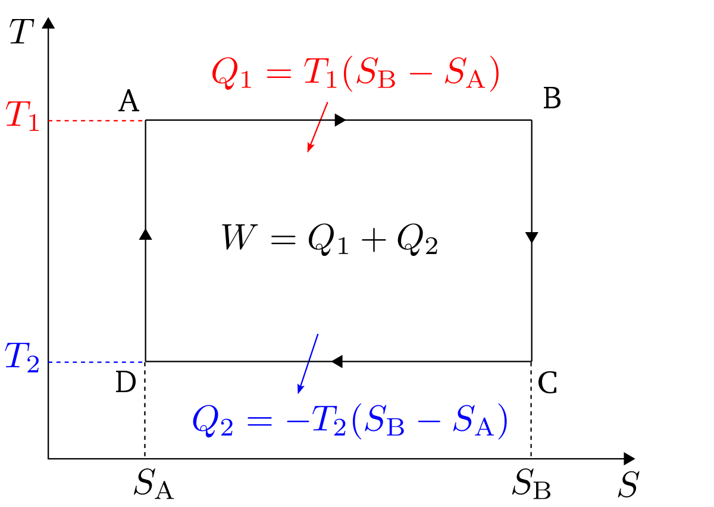
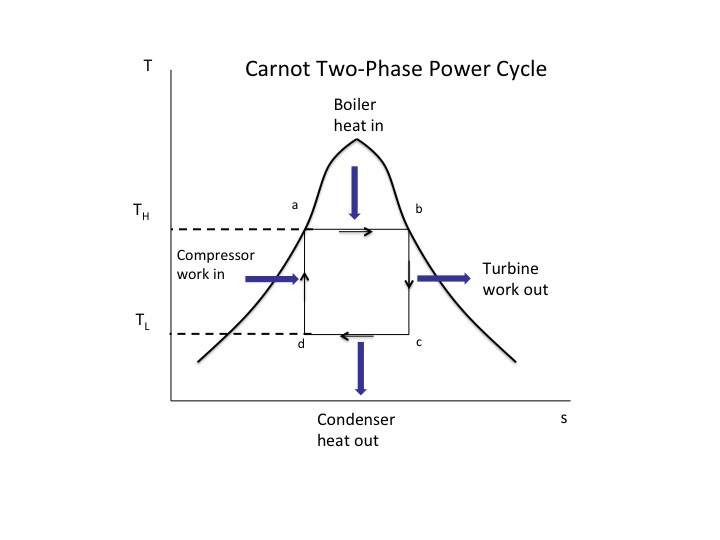

# Lecture 16, Oct 17, 2022

## Heat Engines

* What is the most efficient engine possible?
* A heat engine is any device that works in a thermodynamic cycle which does work on its surroundings as long as heat is supplied
	* The engine must do a net amount of work (that is, it can use work internally, but it must produce work output)
	* It must be able to work continuously (so energy storage devices do not count)
* We can model a heat as a system that takes heat $Q_H$ from a hot thermal reservoir $T_H$, puts heat $Q_C$ into a cold thermal reservoir $T_C$ while producing work $W_{net}$
* Define the thermal efficiency as $\eta _{th} = \frac{W_{net}}{Q_H}$ (neglecting sign convention)
	* So what is the maximum possible efficiency?
* A note on perpetual motion machines:
	* PMM of the first kind violate the first law (they create energy from nothing)
	* PMM of the second kind violate the second law
		* This is a little more subtle to see
		* e.g. an engine that directly converts heat to work, without the use of a cold thermal reservoir
			* Over a thermodynamic cycle, all properties go to their initial values
			* However in this engine, heat only comes in, so the entropy can only increase and is never removed from the system, making it an invalid heat engine
			* This is why heat engines must have a cold reservoir to reject heat in order to remove entropy
* Kevin-Planck statement: It is impossible for any device operating in a thermodynamic cycle to receive heat from a high temperature source and produce work without rejecting heat to a low temperature sink
	* This can be an alternative statement of the second law

## Carnot Engine

* A Carnot engine is the theoretically most efficient heat engine possible
* Consider the same system that takes heat $Q_H$ from a hot thermal reservoir $T_H$, puts heat $Q_C$ into a cold thermal reservoir $T_C$ while producing work $W_{net}$
* All processes are reversible; no $s_{gen}$, the engine is frictionless, and all heat and work transfer is reversible
* Over a cycle $\Delta E = 0 \implies Q_H - Q_C - W = 0 \implies W = Q_H - Q_C$
* $\Delta S = 0 \implies \oint \frac{\delta Q_{rev}}{T} = 0$; this can be broken down into the entropy from heat addition and heat rejection
* We want to minimize the entropy added during heat addition, because we need to get rid of it later
	* This means we need to maximize the temperature, so add heat when $T = T_H$, which means the heat transfer is isothermal
	* $\Delta S_{\text{heat addition}} = \frac{Q_H}{T_H}$
* We also want to maximize the entropy removed during heat rejection
	* This means we need to reject heat at the lowest temperature, so reject heat at $T = T_C$
	* $\Delta S_{\text{heat rejection}} = \frac{Q_C}{T_C}$
* To close the thermodynamic cycle, temperature change is done first through an isentropic expansion, then an isentropic compression

{width=60%}

* $\Delta S_{\text{heat addition}} - \Delta S_{\text{heat rejection}} = 0 \implies \frac{Q_H}{T_H} = \frac{Q_C}{T_C}$ and $W_{net} = Q_H - Q_C$
	* $\eta _{th} = \frac{Q_H - Q_C}{Q_H} = 1 - \frac{Q_C}{Q_H} = 1 - \frac{T_C}{T_H}$

\noteDefn{The Carnot Efficiency: $\eta _{th} = 1 - \frac{T_C}{T_H}$ is the theoretical maximum efficiency of a heat engine}

* This means the maximum efficiency of an engine depends only on the temperatures of the thermal reservoirs and not the engine cycle
	* $T_C$ is usually fixed, so the higher we raise $T_H$, the better our efficiency

## Implementing a Carnot Cycle

* Practically we can do a two-phase Carnot cycle
* Isothermal heat addition can be accomplished with a boiler
	* If we find a liquid that boils at $T_H - \Delta T$, we can pipe the liquid into the boiler, which takes heat from the heat source and the liquid emerges as vapour
* The resulting vapour can be passed into an isentropic turbine, which cools the liquid, extracting work and producing a liquid-vapour mixture
* The heat rejection can be accomplished with a condenser
	* The liquid-vapour mixture would be at temperature $T_C + \Delta T$, which rejects heat to a cold heat sink and produces a liquid
* Finally the liquid is is passed into an isentropic compressor (which requires work, but can be driven by the turbine) and the cycle is complete

{width=40%}

