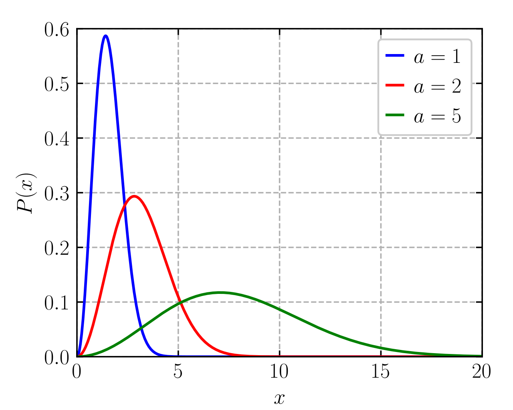

# Lecture 8, Sep 26, 2022

## Molecular Definition of Entropy

* Consider a rigid, insulated box divided into two parts: one with gas, the other with vacuum
	* When the partition is removed, the gas will expand and the pressure equalizes
	* This is accompanied by an increase in entropy
	* But why do the molecules spread out evenly?
* A *microstate* is a combination of the exact states of molecules (we cannot directly measure this); a *macrostate* is some kind of an average (we can measure this in terms of e.g. pressure)
* Divide the boxes into left and right, and consider if there were just 2 particles in the left box
	* We can either have both on one side and one on each side
	* Consider all the possibilities (*microstates*): LL, LR, RL and RR; in terms of *macrostates* (averages), the macrostate with an even distribution is more likely than all the molecules to one side
* If there are instead 4 particles, then there are 5 macrostates (4 left, 3 left + 1 right, etc)
	* The probability of all the particles being on one side is even smaller
* A probability distribution of the percentage of particles on one side would follow a Gaussian
	* The probability of having everything on one side decreases as the number of particles increases
	* The total number of states is $2^n$, but there is only one state corresponding to all particles on one side
	* For a large number of particles the distribution is extremely sharp and essentially all cases are at equilibrium
* The equilibrium macrostate is the one that has the largest number of microstates (and thus the highest probability)
	* This leads us to define molecular entropy in terms of the number of microstates that correspond to each macrostate, so that as the system moves toward equilibrium, it increases
* For a very large number of particles, $S_{eq} = \Omega _{total}$
* But note entropy is an extensive property, i.e. if we have two systems with entropies $S_1$ and $S_2$, the entropy of the combined system should be $S_1 + S_2$
	* Consider if each system had $N$ particles, then the combined system has $2N$ particles, so the number of microstates would be $2^{2N}$
	* This prompts us to use logarithms

## Equilibrium in a Gas

* Consider a gas in an isolated system
	* Constant mass defined by $n$, number of molecules
	* Constant energy determined by $U$, the internal energy
		* Note the energies of the molecules are not continuous but occupy discrete levels
* $n = \sum _i n_i$ where $n_i$ is the number of molecules with energy $\varepsilon _i$
	* The total energy is $U = \sum _i\varepsilon _in_i$
* Any arrangement of molecules that satisfies these constraints is a microstate
* At equilibrium the molecules will be in a *Maxwell-Boltzmann distribution*

{width=50%}

* As the temperature goes up, the peak of the distribution moves to the right; more energy levels become available, and the distribution flattens out
* If $\Omega$ is the number of microstates that correspond to equilibrium state

\noteDefn{$S = k\ln \Omega$, where $\Omega$ is the number of microstates of the system, and $k$ is the Boltzmann constant, $k = \SI{1.38e-23}{J/K}$}

* The Boltzmann constant makes this definition consistent with the Clausius definition based on heat transfer
* Consider the example at the beginning; we had $\Omega _i$ microstates before the partition was opened and $\Omega _f$ after the partition was opened ($\Omega f \gg \Omega i$)
	* This represents a positive entropy change of $\Delta S = k\ln\left(\frac{\Omega _f}{\Omega _i}\right)$
* To calculate $\Omega$, we need to solve Schrödinger's Equation
* For a monoatomic ideal gas, with $n$ molecules, volume of $V$ and energy $U$, then $\Omega(U, V, n) = f(n)V^nU^{\frac{3}{2}n}$
	* Thus $S(U, V, n) = nk\ln V + \frac{3}{2}nk\ln U + k\ln f(n)$
	* $\Delta S = nk\left(\ln\frac{V_2}{V_1} + \frac{3}{2}\ln\frac{U_2}{U_1}\right)$
	* Recall $nk = NR_u = mR$ and $U \propto T$, therefore $\Delta S = mR\left(\ln\frac{V_2}{V_1} + \frac{3}{2}\ln\frac{T_2}{T_1}\right)$

\noteImportant{For a monoatomic ideal gas, $\Delta S = mR\left(\ln\frac{V_2}{V_1} + \frac{3}{2}\ln\frac{T_2}{T_1}\right)$}

