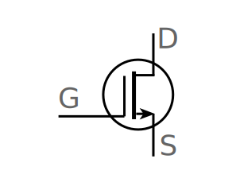

# Lecture 1, Sep 8, 2022

* General purpose processors can be too slow for some applications because of overhead
	* Specialized hardware is used for e.g. WiFi
* Hardware is faster & more efficient
* Writing software involves many layers of abstraction
	* Code -> hardware adder -> logic gates -> transistor -> silicon
	* Makes it easier since it hides things we don't need to worry about
* Abstraction vs Complexity: need to manage complexity, find the right level of abstraction to succeed in labs
* Transistors: acting like a switch {width=100px}
	* When voltage on the gate is high, the drain and source are connected
	* Made of silicon chips, $L$ is the length of the gate (current state of the art $L = 14\si{nm}$)
	* Transistors in chips are getting smaller and more powerful following Moore's Law

## Why Build Hardware?

* Hardware is faster, but harder to produce and apply, and more expensive
* Why is hardware faster than software? Things get in the way with software:
	* Retrieval of instructions, operands, etc from memory
	* Write results back into memory
	* Keeps asking for the next computation
* Hardware is tailored to a specific purpose, so it doesn't have to ask what to do
* If not fast enough (throughput: things that can be done per unit time), just build more hardware!
* Hardware speed is bottlenecked by speed of electrical signal, wire resistance, capacitance, etc

## When to Build Hardware?

* Software is easier to build, test, and manufacture
* Build hardware when software is simply too slow

## Assembly Language

* High level languages are machine agnostic (doesn't care about the specific processor)
	* The compiler compiles this down to assembly
* Assembly language is a low level, machine specific language that is still human readable
* An assembler converts this to a native binary executable, which only runs on the specific architecture it was compiled/assembled for
* Assembly is typically only used in special circumstances:
	* Where high speed behaviour down to the instruction is needed
	* Where low level access to hardware is needed, e.g. device drivers
* ASM is a lot closer to hardware and is a stepping stone to learn computer architecture
* RISC-V: Reduced Instruction Set Computer, RISC-V is an open source ISA (instruction set architecture)

