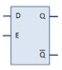

# Lecture 12, Oct 4, 2022

## More on RS Latches

{width=30%}

* Flaw with this design: it cannot support both set and reset going to high/low at the same time (this can cause the circuit to oscillate)

## Characteristic Tables

* For sequential circuits, instead of truth tables we use characteristic tables

| $S$ | $R$ | $Q$ | $\bar Q$ | Comment                |
|:---:|:---:|:---:|:--------:|:----------------------:|
| 0   | 0   | 0/1 | 1/0      | (stored value)         |
| 0   | 1   | 0   | 1        |                        |
| 1   | 0   | 1   | 0        |                        |
| 1   | 1   | 0   | 0        | (not used in practice) |

## Gated RS Latch

{width=60%}

| $E$ | $S$ | $R$ | $Q(t + 1)$ |
|:---:|:---:|:---:|:----------:|
| 0   | x   | x   | $Q(t)$     |
| 1   | 0   | 0   | $Q(t)$     |
| 1   | 0   | 1   | 0          |
| 1   | 1   | 0   | 1          |
| 1   | 1   | 1   | Not Useful |

* When the clock is 0, $S' = R' = 0$ (none of the inputs pass through) so the stored value can't be changed
	* In a digital circuit the clock is typically a square wave generated by a crystal oscillator
* (Gated) RS latches can also be built out of NAND gates
	* We can obtain this by using DeMorgan's rule to convert an OR gate with both inputs inverted to a NAND gate

{width=40%}

## Gated D Latch

{width=70%}

* However $S$ and $R$ can still be 1; we don't want this, because this is not useful, and when they both drop to 0 from 1 the circuit oscillates
* We can let $S = D, R = \bar D$, so that we can't have $S$ and $R$ both be 1 at the same time
* This is represented with the symbol {width=7%}
* $D$ is the "data" input -- when clock is 1, $Q = D$; when clock is 0, $Q$ stores the last value of $D$
* This is known as a *level-sensitive latch*: the output $Q$ is sensitive to the level of the clock (as opposed to edge sensitive latches that operate at the transition)

{width=40%}

* This can also be represented using a mux

{width=10%}

| $A$ | $B$ | $f(t + 1)$ |
|:---:|:---:|:----------:|
| 0   | x   | $f(t)$     |
| 1   | 0   | 0          |
| 1   | 1   | 1          |

## Flip-Flops

{width=15%}

* Another type of storage element
* Consider 2 gated D-latches in series, with $Q$ leading to $D$ of the next latch; the clock to the first latch is inverted and tied together with the second latch's clock
* This is known as a *D Flip-Flop*
* The triangle means that the circuit responds to the *edge* rather than the level of the clock
* Operation: Let $D$ be the input signal to the first latch, $Q_m$ be the output of the first latch (which is fed to the second latch), and $Q$ be the final output of the second latch
	* Case 1: Clock = 0
		* First gated D-latch has clock 1, so middle signal $Q_m$ tracks $D$, the input signal
		* Final output $Q$ could be either 0 or 1 based on the previous stored value (since its clock is 0)
	* Case 2: Clock goes from 0 to 1 (rising/positive edge)
		* At this moment $Q = Q_m = D$, so the value of $D$ is stored
		* Afterwards the clock changes to 1, so the first latch no longer tracks $D$, so the value of $Q$ is stored
* The D flip-flop only changes its value on a clock edge

