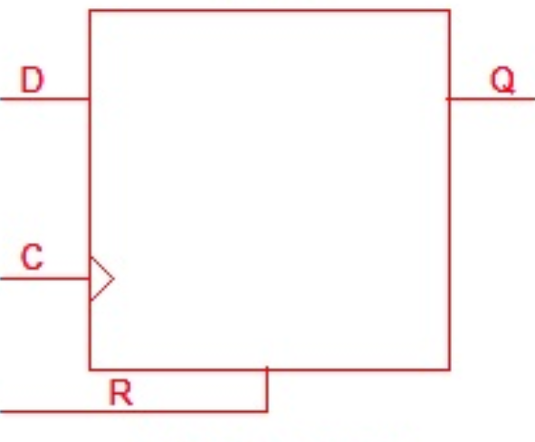
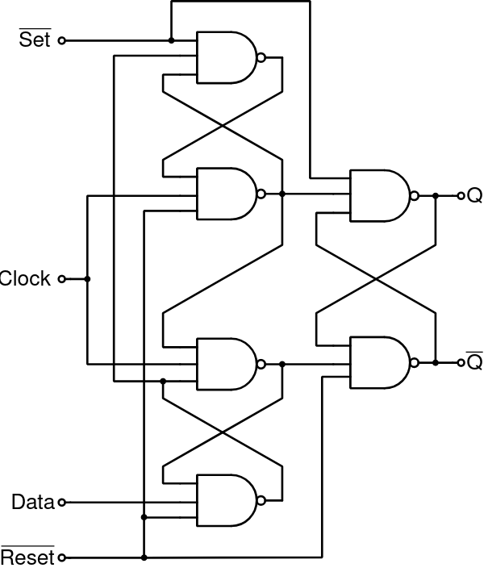

# Lecture 13, Oct 6, 2022

## More on Flip-Flops

* D-flip flops can be positive edge or negative edge triggered
	* A negative edge triggered D-flip flop is basically a positive one but with clock inverted; it stores a value on a clock negative edge (1 to 0)
* A latch tracks changes in its input as long as the clock is high, but a flip-flop only tracks changes on a positive or negative clock edge (transition)
	* D needs to be stable for some time (set-up time) before the clock changes, otherwise the flip-flop ends up in a *metastable state*, so D and clock can't change at the same time
* In Verilog `register` is a flip flop

## Verilog Code for Sequential Circuits

* For a D-latch:

```sv
module D_latch(input logic D, clk,
			   output logic Q);
	always_latch
		if (clk == 1)
			Q = D;
endmodule
```

* The `always_latch` makes it a latch
* If a `case` or `if` does not cover all cases, the compiler will infer a latch, i.e. it stores the previous value
	* In this case that's exactly what we want -- we have no `else`, so the compiler creates a latch to store the previous value of `D` and assign it to `Q`
* For a flip-flop:

```sv
module D_FF(input logic D, clk,
			output logic Q);
	always_ff @(posedge clk)
		Q <= D;
endmodule
```

* `posedge` is a keyword that means the flip flop should trigger on the positive edge
	* `negedge` is a negative edge trigger
* `always_ff` crates a flip flop
* When code describes flip flops, the assignments should use `<=`, not `=`
	* `<=` is a nonblocking assignment used for sequential logic
	* `=` is a blocking assignment used for combinational logic
* The stuff inside `always_ff` only executes on a positive edge, so we don't need an `if` (whereas the latch needs to check)
* For an 8-bit register (in the schematic it's denoted by a D-flip flop with an 8-bit bus for D and Q):

```sv
module reg8(input logic [7:0] D,
			input logic clk,
			output logic [7:0] Q);
	always_ff @(posedge clk)
		Q <= D;
endmodule
```

* Note the only difference is `D` and `Q` are now buses, but inside the module the code is identical since we assign all 8 bits at once

## Resets

* How do we reset a flip-flop to a known value?
	* Synchronously (on a clock edge) or asynchronously (independent of clock edge)
* In the synchronous case we can AND together $D$ and a reset signal and then feed into the flip flop
	* This is known as an *active-low* reset because when the reset signal is 0, the value is reset

{width=40%}

{width=20%}

```sv
module D_FF(input logic D, clk, resetn,
			output logic Q);
	always_ff @(posedge clk)
		if (resetn == 0)
			Q <= 1'b0;
		else
			Q <= D;
end
```

* In the asynchronous case, the flip-flop can be reset regardless of the clock

{width=50%}

* Regardless of the state of the clock, as long as reset is 0, $Q$ will be reset
* Asynchronous reset is marked by an AR instead of just R

