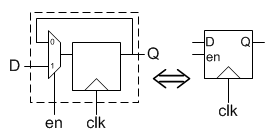
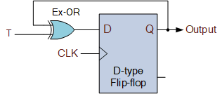
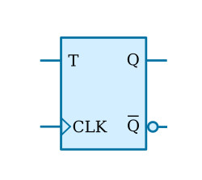
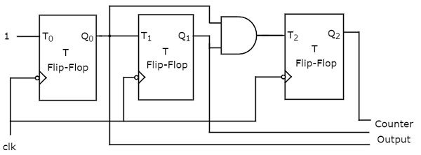

# Lecture 14, Oct 11, 2022

## D-Flip Flop With Reset in Verilog

```sv
module D_FF(input logic D, clock, resetn,
			output logic Q);
	always_ff @(posedge clock, negedge resetn)
		if (resetn == 0)
			Q <= 1'b0;
		else
			Q <= D;
endmodule
```

* `negedge resetn` is added to the sensitivity list because it directly affects `Q`
	* Whenever there's a negative edge on `resetn`, `Q` is reset regardless of clock state

## Multi-Bit Register With Reset

```sv
module reg8(input logic [7:0] D,
			input logic resetn, clock,
			output logic [7:0] Q);
	// Note this is a synchronous reset
	always_ff @(posedge clock)
		if (!resetn)
			Q <= 8'b0;
		else
			Q <= D;
endmodule
```

* We can also add an enable to determine whether data is loaded on a clock edge
	* This can be done via a mux that passes a new $D$ when enable is true and otherwise cycles $Q$ back into $D$
	* We don't just add an AND gate onto the clock because generally in a modern high speed circuit we don't want to add additional gates onto the clock, since that introduces delays that cause timing issues

{width=30%}

## Counters

| Cycle | $Q_2Q_1Q_0$ |
|-------|-------------|
| 0     | 000         |
| 1     | 001         |
| 2     | 010         |
| 3     | 011         |
| 4     | 100         |
| 5     | 101         |
| 6     | 110         |
| 7     | 111         |
| 8     | 000         |

* Circuits that count up or down every clock cycle
* Can we find a pattern in the bits?
	* $Q_0$, the LSB, toggles every clock cycle, so $Q_0(t + 1) = Q_0 \xor 1$
	* $Q_1$ toggles only in the cycle after $Q_0$ is 1, so $Q_1(t + 1) = Q_1 \xor Q_0$
	* $Q_2$ toggles only when both $Q_0$ and $Q_1$ are 1, so $Q_2(t + 1) = Q_2 \xor (Q_0Q_1)$
* A T-flip flop toggles its value on each clock cycle if $T$ is 1; it's made by cycling the output of a D-flip flop back into the input with an XOR with $T$

{width=30%}

{width=20%}

{width=70%}

* Note we should add a reset for all the flip-flops because when the circuit powers on, there is no guarantee that they will initialize to 0
* This called a synchronous counter because all the clocks are the synchronized together
* Instead of a fixed 1 being fed into the first flip flop we can also use an enable input, so when enable is 0 the counter won't count up
* Instead of resetting all the flip flops we might also want to load a preset value into all of them; this is called a parallel load

```sv
module upcount(input logic [3:0] R,
			   input logic resetn, clock, E, L,
			   output logic [3:0] Q);
	always_ff @(posedge clock, negedge resetn)
	begin
		if (!resetn)
			Q <= 4'b0;
		else if (L)
			Q <= R;
		else if (E)
			Q <= Q + 1;
	end
endmodule
```

